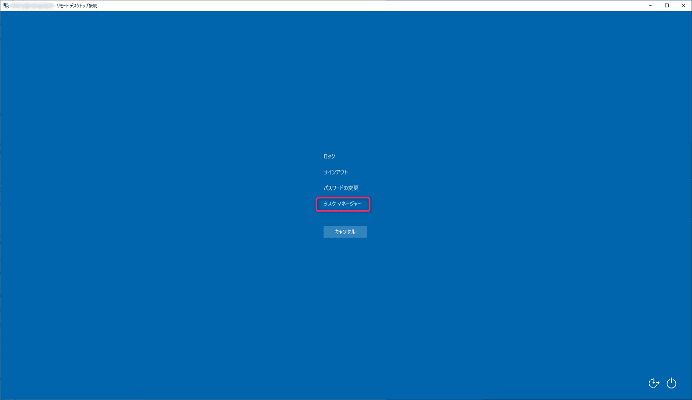
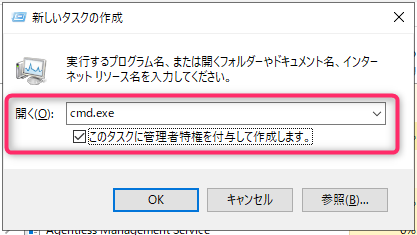
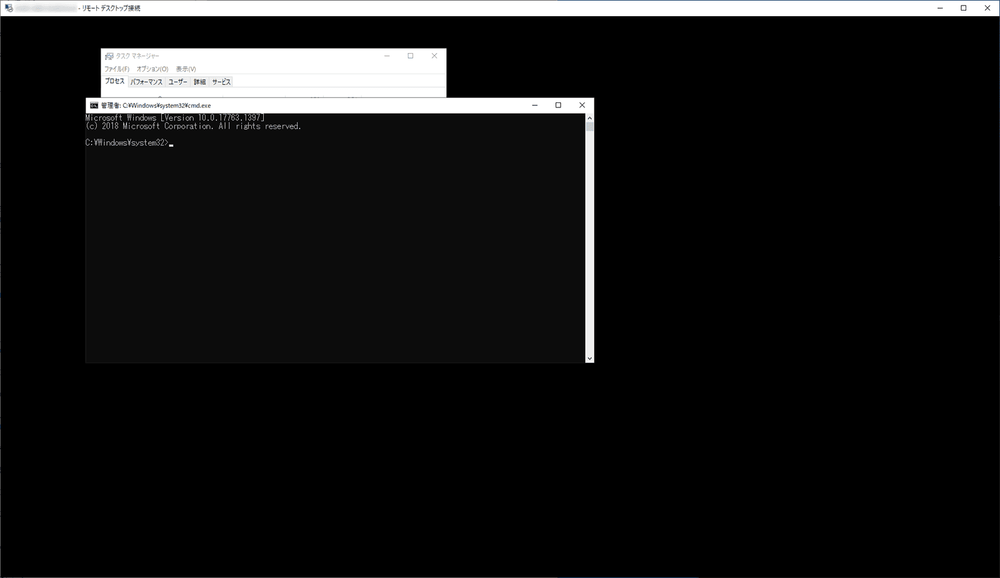
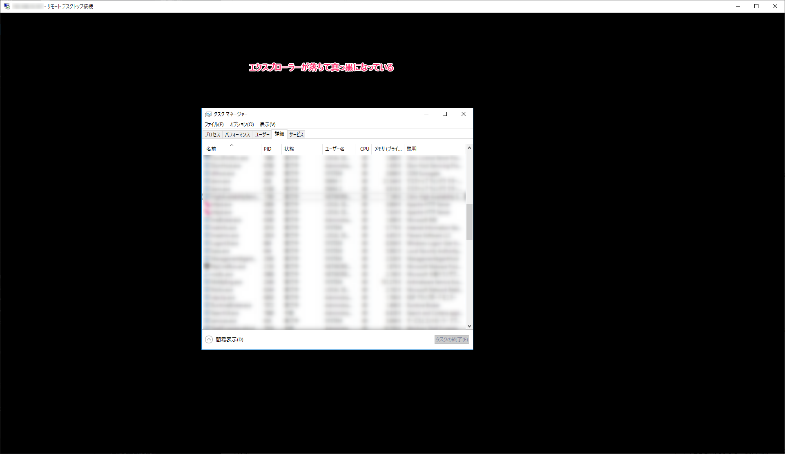
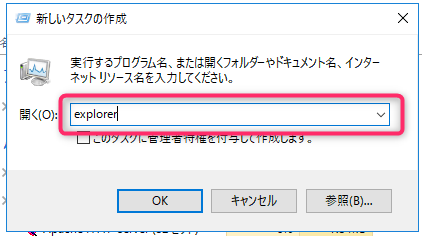
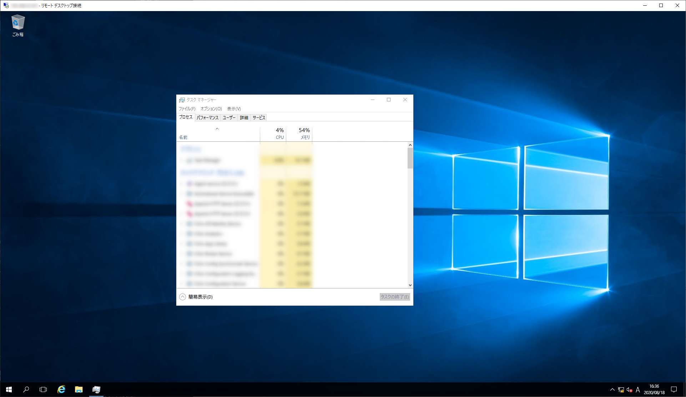

こんにちは、じんないです。

Windows にログオンした際、デスクトップがいつまでも表示されず真っ黒な状態で困っていたのですが、何とかしてコマンドプロンプト (管理者) を起動する方法を見つけたので紹介します。

ログのトレースなどでサーバーが高負荷な状態になっており、再起動しても戻らないといった非常にレアのケースで役に立てるかと思われます(笑)

## 前提条件

- Windows にログオンはできる
- Ctrl + Alt + Del キーが有効である

## コマンドプロンプトの起動方法

Windows にログオンし、`Ctrl + Alt + Del` キーを押下します。(リモートデスクトップ接続の場合は `Ctrl + Alt + End` キー)

タスクマネージャーを起動します。

[詳細] をクリックします。

[ファイル] > [新しいタスクの実行] をクリックします。

開く欄に `cmd.exe` を入力し、[OK] をクリックします。このとき、**`このタスクに管理者特権を付与して作成します。` にチェックを入れると管理者権限でコマンドプロンプトを起動できます**。

こんな感じでコマンドプロンプトが起動します。ここまでくればあとは何とでもなる感があるので安心できますね。

## 【おまけ】エクスプローラーが落ちてしまったときの復旧方法

エクスプローラー (Explorer.exe) が落ちてしまって真っ黒になってしまったときも、同様の方法で復旧することができます。

タスクマネージャーから [ファイル] > [新しいタスクの実行] をクリックし、開く欄に `Explorer` を入力して [OK] をクリックします。

エクスプローラーが復旧し、デスクトップやタスクバーが表示されるようになりました。

どちらかというとこちらの方が遭遇するケースが多いかもしれませんね。

短い記事でしたが、お役に立てれば幸いです。

ではまた。

## 参考

[Server Coreでコマンド・プロンプトを表示させる－ ＠IT](https://www.atmarkit.co.jp/fwin2k/win2ktips/1104corecmd/corecmd.html)