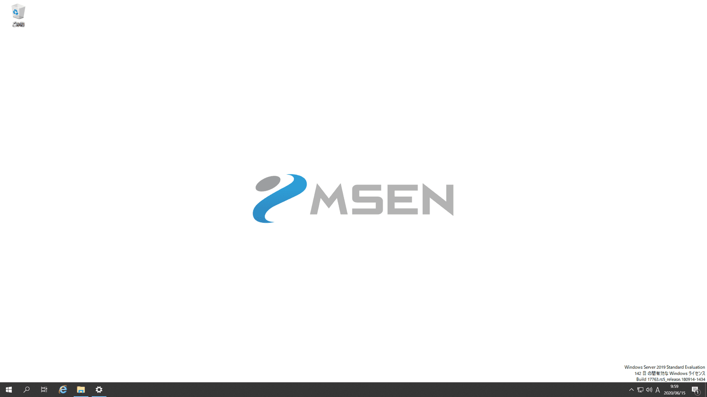

こんにちは、じんないです。

Active Directory 環境において、**クライアント端末の壁紙や背景色などの個人設定 (Windows テーマ) を一括で管理したい**などの要望があると思います。

今回はカスタマイズした個人設定 (Windows テーマ) をグループポリシーから設定する方法を紹介します。

シナリオとして下記のようにロゴを上下中央に配置し、ロゴの周りは同じ背景色 (白) に設定してみます。

## 環境
- Windows Server 2019

Windows 10 でも同じ手順で設定可能かと思います。

## テンプレートとなる Windows テーマを作成する

まずは、テンプレートとなるカスタムテーマを作成します。

適当なクライアント端末にログインし、[設定] > [個人用設定] の順にクリックします。

[背景] > [参照] をクリックし、壁紙を選択します。
**このとき、複数の端末に反映したい場合はユーザーがアクセス可能な共有フォルダーに壁紙を格納しておいてください**。

このままでは超拡大されてしまうので、[調整方法を選ぶ] から [中央に表示] を選択します。

 
ひとまず、壁紙の配置ができました。続いて、周りの背景色が合ってないので調整していきます。

背景色の選択から、お好みの色を選択します。パレットに希望の色がないときは、[カスタム色] を選びます。

色を選択し、[完了] をクリックします。絶妙な色に合わしたい場合は壁紙をペイント等で開き、スポイトでカラーコードを確認して RGB 値を指定するとよいでしょう。

これで、壁紙と同一色となり違和感がなくなりました。

最後にこの設定をエクスポートします。[テーマ] > [テーマの保存] をクリックします。

適当なテーマを名付けて保存します。

保存したテーマは下記に保存されますので、こちらもユーザーがアクセス可能な共有フォルダーに格納しておいてください。

`%USERPROFILE%\AppData\Local\Microsoft\Windows\Themes`

ドメイン環境なら SYSVOL などでいいかもしれません。
また、このテーマをテキストエディターなどで開くとわかりますが、**壁紙のパスが書かれていますのでこれらを変更した場合はテーマを作りなおす必要がある**ので注意してください。

## グループポリシーの設定

グループポリシーの設定方法は割愛しますが、対象のユーザーが格納された OU を対象にグループポリシーオブジェクトを作成し、下記のポリシーを有効化します。

**`[ユーザーの構成] > [ポリシー] > [管理用テンプレート] > [コントロールパネル] > [個人設定]`**

- **特定のテーマを読み込む**
  - テーマファイルへのパス: `\\<ファイルサーバー>\<共有フォルダー>\<テーマファイル>`

これで、任意のユーザーがログオンしたときに、壁紙や背景色などがカスタムされたテーマを適用することができます。

ではまた。