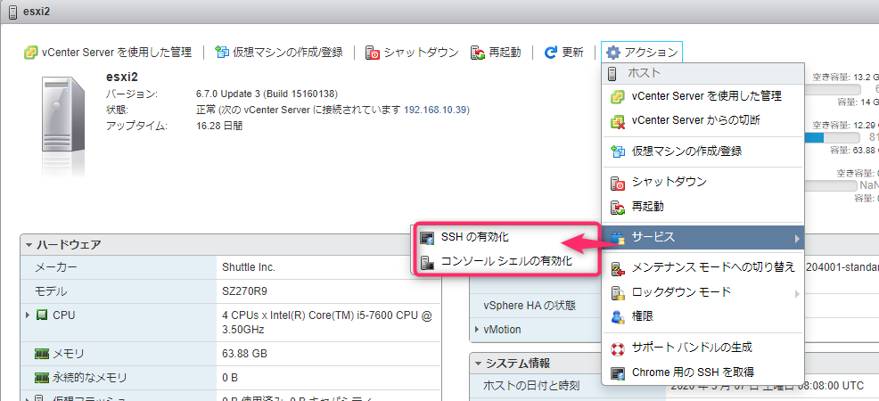

こんにちは、じんないです。

今回は VMware ESXi から SNMP Trap を送信する手順をご紹介します。

## 想定環境
- SNMP エージェント: VMware ESXi 6.7
IP アドレス: 192.168.10.31
- SNMP マネージャー: CentOS 7
IP アドレス: 192.168.10.24
- SNMP コミュニティ名: public

ここで、SNMP Trap を送信する側を SNMP エージェント、SNMP Trap を受信する側を SNMP マネージャーと呼びます。

## 前提

SNMP Trap を受信するために必要なマネージャー側の設定が完了しているものとします。

## ESXi の SNMP Trap 送信設定
### 事前準備
SNMP Trap の設定には ESXi に SSH で接続する必要があります。

VMware Host Client 等から ESXi に接続し、SSH と ESXi シェルのサービスを起動しておきましょう。



サービスが起動したらターミナルソフトから SSH 接続します。なお、 ESXi はチャレンジレスポンス認証です。

### 設定

まずは現状の設定を確認します。デフォルトなのでサービス自体も上がってません。

```
[root@esxi1:~] esxcli system snmp get
   Authentication:
   Communities:
   Enable: false
   Engineid:
   Hwsrc: indications
   Largestorage: true
   Loglevel: info
   Notraps:
   Port: 161
   Privacy:
   Remoteusers:
   Syscontact:
   Syslocation:
   Targets:
   Users:
   V3targets:
```

`esxcli system snmp set -e=true -c=public -t=192.168.10.24@162/public`

-e: enable するかどうか
-c: コミュニティ名
-t: Trap を誰に送るか。`<IP アドレス>@<ポート>/<コミュニティ名>` で指定します

※トラップを送信するだけであれば -c は不要かもしれません。

余談ですが、↑ のコマンドの実行したタイミングで SNMP マネージャーの `/var/log/messages` には下記のログが表示されます。

```
Mar  6 14:39:46 zabbix snmptrapd[22357]: 2020-03-06 14:39:46 192.168.10.31(via UDP: [192.168.10.31]:46703->[192.168.10.24]:162) TRAP, SNMP v1, community public#012#011SNMPv2-MIB::snmpTraps Warm Start Trap (0) Uptime: 0:04:38.00
Mar  6 14:39:47 zabbix snmptt[26030]: .1.3.6.1.6.3.1.1.5.2 Normal "Status Events" 192.168.10.31 - Device reinitialized (warmStart)
Mar  6 14:39:47 zabbix snmptrapd: Agent IP address (192.168.10.31) is the same as the host IP, so copying the host name: 192.168.10.31
```

設定を確認します。

```
[root@esxi1:~] esxcli system snmp get
   Authentication:
   Communities: public
   Enable: true
   Engineid: 00000063000000a100000000
   Hwsrc: indications
   Largestorage: true
   Loglevel: info
   Notraps:
   Port: 161
   Privacy:
   Remoteusers:
   Syscontact:
   Syslocation:
   Targets: 192.168.10.24@162 public
   Users:
   V3targets:
```

テストトラップを送信してみます。

`esxcli system snmp test`

SNMP マネージャーのログを見てみます。

- /var/log/messages
```
Mar  6 14:39:46 zabbix snmptrapd[22357]: 2020-03-06 14:39:46 192.168.10.31(via UDP: [192.168.10.31]:46703->[192.168.10.24]:162) TRAP, SNMP v1, community public#012#011SNMPv2-MIB::snmpTraps Warm Start Trap (0) Uptime: 0:04:38.00
Mar  6 14:39:47 zabbix snmptt[26030]: .1.3.6.1.6.3.1.1.5.2 Normal "Status Events" 192.168.10.31 - Device reinitialized (warmStart)
Mar  6 14:39:47 zabbix snmptrapd: Agent IP address (192.168.10.31) is the same as the host IP, so copying the host name: 192.168.10.31
```

- /var/log/snmptt/snmptt.log ※snmptrapd で受信した Trap を snmptt に飛ばしています
```
2020/03/06 14:39:46 .1.3.6.1.6.3.1.1.5.2 Normal "Status Events" 192.168.10.31 - Device reinitialized (warmStart)
```

正常に受信できていることが確認できました。

## NIC をリンクダウンさせてみる

試しに冗長化されている NIC を抜いてみました。

- /var/log/messages
```
Mar  6 15:13:17 zabbix snmptrapd[22357]: 2020-03-06 15:13:17 192.168.10.31(via UDP: [192.168.10.31]:30377->[192.168.10.24]:162) TRAP, SNMP v1, community public#012#011SNMPv2-MIB::snmpTraps Link Down Trap (0) Uptime: 0:11:07.00#012#011IF-MIB::ifIndex.3 = INTEGER: 3#011IF-MIB::ifAdminStatus.3 = INTEGER: up(1)#011IF-MIB::ifOperStatus.3 = INTEGER: down(2)#011SNMPv2-SMI::mib-2.47.1.1.1.1.2.1 = STRING: "Shuttle Inc. SZ270R9"
Mar  6 15:13:17 zabbix snmptt[26789]: .1.3.6.1.6.3.1.1.5.3 Normal "Status Events" 192.168.10.31 - Link down on interface 3.  Admin state: up.  Operational state: down
Mar  6 15:13:17 zabbix snmptrapd: Agent IP address (192.168.10.31) is the same as the host IP, so copying the host name: 192.168.10.31
```

- /var/log/snmptt/snmptt.log
```
2020/03/06 15:13:17 .1.3.6.1.6.3.1.1.5.3 Normal "Status Events" 192.168.10.31 - Link down on interface 3.  Admin state: up.  Operational state: down
```

元に戻してみました

- /var/log/messages
```
Mar  6 15:19:13 zabbix snmptrapd[22357]: 2020-03-06 15:19:13 192.168.10.31(via UDP: [192.168.10.31]:30377->[192.168.10.24]:162) TRAP, SNMP v1, community public#012#011SNMPv2-MIB::snmpTraps Link Up Trap (0) Uptime: 0:17:03.00#012#011IF-MIB::ifIndex.3 = INTEGER: 3#011IF-MIB::ifAdminStatus.3 = INTEGER: up(1)#011IF-MIB::ifOperStatus.3 = INTEGER: up(1)#011SNMPv2-SMI::mib-2.47.1.1.1.1.2.1 = STRING: "Shuttle Inc. SZ270R9"
Mar  6 15:19:13 zabbix snmptt[26940]: .1.3.6.1.6.3.1.1.5.4 Normal "Status Events" 192.168.10.31 - Link up on interface 3.  Admin state: up.  Operational state: up
Mar  6 15:19:13 zabbix snmptrapd: Agent IP address (192.168.10.31) is the same as the host IP, so copying the host name: 192.168.10.31
```

- /var/log/snmptt/snmptt.log
```
2020/03/06 15:19:13 .1.3.6.1.6.3.1.1.5.4 Normal "Status Events" 192.168.10.31 - Link up on interface 3.  Admin state: up.  Operational state: up
```

あとはこのあたりのログを Zabbix などの監視ソフトウェア等で拾ってあげれば障害監視ができるのではないでしょうか。

ではまた。