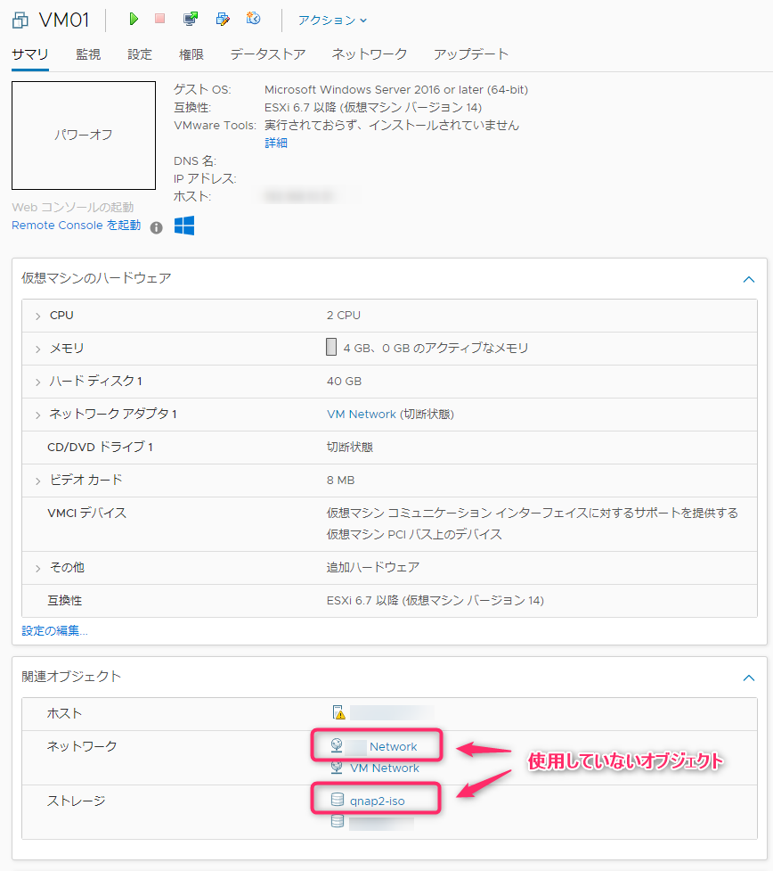
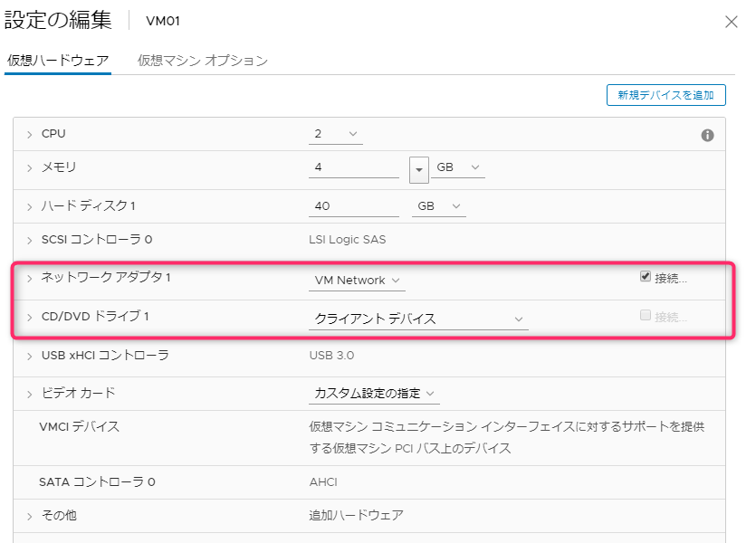
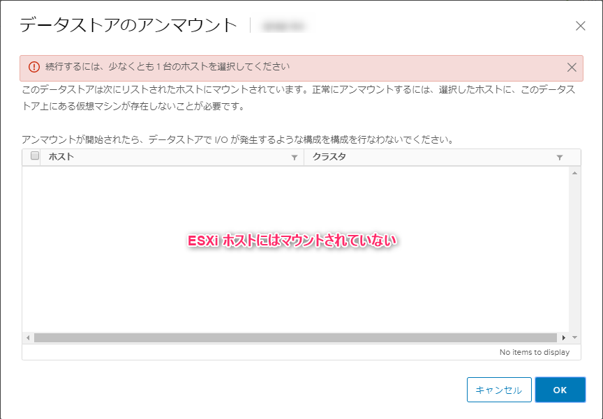
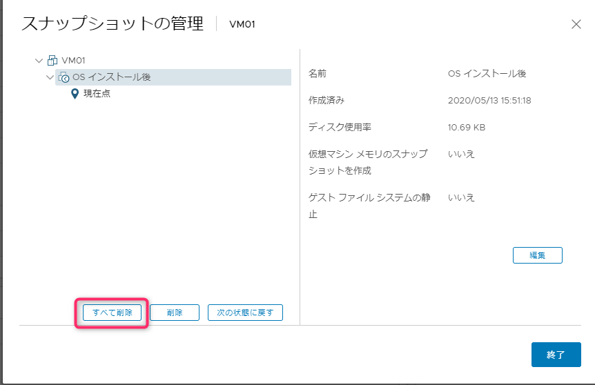
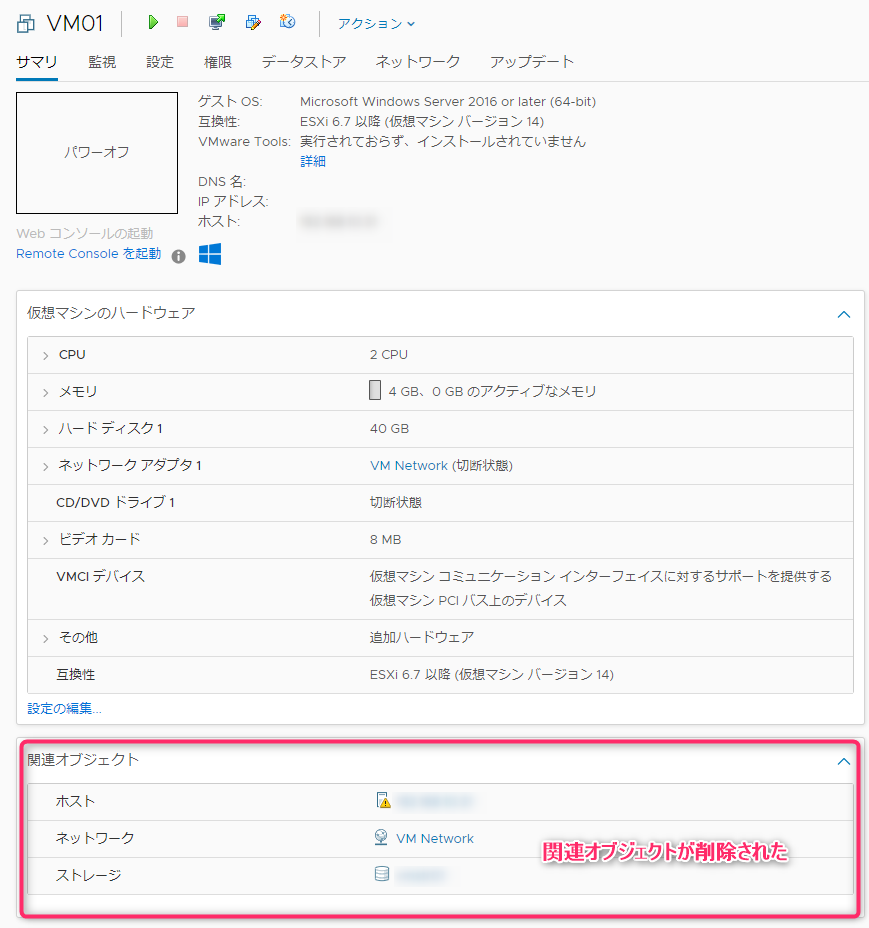

こんにちはじんないです。

VMware の仮想マシンで**使用していないストレージやネットワークが関連オブジェクトとして表示**されており、どうにもこうにも消えないので原因と対処方法を確認しました。

## 環境

- VMware vSphere 6.7

## 現象

vSphere Client から仮想マシンのサマリを参照すると、仮想マシンの詳細を確認することができます。

関連オブジェクトに接続しているストレージやネットワークなどが表示されるのですが、**過去に接続していて現在は接続していないものまで表示されることがあります**。

一部マスクしていますが、今回の例では `hogehoge Network` (ネットワーク)や `qnap2-iso` (ストレージ)が現在接続していないオブジェクトです。

仮想マシンの設定を表示させても接続されていないことがわかります。

※ `hogehoge Network` はネットワークアダプター1に、`qnap2-iso` はCD/DVDドライブ1 にそれぞれ接続していました。

### 関連オブジェクトが消えないことの問題点

接続していない関連オブジェクトが表示されていることで、仮想マシンに影響を及ぼすことはありませんが、関連オブジェクトの情報を握っているためストレージのリプレイスなどを行ったときに**古いストレージをデータセンターからアンマウントできないといった問題が発生**します。

※ ESXi ホストからはアンマウントすることができます。

運用上大きな問題ではないですが、使用していないストレージの情報がいつまでも残っているのは気持ち悪いですし、同じ名前でデータストアをマウントすることができなくなります。

## 原因はスナップショット

**現在は接続していない関連オブジェクトが表示される原因はスナップショット**にありました。

スナップショットではその時点での静止点を保存しておくことができ、作業前の簡易的なバックアップのように使用する方も多いと思います。

**このスナップショットでは仮想マシンのハードウェア構成も保存できるため、その時のハードウェア構成が関連オブジェクトに表示される仕様のようです。**

当該仮想マシンでは OS のインストール後にスナップショットを取得しており、その時に `hogehoge Network` や `qnap2-iso` を接続していた経緯があります。

不要なスナップショットを削除することでこの問題を解消することができます。

スナップショットの管理から、スナップショットを削除します。
※ **対象の関連オブジェクトが含まれるスナップショットを削除しなければ解消しないので注意**しましょう。

再度、仮想マシンのサマリを参照すると、関連オブジェクトが削除されていることがわかります。

## あとがき
ずいぶんと長い間悩んでましたが、解消する方法が分かってよかったです。

スナップショットは非常に便利なのですが、消し忘れてしまうことが多々あります。

そしてこの溜まりにたまったスナップショットのおかげで、仮想マシンのディスク統合ができず起動しなくなったという苦い思い出もありますのでなるべく不要になった時点で消すようにしましょう。

とは言っても「いつか戻すかも・・・」で置いておくことがほとんどで困ったものです。

ではまた。

## 参考

[仮想マシンの移行後にデータストアをアンマウントできない (2019728)](https://kb.vmware.com/s/article/2019728?lang=ja)