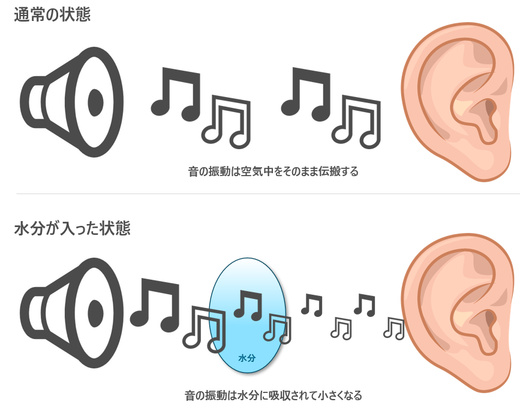
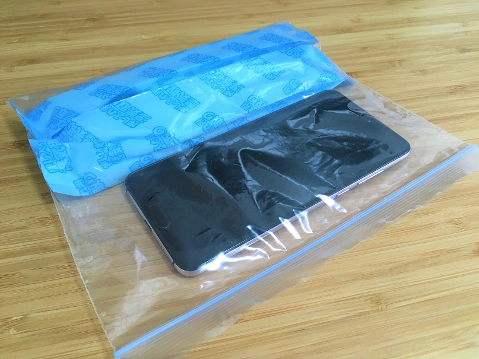
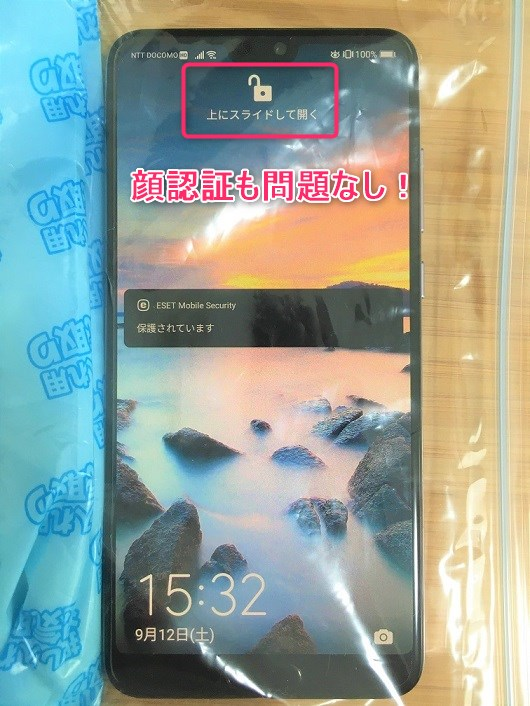

こんにちは、じんないです。

スマートフォン (以下、スマホ) や携帯電話が水に濡れたあと、電話の音が小さかったり聞こえなかったりすることはありませんか?!

**「突然の雨でスマホが濡れてしまった!!」「レジャーをしていて水がかぶってしまった!!」「油汚れがひどかったのでジョ○で洗った!!」**など、色んなケースがあると思います。

「防水のはずなのになんで?!」「壊れたの?!」 って思ってしまいがちですが、**スマホの防水性能に関わらず起こり得る現象**です。

そんなときに、復活させる方法をご紹介します。簡単ですので是非やってみてください。

## 犯人はスピーカーに付着した水分

主な原因は**スピーカーに付着した水分**です。

電話の相手が喋った声は電気信号としてスピーカーに伝わってスピーカーを振動させます。その振動が空気中を伝搬し、鼓膜が振動することで人間は音(声)として認識することができます。

通常の状態であれば、スピーカーの振動が空気を振動させますが、間に水の層が加わることでその振動が吸収されて小さくなってしまい、十分に振動を伝えることができません。

プールや海で耳に水が入ると音が聞こえづらくなる現象と同じイメージです。

これを解消するにはスピーカーに付着した水分を乾かしてあげればよいです。

## 復活させる方法

水分を乾かす手段としては「風を当てる」「ドライヤーで乾かす」「放置」など色々あると思いますが、**おすすめしたい方法は「乾燥剤と一緒に袋に入れて一晩放置!!」**です。

ドライヤーなどで熱を加えるとスマートフォン本体が破損したり、強い風を当てることで機器の内部まで水が入る可能性もあり、かえって大事になりかねません。

乾燥材を使う方法は寝ている間に復活させることができるので、簡単でかつ安全な方法です。

準備するものは下記のとおりです。

- **乾燥剤**
- **ジッパー袋**

乾燥剤はクローゼットなどの湿気取りでいいです。100円ショップにも売ってますし、なければ海苔やお菓子に入っている乾燥剤（使える場合は）を使ってもいいでしょう。

方法は簡単、**密閉できるジッパー袋にスマホと乾燥剤を入れて寝るだけ**です!!

透明な袋であれば**顔認証もできますし、タッチ操作もできる**ので普段通りスマホを使うこともできます。ただし袋に穴が開いては意味がないで一晩くらいは触らず我慢しましょう笑

試してはいませんが、ワイヤレス充電もできると思います。

私は翌朝には直っていました!!

今まで何とも思ってませんでしたが、電話が聞こえるというのは実に幸せなことなんだと実感しました。笑

## それでも直らない場合

乾燥剤でも直らない場合は、**データのバックアップを取得したあと**お近くのケータイショップや修理業者に修理を依頼しましょう。

下手に自分で分解したりすると保証が受けられないばかりか故障する可能性もあるので注意です。