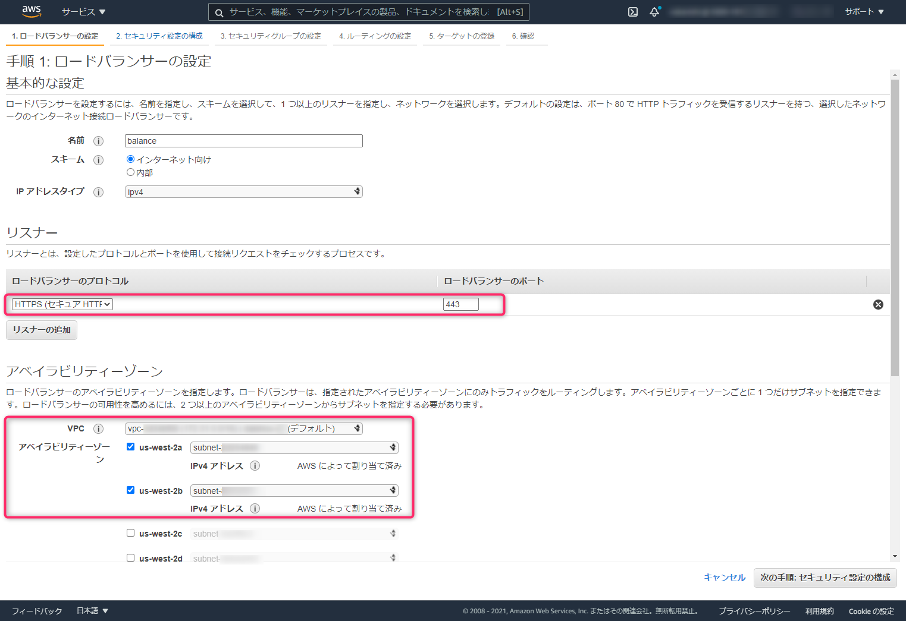

こんにちは、じんないです。

今回は **EC2 インスタンス上に構築した Web サーバーへのアクセスを [Application Load Balancer](https://aws.amazon.com/jp/elasticloadbalancing/application-load-balancer/) 経由でアクセスする方法**をご紹介します。

Application Load Balancer は [Elastic Load Balancing](https://aws.amazon.com/jp/elasticloadbalancing/?whats-new-cards-elb.sort-by=item.additionalFields.postDateTime&whats-new-cards-elb.sort-order=desc) の中でも HTTP トラフィックおよび HTTPS トラフィックを負荷分散する際に使われるロードバランサーです。OSI 基本参照モデルの L7 に位置し、SSL サーバー証明書を設定することで SSL オフロード (SSL 終端) することができます。

ご紹介する例では Web サーバーとして Nginx を使用していますが、Apache 等でも問題ありません。

## 想定環境


- クライアントから **https://balance.msen.jp** でアクセスしたときに、ロードバランサー (Application Load Balancer) を経由して Web サーバーの画面を表示させるようにします。
- ロードバランサーに SSL サーバー証明書を設定し、**クライアントとロードバランサー間の通信は HTTPS** で、**ロードバランサーと Web サーバー間の通信は HTTP** で行えるように設定します。
- SSL サーバー証明書は [AWS Certificate Manager](https://aws.amazon.com/jp/certificate-manager/) で発行したものを使用します。AWS Certificate Manager で発行する証明書は無料で使用することができます。
- Web サーバーはロードバランサーからのみ HTTP アクセスを許可し、それ以外の通信を拒否するようセキュリティグループを設定します。
- DNS 設定では [Amazon Route 53](https://aws.amazon.com/jp/route53/) は使用せず、自身が管理するドメインの権威 DNS サーバーを設定します。
- 本記事ではスケーリングについては触れていません。 

## 前提条件

- 自身の管理するドメインの権威 DNS サーバーに CNAME を設定しますので、それらにアクセスできる権限が必要です。
- ロードバランサーや EC2 インスタンスなどを含め使用するリソースはすべて同一の VPC 内に存在していることを前提としています。

## EC2 Web サーバーの用意

EC2 インスタンスを起動し、Amazon Linux 2 に Nginx をインストールします。今回の例では Nginx を使用しますが、web サーバーであれば Apache などでも問題ありません。

Amazon Linux 2 では amazon-linux-extras から `nginx1` というパッケージが提供されていますのでこれをインストールします。

```shell
# nginx のインストール
sudo amazon-linux-extras install nginx1

# nginx の起動と自動起動の有効化
sudo systemctl start nginx
sudo systemctl enable nginx
```

EC2 インスタンスに Elastic IP アドレスを割り当て、ブラウザから `http://<Elastic IP>` でアクセスしまずはダイレクトに Web サーバーにアクセスできることを確認しておきます。この時 EC2 インスタンスに割り当てているセキュリティグループの設定で HTTP のアクセス元の制限を自身のグローバル IP アドレスなどに制限しておくとよいでしょう。Nginx では下記の初期画面が表示されます。


確認が終わったら Elastic IP アドレスは不要になりますので解放して問題ありません。

## SSL サーバー証明書の準備

SSL サーバー証明書は AWS Certificate Manger から発行します。例として `balance.msen.jp` 用の証明書を発行します。


パブリック証明書を選択し、リクエストします。


ドメイン名を入力し、次へをクリックします。例ではここで `balance.msen.jp` を入力します。


msen.jp のドメインを所有しているかどうか検証が行われます。今回は DNS の検証を選択します。


タグはわかりやすいように任意の名前を付けておきましょう。


内容を確認し、リクエストします。


リクエストしているドメインが本当に自身が管理するものなのかの検証が行われます。検証用の CNAME レコードが発行されますのでドメインの権威 DNS サーバーにこの CNAME を追加します。


しばらく経過すると状況が **`検証保留中`** から **`発行済み`** に変わります。5分もかからなかったと思います。これで SSL 証明書の準備が完了しました。


## Application Load Balancer の構成

EC2 のダッシュボードからロードバランサーを作成します。ロードバランサーのタイプは色々ありますが、今回は HTTPS トラフィックをバランスしたいので **Application Load Balancer** を作成します。


ロードバランサーの名前は任意のものを設定おきましょう。リスナーの設定では HTTPS (443) を待ち受けるように追加します。アベイラビリティゾーンのチェックは最低2つ以上必要です。



タグは適当に Name タグなどを追加して次の手順に進みます。


ロードバランサーに割り当てる証明書を設定します。**ACM から選択する** にチェックを入れ、前項で作成した証明書を選択し次の手順に進みます。


ロードバランサーに割り当てるセキュリティグループを設定します。せっかくなのでロードバランサー専用のセキュリティグループを新規作成しておきましょう。ここで大事なことは **HTTPS (443) のみを許可し**、**EC2 インスタンスに割り当てるセキュリティグループと分ける** ことです。
また、アクセス元を自身のグローバル IP アドレスなどに制限しておくとセキュリティ観点からもよいでしょう。


## DNS レコードの登録

Application Load Balancer の構成が終わると、ロードバランサーの DNS レコード (A レコード) が発行されます。`balance.msen.jp` にアクセスしたときに、このロードバランサーの A レコードを参照するように CNAME を設定する必要があります。


自身の管理するドメインの権威 DNS サーバーに CNAME を追加し、正常に名前解決ができれば OK です。アベイラビリティゾーンを2つ以上設定しているため、ロードバランサーの IP アドレスがアベイラビリティゾーンの数だけ返ってきます。


## EC2 インスタンスのセキュリティグループ設定

最後に EC2 インスタンスのセキュリティグループを設定します。今回の例では **ロードバランサーからのみ HTTP リクエストを受けるようにしたい** ので、セキュリティグループのソースに **ロードバランサーに割り当てたセキュリティグループを指定** します。


以上ですべての設定が終わりましたのでクライアントから `https://balance.msen.jp` にアクセスします。Nginx のデフォルトページが表示されれば成功です。


### 504 Gateway Time-out になる場合

> ロードバランサーまではつながるんだけども、504 Gateway Time-out になってしまう。

そんな場合は、ロードバランサーから EC2 インスタンスへの HTTP アクセスができていない可能性があります。先に記載したセキュリティグループの設定を確認してみてください。


それではこの辺で。

## 参考

- [AWSの無料SSL証明書サービス”Certificate Manager”をELBに設定して『https』になるか確認してみる | DevelopersIO](https://dev.classmethod.jp/articles/specification-elb-setting/)
- [AWS Application Load Balancer の SSL（HTTPSリスナー）設定メモ | あぱーブログ](https://blog.apar.jp/web/6645/)
- [EC2へのアクセスをALBからのみに制限する方法 - ブロックチェーンエンジニアとして生きる](https://tomokazu-kozuma.com/how-to-restrict-access-to-ec-2-only-from-alb/)