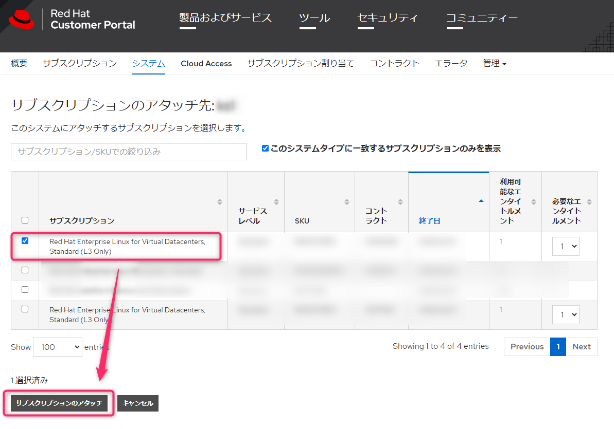

こんにちは、じんないです。

[Red Hat Enterprise Linux](https://www.redhat.com/en/technologies/linux-platforms/enterprise-linux) はサポート付きの Linux OS ディストリビューションです。オンラインのリポジトリからパッケージをインストールするにはサブスクリプション登録(ライセンス認証)する必要があります。

ライセンス形態はいくつかあり、2物理 CPU または2ゲスト OS で利用可能な Server ライセンスのほか、**ゲスト OS がいくつでも作成できる無制限ゲスト OS ライセンス**というものがあります。

無制限ゲスト OS ライセンスは以下のような種類があり、ハイパーバイザの種類に応じて適当なライセンスを選択します。

- Red Hat Enterprise Linux for Virtual Datacenters （無制限ゲスト OS のみ)
- Red Hat Enterprise Linux OpenStack Platform (OpenStack 環境と無制限ゲスト OS)
- Red Hat Enterprise Linux with Smart Virtualization (RHEV 仮想化環境と無制限ゲスト OS)

今回は、仮想化環境に VMware vSphere を使用しますので、`Red Hat Enterprise Linux for Virtual Datacenters（無制限ゲスト OS のみ)` を使った例を紹介します。

## virt-who が必要な理由

無制限ゲスト OS ライセンスを使用する場合は、サブスクリプション管理用の virt-who と呼ばれるデーモンをシステム内で構成する必要があります。

通常、サブスクリプション登録したサーバーは Red Hat 社のサーバーと通信しサブスクリプションの利用状況を管理されますが、**どのハイパーバイザ上で動いているか** まではわかりません。

それを vCenter Server や ESXi と通信し、**どのハイパーバイザ上でどのゲスト OS が動いているか**の対応関係を管理するのが virt-who の役割です。いわゆるライセンス管理サーバーとも言えるでしょう。

ちなみに、Server ライセンスを購入される場合は virt-who の導入は不要です。

具体的には下記のような流れになります。

1. virt-who の構成
1. ハイパーバイザのサブスクリプション登録
1. ゲスト OS のサブスクリプション登録

## 環境

- 仮想化環境: VMware vSphere 6.7u3 (2台)
- 仮想化管理: VMware vCenter Server for Windows 6.7u3
- ゲストOS: Red Hat Enterprise Linux 8.2

今回の例では、virt-who で vCenter Server を参照するように設定します。

vCenter Server 環境ではデータセンター内に1つの仮想マシンで virt-who を構成すれば OK です。

vCenter Server 環境でない場合は、ハイパーバイザ (ESXi) 毎に virt-who を構成する必要があります。

## 事前準備

このあと、仮想マシンに virt-who をインストールしますが、何らかのサブスクリプションを登録していないとインストールができません。

評価用ライセンスまたは、このあと使用する無制限ゲスト OS ライセンスを一時的に割り当てておきましょう。

評価用ライセンスの場合は、無制限ゲスト OS ライセンスと同じ Red Hat カスタマーポータルアカウントでないといけませんので注意してください。

## virt-who デーモンの導入

データセンター内で稼働する任意の仮想マシンに virt-who をインストールします。

`dnf install virt-who`

組織名、組織 ID の確認します。

`subscription-manager identity`

```
[root@jinna-i ~]# subscription-manager identity
システム ID: 143rqqp31-9845-1345-base-039563eXXdek
名前: jinna-i
組織名: 12345678
組織 ID: 12345678
```

`virt-who-password` コマンドを使って vCenter Server 接続パスワードを暗号化します。

```
[root@jinna-i ~]# virt-who-password
Password:　★vCenter 接続パスワードを入力
Use following as value for encrypted_password key in the configuration file:
016185b866er4f572ce6981fasfdsae6e925　★暗号化されたパスワード
```

設定ファイルは `/etc/virt-who.d/` 配下に配置します。

`/etc/virt-who.d/template.conf` にテンプレートファイルがあるので、これをコピーして使います。

```
[root@jinna-i ~]# cp -p /etc/virt-who.d/template.conf /etc/virt-who.d/jinna-i.conf
[root@jinna-i ~]# vi /etc/virt-who.d/jinna-i.conf
[vmware]
type=esx
server=192.168.1.1
username=vsphere.local\administrator
#password=
encrypted_password=016185b866er4f572ce6981fasfdsae6e925
env=Library
owner=12345678
hypervisor_id=hostname
```

- server: vCenter Server IP アドレス
- username: vCenter Server 接続用ユーザー名
- encrypted_password: vCenter Server 接続用パスワード
- owner: 組織 ID

その他のパラメータは上記のもので問題ありません。

virt-who がサブスクリプション管理ホストと通信できるように `/etc/sysconfig/virt-who` に `VIRTWHO_SAM=1` を追加します。

```
[root@jinna-i ~]# vi /etc/sysconfig/virt-who
# Environmental variables for virt-who service can be specified here.
#
# These environmental variables are only used when starting virt-who as service,
# otherwise you must specify them manually.
#
# Note that if some value contains special character, it must be escaped
# or the value must be quoted - for example ampersand in the password or
# backslash separating domain and username in username field.

# Enable debugging output.
VIRTWHO_DEBUG=0

# Send the list of guest IDs and exit immediately.
#VIRTWHO_ONE_SHOT=0

# Acquire list of virtual guest each N seconds, only sends if changes detected
# 0 means default configuration.
#VIRTWHO_INTERVAL=0

VIRTWHO_SAM=1　★追加
```

virt-who サービスを起動し自動起動を有効化しておきます。

`systemctl start virt-who.service`

`systemctl enable virt-who.service`

これで virt-who の導入は完了です。

## ハイパーバイザのサブスクリプション登録

**ハイパーバイザのサブスクリプション登録は Red Hat カスタマーポータルから**行います。

前項の virt-who の設定が完了したタイミングで、ハイパーバイザが登録されていることを確認できます。このハイパーバイザにサブスクリプションを割り当てます。

<a href="images/activate-red-hat-using-the-virt-who-daemon-1.png"></a>

ハイパーバイザを選択し、[サブスクリプション] > [サブスクリプションのアタッチ] をクリックします。

<a href="images/activate-red-hat-using-the-virt-who-daemon-2.png"></a>

無制限ゲスト OS ライセンスを選択し、[サブスクリプションのアタッチ] をクリックします。

<a href="images/activate-red-hat-using-the-virt-who-daemon-3.png"></a>

もう一度、サブスクリプションを確認すると正常に割り当てられていることを確認できます。ほかにもハイパーバイザが存在する場合は同様手順でサブスクリプションを割り当てます。

<a href="images/activate-red-hat-using-the-virt-who-daemon-4.png"></a>


## ゲスト OS のサブスクリプション登録

ハイパーバイザにサブスクリプション登録ができたら、ゲスト OS にもサブスクリプションを割り当てます。

先ほど仮で何らかのサブスクリプションを割り当てた場合は、削除しておきましょう。

`subscription-manager remove --all`

ゲスト OS のシステム情報を登録します。登録済みの場合は下記のようになります。

```
[root@jinna-i ~]# subscription-manager register
このシステムはすでに登録されています。上書きするには --force を使用します
```

利用可能なエンタイトルメントプールを確認します。無制限ゲスト OS ライセンスが表示されるはずです。


```
[root@jinna-i ~]# subscription-manager list --available
サブスクリプション名:     Red Hat Enterprise Linux for Virtual Datacenters, Standard　★無制限ゲスト OS ライセンスであること
提供:                     Oracle Java (for RHEL Server)
                          Red Hat Software Collections (for RHEL Server)
                          Red Hat CodeReady Linux Builder for x86_64
                          Red Hat Ansible Engine
                          Red Hat Enterprise Linux Atomic Host Beta
                          Red Hat Enterprise Linux Atomic Host
                          Red Hat Developer Tools (for RHEL Server)
                          Red Hat Beta
                          Red Hat Software Collections Beta (for RHEL Server)
                          Red Hat Enterprise Linux Server
                          Red Hat Developer Tools Beta (for RHEL Server)
                          Red Hat Enterprise Linux for x86_64
                          Red Hat Developer Toolset (for RHEL Server)
                          dotNET on RHEL (for RHEL Server)
SKU:                      RH00000
契約:                     12345678
プール ID:                <pool ID> ★これを確認
管理の提供:               はい
数量:                     無制限
推奨:                     1
サービスタイプ:           L1-L3
ロール:                   Red Hat Enterprise Linux Server
サービスレベル:           Standard
使用方法:                 Production
アドオン:
サブスクリプションタイプ: Standard
開始:                     2000年01月27日
終了:                     2100年01月27日
エンタイトルメントタイプ: 仮想
```

無制限ゲスト OS ライセンスのプール ID を指定し、サブスクリプションをアタッチします。
このとき、**ハイパーバイザごとにプール ID が異なる** ので注意しましょう。

`subscription-manager attach --pool=<pool ID>`

<a href="images/activate-red-hat-using-the-virt-who-daemon-5.png"></a>

`subscription-manager status` を実行し、**システムの目的の状態が一致**していれば OK です。 

<a href="images/activate-red-hat-using-the-virt-who-daemon-6.png"></a>

すべてのゲストで以上の手順を繰り返します。

## 参考

- [RHEL サブスクリプション (2013 パッケージ) の使用: シナリオ 5 仮想データセンター - Red Hat Customer Portal](https://access.redhat.com/ja/articles/1435793)
- [仮想インスタンスガイド Red Hat サブスクリプション管理 1 | Red Hat Customer Portal](https://access.redhat.com/documentation/ja-jp/red_hat_subscription_management/1/html-single/virtual_instances_guide/index)
- [Red Hat Enterprise Linuxを仮想化環境で動作させる時の注意点 | Red Hat Portal](https://redhat.sios.jp/red-hat-enterprise-linux/red-hat-enterprise-linux_vm/)