こんにちは、じんないです。

[2021/1/25 に ESET File Security for Linux v7 がリリース](https://eset-support.canon-its.jp/faq/show/17836?site_domain=business)され、**Red Hat Enterprise Linux 8.x 系/ CentOS 8.x 系に対応**しました。

以前のバージョン (v4.5 系) から変わってそうなので、インストール手順などをまとめておきます。

## 環境

- ESET File Security for Linux 7.2.574.0
- Red Hat Enterprise Linux 8.1 (最小構成)

## インストール手順

ESET Endpoint Protection Standard ユーザーズサイトからインストールプログラムをダウンロードします。

また、**インストールの際に `kernel-devel` と `kernel-headers` が必要**だったので、入ってないかたはパッケージをインストールしておきましょう。

`/tmp` などにインストールプログラムを配置し実行します。使用許諾契約書に `y` で応答しインストールを継続します。

```shell
# インストールプログラムの展開
[root@jinna-i ~]# ls /tmp/efs.x86_64.bin
/tmp/efs.x86_64.bin

[root@jinna-i ~]# sh /tmp/efs.x86_64.bin
This is an ESET File Security distribution script. Press Enter to show the Licence...
(press q after you have read the License to continue extraction)
：略
Privacy Policy:
http://help.eset.com/getHelp?product=efsu&version=72&lang=1033&topic=privacy_policy

Do you accept this End User License Agreement and acknowledge Privacy Policy? (y/n) y
```

インストールが完了すると最後に Web インタフェースへのアクセス情報が出力されるのでメモっておきましょう。

```shell
完了しました!
GUIが有効です。
URL: https://jinna-i:9443
ユーザー名: Administrator
パスワード: [password]
To upgrade ESET File Security to newer version, use:
        dnf upgrade ./efs-7.2.574.0.x86_64.rpm
To uninstall ESET File Security, use:
        dnf remove efs

```

## アクティベーション

アクティベーションの方法はいくつかあるようですが、今回は **製品認証キーでアクティベーション** します。

[ESET File Security for Linuxのアクティベーション | ESET File Security for Linux | ESETオンラインヘルプ](https://help.eset.com/efs/7/ja-JP/?activate_productname.html)

製品認証キーはESET Endpoint Protection Standard ユーザーズサイトに記載されています。

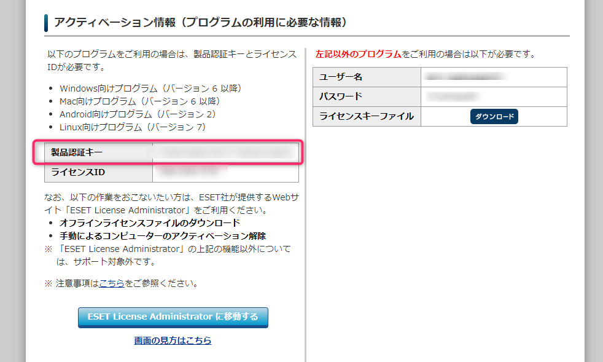

インターネットにアクセスできる環境であれば、下記のコマンドを実行するとアクティベーションされます。

```shell
# 製品のアクティベーション
[root@jinna-i ~]# /opt/eset/efs/sbin/lic -k [製品認証キー]
アクティベーションは正常に実行されました。
```

[ESET License Administrator](https://ela.eset.com/) から、アクティベーションされたことを確認できました。

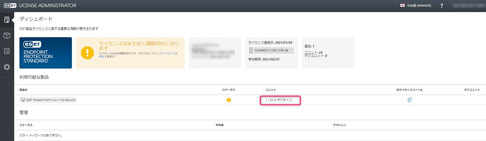


## Web コンソールへのアクセス
### ポート開放

お約束ですが、filewalld が有効になっている環境では使用ポートの解放が必要です。デフォルトでは `9443` ポートを使用していますので、これを解放します。

```shell
[root@jinna-i ~]# firewall-cmd --add-port=9443/tcp --permanent
success
[root@jinna-i ~]# firewall-cmd --reload
success
```

### Web コンソールへログイン

Web ブラウザから `https://jinna-i:9443` にアクセスします。

おぉー、なんかかっこいいですね。先ほどメモったアクセス情報でログインします。

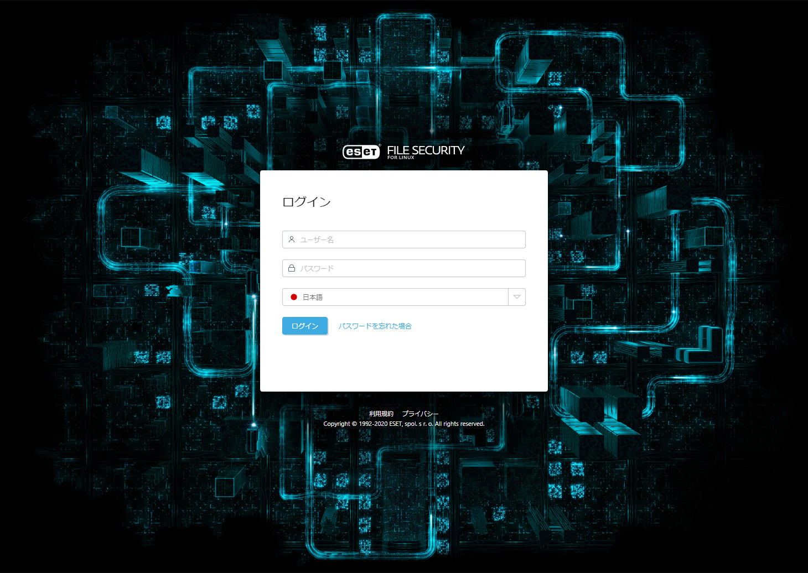

ログイン後の画面

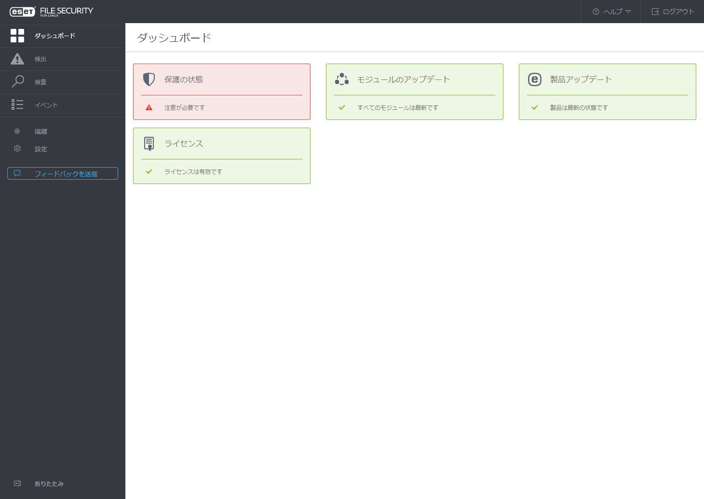


### Secure Boot は無効に

イベントログに何やらでているので確認します。

> Secure Boot はサポートされていません。BIOS/UEFI で無効にしてください。

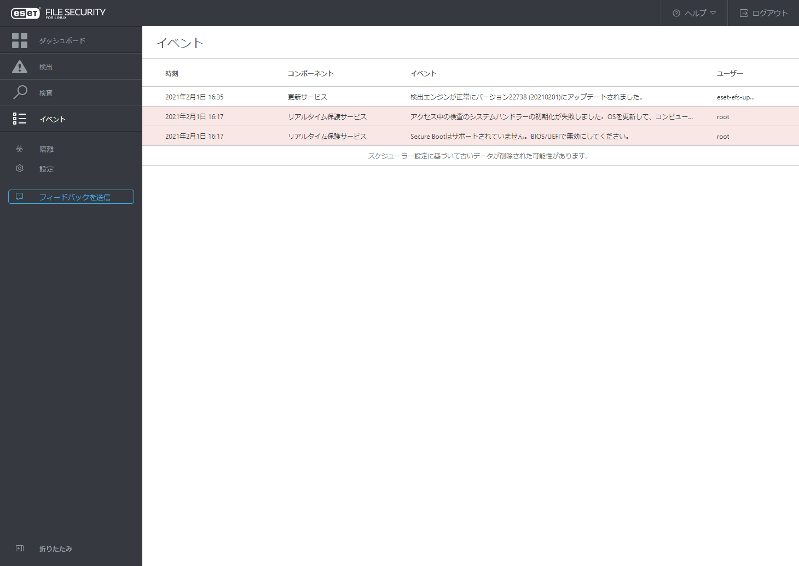

今回は VMware vSphere 環境でしたので、仮想マシンの設定から Secure Boot を無効化し再起動します。
※仮想マシンを停止した状態で設定を変更します。

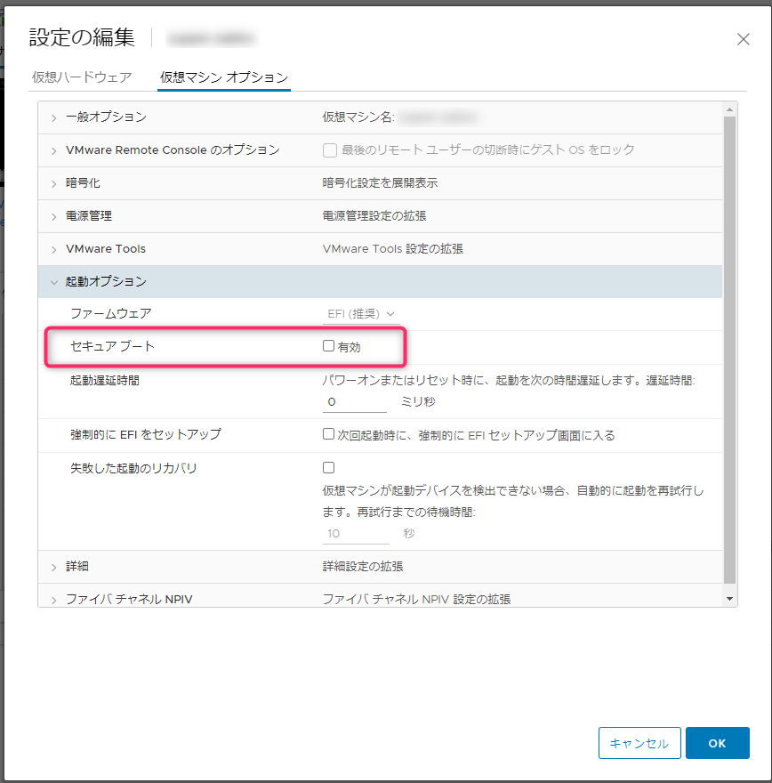

再度ログインするとエラー表示が消えました。

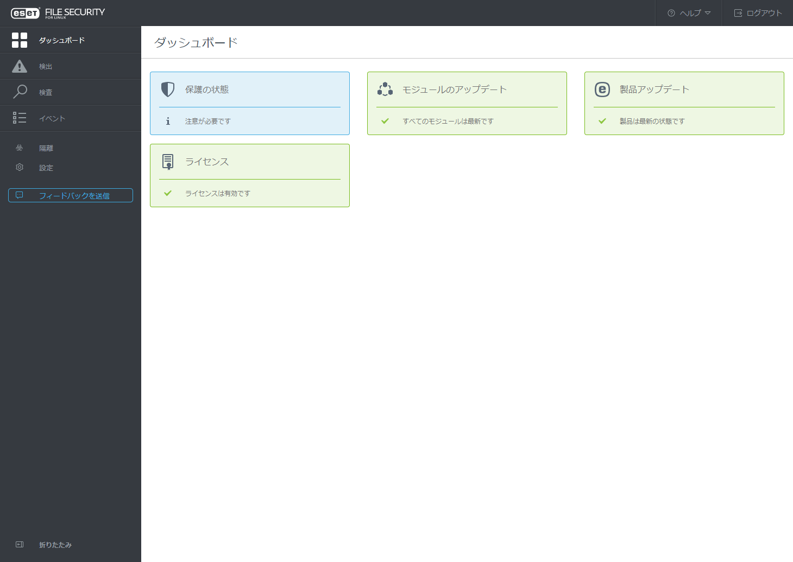

## リアルタイム保護のテスト

[Eicar – EUROPEAN EXPERT GROUP FOR IT-SECURITY](https://www.eicar.org/) からテスト用のウイルスをダウンロードし、リアルタイム保護の動作を確認します。

`wget http://www.eicar.org/download/eicar.com.txt`

ダウンロードされた瞬間に削除されました。

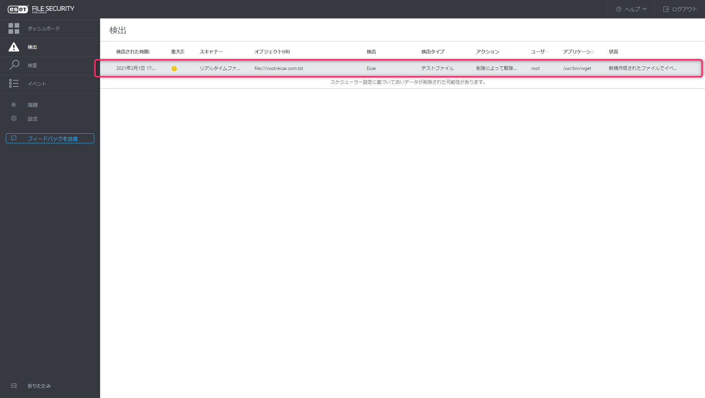

## v7 からウイルス検知時のメール通報機能が廃止

[ESET File Security for Linux の変更点（V4.5.15.0 → V7. | ESETサポート情報 | 法人向けサーバー ・ クライアント用製品 | キヤノンITソリューションズ](https://eset-support.canon-its.jp/faq/show/17836?site_domain=business)

> ウイルス検出時にメールで通知する機能が廃止されました。

v7 からウイルス検知時のメール通報機能が廃止されたらしいのですが、じゃあどうやってアラートを確認するのかといった情報の記載がなく・・・

設定メニューにもそれらしい項目が見当たりませんでした。 <s>ESETサポートに問い合わせ中ですので、なにか分かればまた追記します。</s>

### **【2021/07/29更新】**

回答を更新するのをすっかり忘れておりました。

ウイルス検知時に通報する方法としては下記の2パターンあるようです。

**1. 管理プログラムを使う**
管理プログラム [ESET Security Management Center](https://eset-info.canon-its.jp/business/esmc/) を使用すれば、管理プログラム側の通知設定でメール通報を行うことができます。

実際の画面では下記になります。

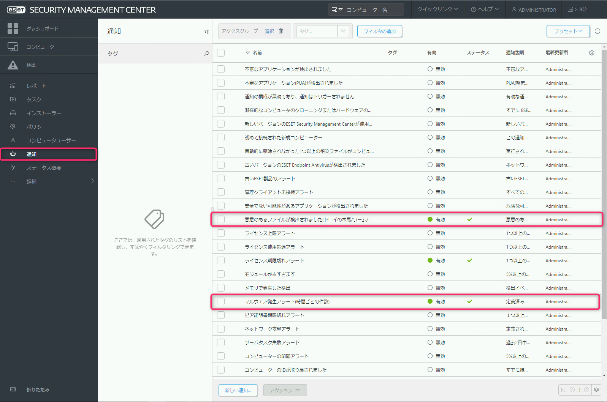

実際に届くメールはこんな感じです。

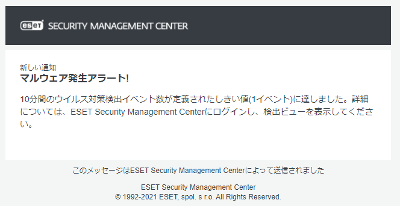

**2. コマンドでウイルス検知時のログを出力する**
ESET File Security for Linux がインストールされたマシンから下記のコマンドを実行することで、ウイルス検知時のログを csv 出力できます。

`# /opt/eset/efs/bin/lslog -dc`　

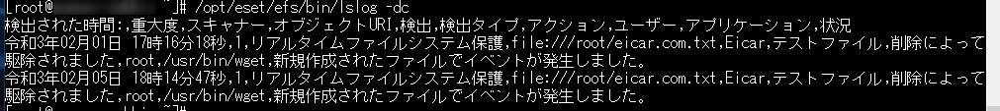

ただし、こちらはあくまでログの出力のみなので、通報する仕組みは別途考えなければいけません。
Zabbix などから監視する場合でもログファイルではないので、一旦コマンドでどこかのファイルに吐き出し、そのファイルを監視するなどといった工夫が必要です。

ESET のみの機能で実現しようとなると管理プログラムを入れるほかなさそうです。なんとも不便ですね・・・

## 参考

[概要 | ESET File Security for Linux | ESETオンラインヘルプ](https://help.eset.com/efs/7/ja-JP/?index.html)
