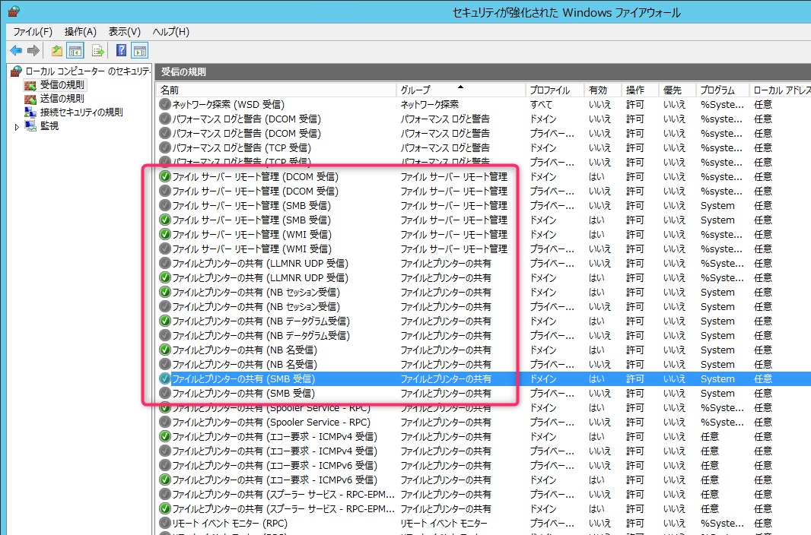

こんにちは、じんないです。

今回はファイルサーバの Windows ファイアウォールを変更し、すでに**公開済みの共有フォルダを特定のコンピュータ (IP アドレス) からのアクセスに制限する方法**をご紹介します。

ファイルサーバの移行などで、データを確定したいときに他のクライアントからのアクセスを拒否しつつ、移行先の新しいファイルサーバからのファイルアクセスは許可したいといった場合に活用できるのではないかと思います。

共有フォルダの NTFS アクセス権限を特定のユーザーに変更するという手もありますが、環境によっては複雑にアクセス権が設定されていてそっくりそのまま移行したいということも多いのではないでしょうか。

そんな場合はファイアウォールでファイルアクセスを遮断し、アクセス権は保持したままで最終のデータ移行を行う方法をおすすめします。

## 環境

- Windows Server 2012 R2

※ Windows Server 2016 や 2019 などでも変わらないと思います。

### 注意事項

- Windows ファイアウォールの設定を変更しますので、**共有フォルダが複数ある場合はすべての共有フォルダへのアクセスに影響があります**。特定の共有フォルダのみアクセスを制限することはできませんのでご注意ください。

## Windows ファイル共有に使われるポート

まずは Windows ファイル共有に使われるポートをおさらいしておきましょう。詳細は下表のとおりです。

ポート | プロトコル | 用途
-- | -- | --
137 | TCP/UDP | NetBIOS 名前サービス
138 | UDP | NetBIOS データグラムサービス
139 | TCP | NetBIOS セッションサービス
445 | TCP | ダイレクトホスティング SMB

ポート 137～139 は NBT (NetBIOS over TCP/IP) で使用され、これに加えて Windows 2000 以降の Windows OS ではポート 445 もダイレクトホスティング SMB で使用されます。

共有フォルダへのアクセスを制限する場合は、これらのポートへのアクセス制御を行う必要があります。 

[TCPやUDPにおけるポート番号の一覧 - Wikipedia](https://ja.wikipedia.org/wiki/TCP%E3%82%84UDP%E3%81%AB%E3%81%8A%E3%81%91%E3%82%8B%E3%83%9D%E3%83%BC%E3%83%88%E7%95%AA%E5%8F%B7%E3%81%AE%E4%B8%80%E8%A6%A7)

## Windows ファイアウォールの設定
### まずはファイル共有が有効化されているか確認

[コントロール パネル] - [システムとセキュリティ] - [Windows ファイアウォール] - [許可されたアプリ] を開き、下記の項目を確認します。

- **ファイル サーバー リモート管理**
- **ファイルとプリンターの共有**

これらの項目にチェックが入っていることを確認しておきます。

当初、**`ファイルとプリンターの共有`** のみでよいと思っていたのですが、**`ファイル サーバー リモート管理`** も 445 ポートを使っているため影響があります。

### 特定の IP アドレスのみに制限する

[コントロール パネル] - [システムとセキュリティ] - [Windows ファイアウォール] - [詳細設定] から [受信の規則] を開きます。

**ファイル サーバー リモート管理** と **ファイルとプリンターの共有** から始まる**すべての規則**に下記を実施します。

規則を右クリック→ [プロパティ] から [スコープ] タブを開きます。

リモート IP アドレスの項目で、`これらの IP アドレス` を選択し、**アクセスを許可したい IP アドレスやサブネット、IP アドレスの範囲を指定** します。

この項目を設定することで、**指定した IP アドレスからのアクセスしか許可しないようにできます**。余談ですが、リモートデスクトップ接続のアクセス制御などにも応用できます。

あとは、一覧からローカルポート順にソートしてポート 137～139, 445 を使用している規則に漏れがないか確認し、ほかにもある場合はそちらも同様に設定します。

## サービスの再起動

これまでの手順で特定の IP アドレスのみが共有フォルダへアクセスできる状態ですが、すでにコネクションが確立された通信があると指定した IP アドレス以外からも共有フォルダへアクセスできる場合があります。

Server サービスを再起動し、一旦すべての Windows 共有へのアクセスを切断しておきましょう。

ではまた。

## 参考

- [ファイアウォールの設定について](https://social.technet.microsoft.com/Forums/office/ja-JP/ec9331fa-24c1-4539-81f8-701c395afe86/12501124491245212450124541245712540125231239835373234501239512?forum=winserver8)

