こんにちは、じんないです。

以前の記事で、**ESET File Security for Linux v7 では管理プログラムを使用しないとマルウェア検出などのセキュリティアラートが発生した場合メール通報を行うことができない**とお伝えしました。

以前の記事 --> [\[RHEL8\] ESET File Security for Linux v7 をインストールする](https://mseeeen.msen.jp/how-to-install-eset-file-security-for-linux-v7/)

今回は、その続編として管理プログラム [ESET Security Management Center (ESET PROTECT)](https://eset-info.canon-its.jp/business/esmc/) を使ってメール通報する方法を紹介します。

当初管理プログラムとして ESET Security Management Center v7.2 をインストールしていたのですが、初回ログオン時にアップデートがかかり ESET PROTECT になってしまいました。が、操作感についてはほぼ同様かと思います。

## 想定環境

- 管理プログラムをインストールするサーバー
  - OS: Windows Server 2012 R2

- 管理対象のサーバー
  - OS: CentOS 8.3
  - クライアントプログラム: ESET File Security for Linux v7.2

## 管理プログラムのインストール

[ESET PROTECT ユーザーズサイト](https://canon-its.jp/product/eset/users/index.html) にログインし、[ライセンス情報/申込書作成] のページから製品認証キーを確認します。管理プログラムのインストール時に使用しますのでメモしておきましょう。

<a href="images/how-to-send-an-email-when-malware-is-detected-from-eset-security-management-center-1.png">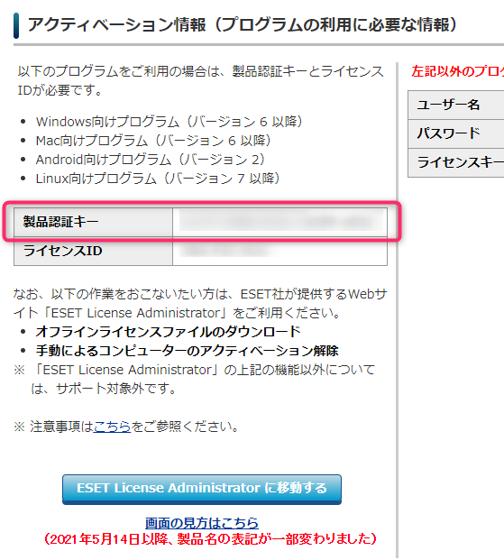</a>

つぎに、[管理プログラムをダウンロードページ](https://eset-info.canon-its.jp/files/user/html/usersite/eep/dl_mng/index.html) から管理プログラムをダウンロードします。

<a href="images/how-to-send-an-email-when-malware-is-detected-from-eset-security-management-center-2.png">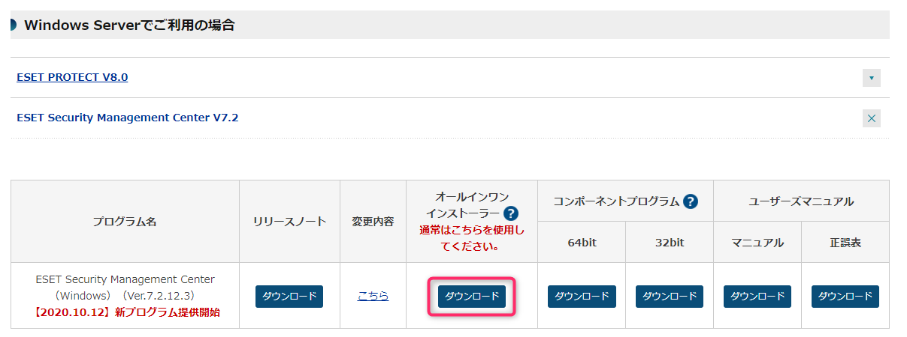</a>

また、ESET Security Management Center では [java (64bit)](https://www.java.com/ja/download/manual.jsp) が必要になるので、事前にインストールしておきましょう。

管理プログラムをインストールするサーバーでダウンロードしたインストーラーを実行し、ウィザードに従ってインストールを進めていきます。

<a href="images/how-to-send-an-email-when-malware-is-detected-from-eset-security-management-center-3.png">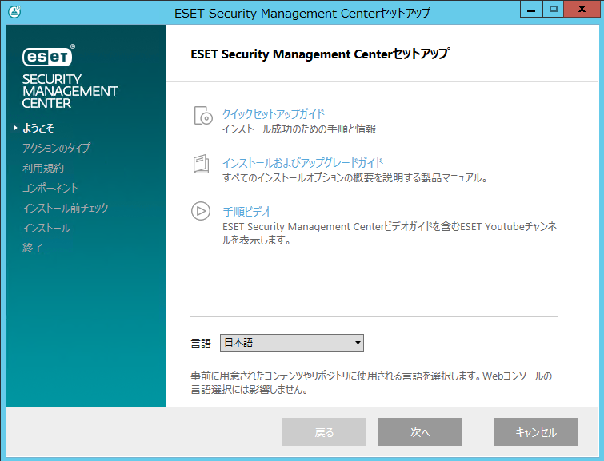</a>

途中でアクティベーションの画面が出てくるので、先にメモした製品認証キーを入力してインストールを進めます。

<a href="images/how-to-send-an-email-when-malware-is-detected-from-eset-security-management-center-4.png">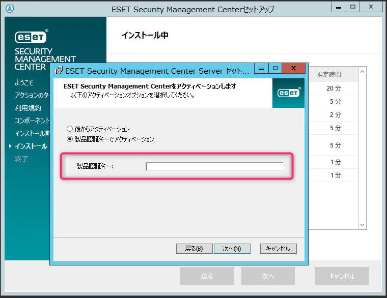</a>

## ESET Management エージェントのインストール

管理プログラムと同様の[ダウンロードページ](https://eset-info.canon-its.jp/files/user/html/usersite/eep/dl_mng/index.html)から ESET Management エージェントをダウンロードします。

<a href="images/how-to-send-an-email-when-malware-is-detected-from-eset-security-management-center-5.png">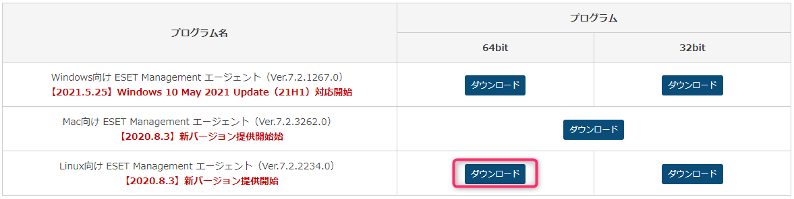</a>

ダウンロードしたインストーラーを管理対象のサーバーの /tmp などに格納し、実行権限を付けてインストールします。


```
# 実行権限の付与
chmod +x /tmp/Agent-Linux-x86_64.sh

# ESET Management エージェントのインストール
/tmp/Agent-Linux-x86_64.sh \
--skip-license \
--hostname=<ESET Security Management Center の IP アドレス> \
--port=2222 \
--webconsole-user=Administrator \
--webconsole-password=<パスワード> \
--webconsole-port=2223
```

[エージェントインストール - Linux | ESET Security Management Center | ESETオンラインヘルプ](https://help.eset.com/esmc_install/70/ja-JP/component_installation_agent_linux.html)

エージェントがインストールできたら、ESET Security Management Center のコンソールに登録されます。
グループ分けやポリシーの適用などいい感じにしておきましょう。

<a href="images/how-to-send-an-email-when-malware-is-detected-from-eset-security-management-center-6.png">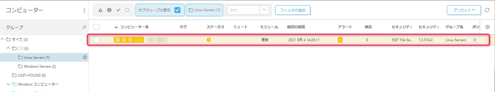</a>

## メール通知設定
### SMTP サーバーの設定

まずはメールが送信できるように SMTP サーバーの設定をします。

ESET Security Management Center コンソールの左ペインから [詳細] - [サーバー設定] を展開し、SMTP サーバーの設定を行います。テストメールを送信しメールが正常に送られることを確認しておきましょう。

<a href="images/how-to-send-an-email-when-malware-is-detected-from-eset-security-management-center-7.png">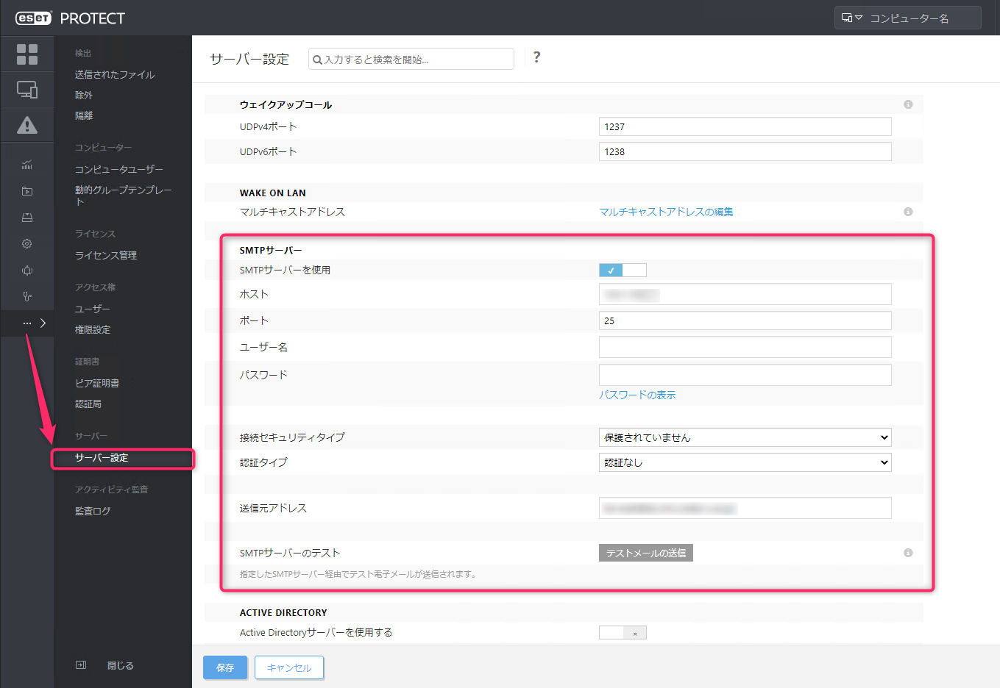</a>

こんな感じのテストメールが届きます。

<a href="images/how-to-send-an-email-when-malware-is-detected-from-eset-security-management-center-8.png">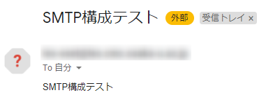</a>

### アラート通知設定

つづいて、マルウェアが検出された場合にメール通知できるよう通知イベントの設定を行います。

ESET Security Management Center コンソールの左ペインから [通知] を展開すると、**マルウェア発生アラート(時間ごとの件数)** という項目があるので、これを有効化します。

※ESET から[ウイルス検出時に管理者に通知をおこなう方法](https://eset-support.canon-its.jp/faq/show/146?site_domain=business) が公開されており、その中で **`悪意のあるファイルが検出されました（トロイの木馬/ワーム/ウイルス/アプリケーション）` の通知項目を使う例が紹介されていますが、Eicar によるテストファイルで試した感じだとトリガーされないことが分かりました**ので、「マルウェア発生アラート(時間ごとの件数)」の通知項目を使用する方法を紹介しています。

<a href="images/how-to-send-an-email-when-malware-is-detected-from-eset-security-management-center-9.png">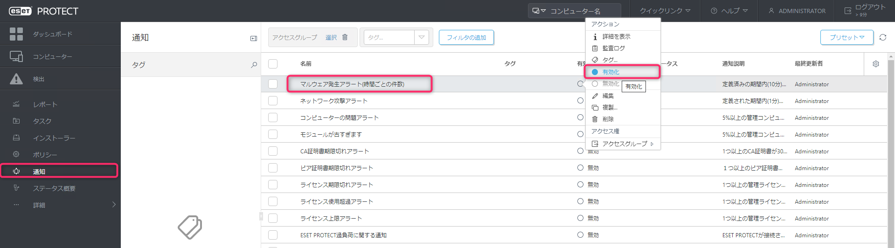</a>

**詳細設定 - 調整** 項目から **時間ベースの条件** や **期間の発生件数** を調整します。
※あくまで設定例なので、環境に応じて調整してください。

<a href="images/how-to-send-an-email-when-malware-is-detected-from-eset-security-management-center-10.png">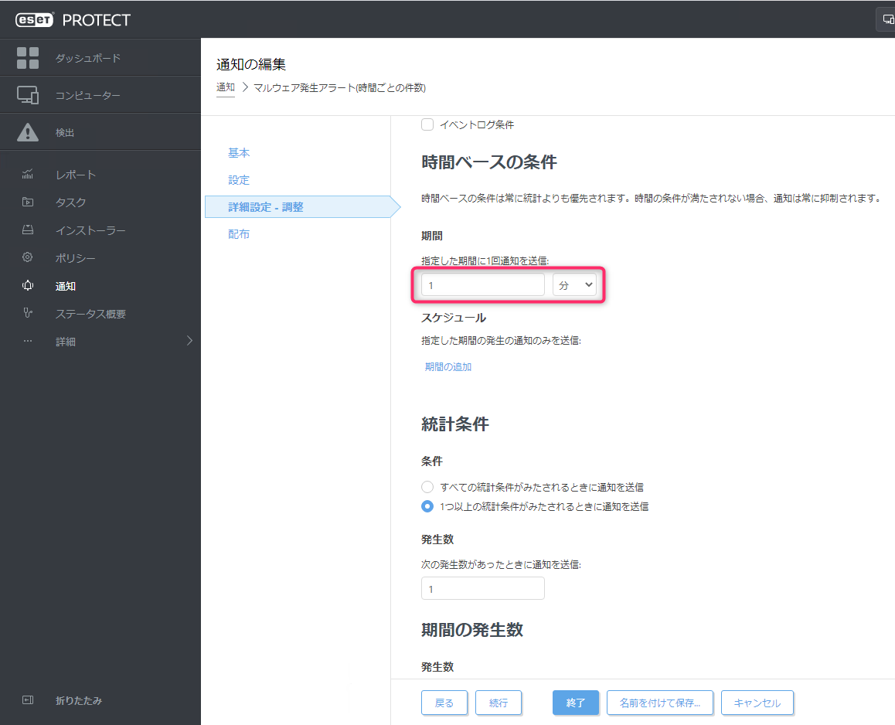</a>

<a href="images/how-to-send-an-email-when-malware-is-detected-from-eset-security-management-center-11.png">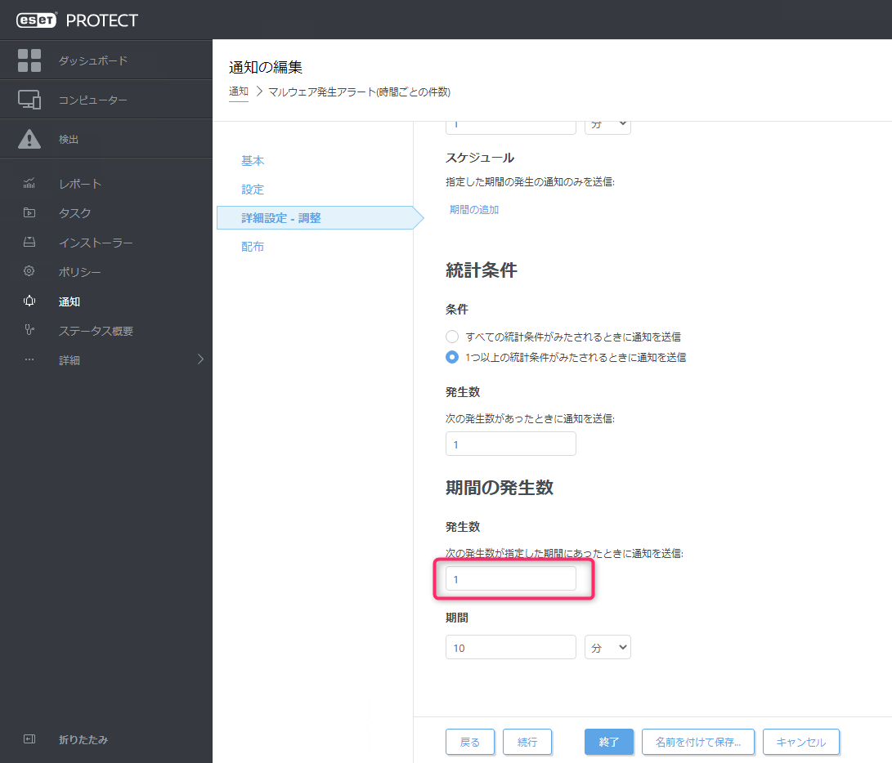</a>

**配布** 項目では `電子メールを送信` にチェックが入っていることを確認し、送信先メールアドレスを設定します。

<a href="images/how-to-send-an-email-when-malware-is-detected-from-eset-security-management-center-12.png"></a>

タイムゾーンがデフォルトで `UTC+00:00 イギリス時間` になっているので、`UTC+09:00 日本標準時` にしておきましょう。

<a href="images/how-to-send-an-email-when-malware-is-detected-from-eset-security-management-center-13.png">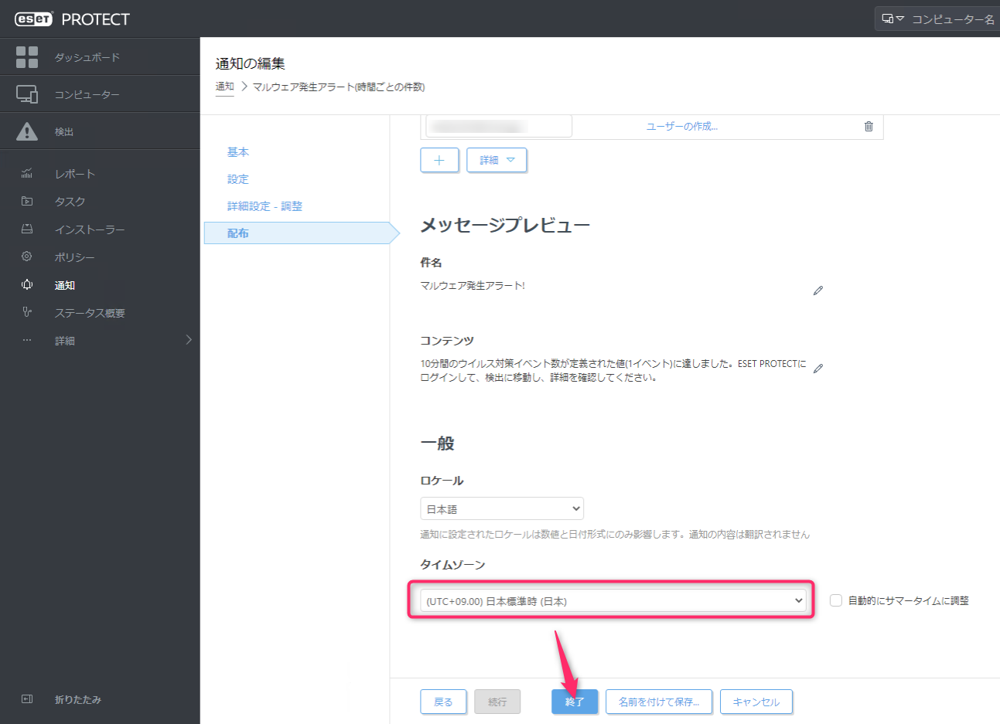</a>

## 動作確認

管理対象のサーバーから Eicar のテストウイルスをダウンロードしてみます。

```
wget www.eicar.org/download/eicar.com.txt
```

以下のようなメールが通知されれば OK です。

<a href="images/how-to-send-an-email-when-malware-is-detected-from-eset-security-management-center-14.png">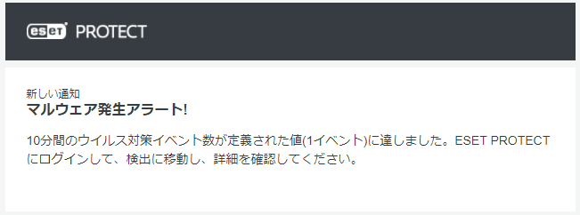</a>

ESET Security Management Center の **検出** からも確認ができます。

<a href="images/how-to-send-an-email-when-malware-is-detected-from-eset-security-management-center-15.png">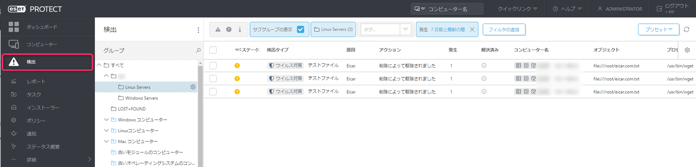</a>

### メッセージ内容のカスタム

`悪意のあるファイルが検出されました（トロイの木馬/ワーム/ウイルス/アプリケーション）` の通知項目のメッセージに使用されている変数を持ってくるとより分かりやすくなったので、このようにカスタムしてもよいかと思います。

<a href="images/how-to-send-an-email-when-malware-is-detected-from-eset-security-management-center-16.png">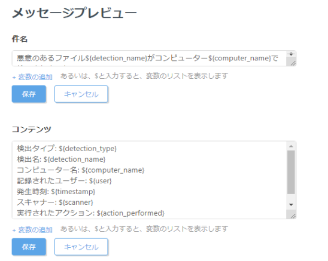</a>

通知されるメール

<a href="images/how-to-send-an-email-when-malware-is-detected-from-eset-security-management-center-17.png">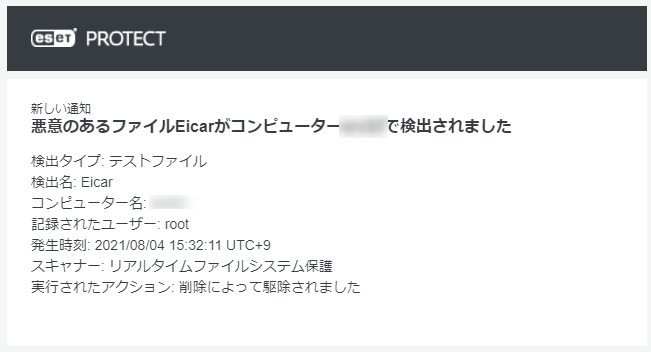</a>

以下、コピー用です。お使いの環境に合わせていい感じにカスタムしていただければと思います。

件名
```
悪意のあるファイル${detection_name}がコンピューター${computer_name}で検出されました
```

コンテンツ
```
検出タイプ: ${detection_type}
検出名: ${detection_name}
コンピューター名: ${computer_name}
記録されたユーザー: ${user}
発生時刻: ${timestamp}
スキャナー: ${scanner}
実行されたアクション: ${action_performed}
```

ではまた。

## 参考

- [ウイルス検出時に管理者に通知をおこなう方法 | ESETサポート情報 | 法人向けサーバー ・ クライアント用製品 | キヤノンITソリューションズ](https://eset-support.canon-its.jp/faq/show/146?site_domain=business)