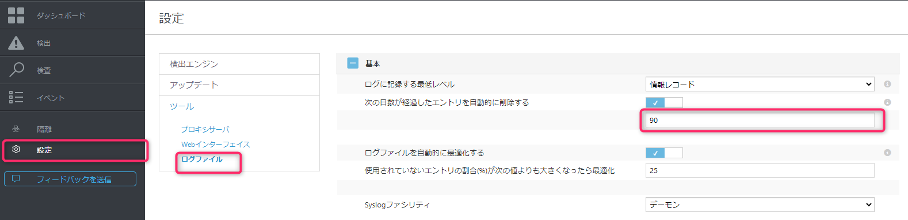
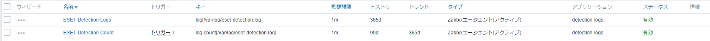
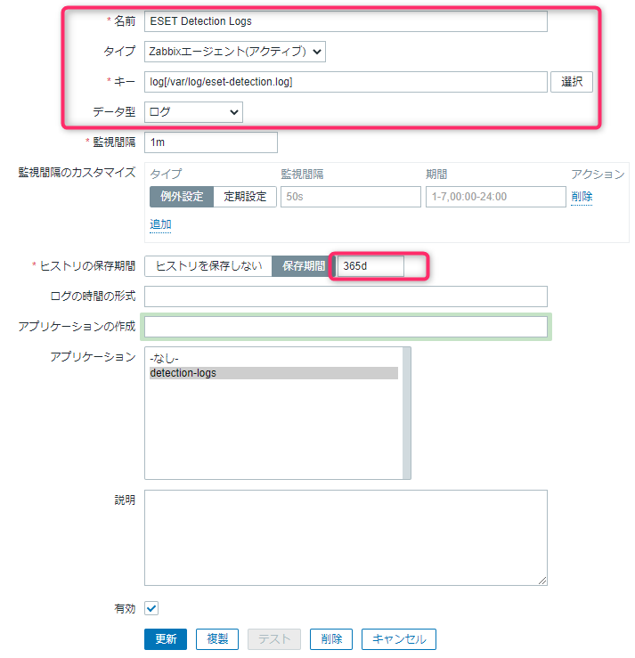
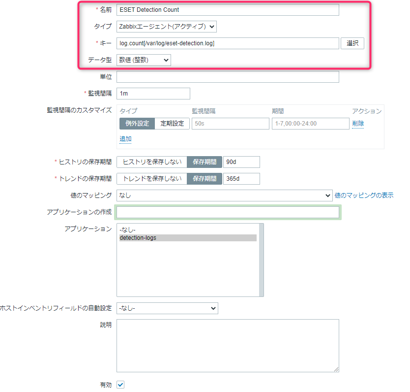
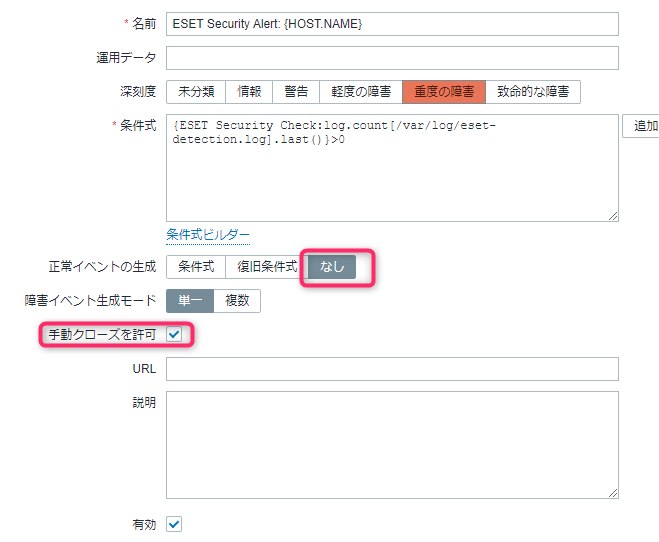
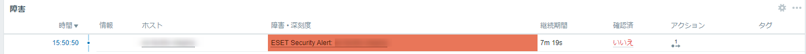
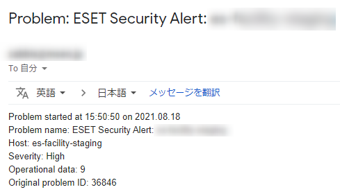
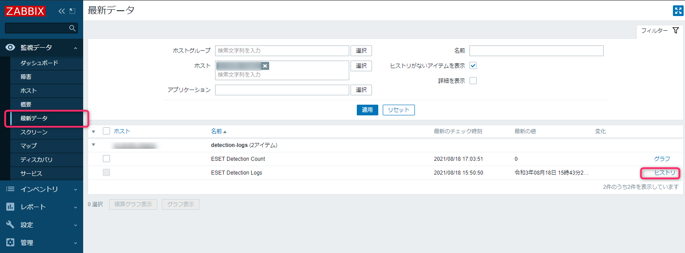
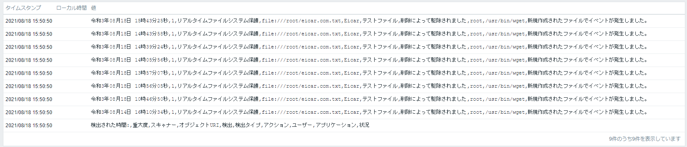
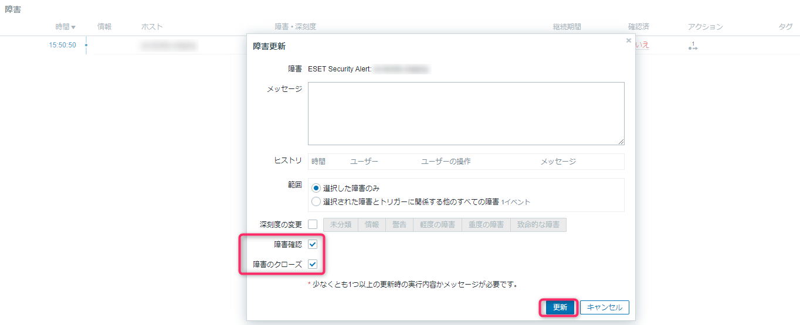

こんにちは、じんないです。

[以前の記事](/how-to-install-eset-file-security-for-linux-v7/)でもご紹介しましたが、ESET File Security for Linux v7.2 では**管理プログラムを使用しないとマルウェア検出などのセキュリティアラートが発生した場合にメール通報を行うことができません**。

今回は管理プログラムは使用せずに **Zabbix から ESET File Security for Linux v7.2 のウイルス検出を監視する方法**をご紹介します。

管理プログラムを使った方法もご紹介していますのであわせてご参照いただければと思います。
[ESET Security Management Center (ESET PROTECT) でマルウェア検出時にメール通報を行う方法](/how-to-send-an-email-when-malware-is-detected-from-eset-security-management-center/)


## 想定環境
- 監視対象サーバー
  - CentOS 7.9
  - ESET File Security for Linux v7.2
- 監視サーバー
  - Zabbix Server 5.0 LTS

### 前提
- ESET File Security for Linux v7.2 がすでにインストール済みであること。
- 監視対象サーバーに Zabbix Agent がインストール済みで Zabbix Server から監視できる環境であること。

また、Zabbix の基本操作については記載を割愛しています。

## 概要

監視の大まかな流れは下記のとおりです。

1. `/opt/eset/efs/bin/lslog -dc` コマンドを実行することで、ESET イベントログ内の**検出イベントが出力される**ので、これをログファイル `/var/log/eset-detection.log` にリダイレクト（上書き）する。
※この処理は cron などで 10分毎などに実施

2. Zabbix Agent からログファイルを監視し、**前回よりもログが増えている場合**にトリガー（メール通報）させる。

ログローテーションは ESET 側で行い、OS 側では行いません。ESET のログ設定は `設定 > ツール > ログファイル` から可能です。



## OS 側の設定

検出ログを出力させるためのログファイルの作成します。Zabbix Agent からログの読み取りができるよう**グループを `zabbix` に変更**しておきましょう。

```
touch /var/log/eset-detection.log
chown root:zabbix /var/log/eset-detection.log
```

cron (`/var/spool/cron/root`) を設定し、10分毎に検出イベントをログファイルに反映させるようにします。実行間隔はお好みで設定してください。

```
*/10 * * * * /opt/eset/efs/bin/lslog -dc > /var/log/eset-detection.log
```

## Zabbix Server 側の設定
### テンプレート作成

ESET 監視用のテンプレートを作成します。名前は `ESET Security Check` としました。このテンプレートにアイテムとトリガーを作成します。


### アイテム
アイテムは以下の2つを作成します。

- **ESET Detection Logs**
- **ESET Detection Count** (トリガーあり)



**ESET Detection Logs**

ログファイル `/var/log/eset-detection.log` をウォッチするだけのアイテムです。ヒストリを 365day として検出ログを保全します。

- 名前: ESET Detection Logs
- タイプ: Zabbixエージェント(アクティブ)
- キー: log[/var/log/eset-detection.log]
- データ型: ログ
- ヒストリの保存期間: 365d



**ESET Detection Count**

ログファイル `/var/log/eset-detection.log` の行数をカウントするアイテムです。

- 名前: ESET Detection Count
- タイプ: Zabbixエージェント(アクティブ)
- キー: log.count[/var/log/eset-detection.log]
- データ型: 数値(整数)
- ヒストリの保存期間: 90d ※デフォルト
- トレンドの保存期間: 365d ※デフォルト



### トリガー

アイテム `ESET Detection Count` でカウントした値が**前回カウントした値よりも大きければ**トリガーさせるよう設定します。また、正常イベントの生成をなしにすることで自動復旧させないようにし、ログを確認した後に障害をクローズするようにします。

- 名前: ESET Security Alert: {HOST.NAME}
- 深刻度: 重度の障害
- 条件式: {ESET Security Check:log.count[/var/log/eset-detection.log].last()}>0
- 正常イベントの生成: なし
- 手動クローズを許可: チェック



ここまで完成したら、テンプレートを監視対象サーバに割り当てます。

また、テンプレート登録用の xml を用意しておきましたので活用してください。
```xml
<?xml version="1.0" encoding="UTF-8"?>
<zabbix_export>
    <version>5.0</version>
    <date>2021-08-18T08:18:48Z</date>
    <groups>
        <group>
            <name>Templates</name>
        </group>
    </groups>
    <templates>
        <template>
            <template>ESET Security Check</template>
            <name>ESET Security Check</name>
            <groups>
                <group>
                    <name>Templates</name>
                </group>
            </groups>
            <applications>
                <application>
                    <name>detection-logs</name>
                </application>
            </applications>
            <items>
                <item>
                    <name>ESET Detection Count</name>
                    <type>ZABBIX_ACTIVE</type>
                    <key>log.count[/var/log/eset-detection.log]</key>
                    <applications>
                        <application>
                            <name>detection-logs</name>
                        </application>
                    </applications>
                    <triggers>
                        <trigger>
                            <expression>{last()}>0</expression>
                            <recovery_mode>NONE</recovery_mode>
                            <name>ESET Security Alert: {HOST.NAME}</name>
                            <priority>HIGH</priority>
                            <manual_close>YES</manual_close>
                        </trigger>
                    </triggers>
                </item>
                <item>
                    <name>ESET Detection Logs</name>
                    <type>ZABBIX_ACTIVE</type>
                    <key>log[/var/log/eset-detection.log]</key>
                    <history>365d</history>
                    <trends>0</trends>
                    <value_type>LOG</value_type>
                    <applications>
                        <application>
                            <name>detection-logs</name>
                        </application>
                    </applications>
                </item>
            </items>
        </template>
    </templates>
</zabbix_export>
```

## 動作確認

監視対象サーバーでテストウイルス eicar をダウンロードします。

```
wget www.eicar.org/download/eicar.com.txt
```

cron が実行されると、検出イベントがログファイルに反映されます。それを Zabbix が検知し障害情報として登録されます。



アクション設定をすれば下記のようにメール通報を行うこともできます。



[監視データ] > [最新データ] から ESET Detection Logs のヒストリを参照することで、検出イベントのログを確認することができます。





障害情報をクローズするには、障害情報をクリックし `障害確認` と `障害のクローズ`　にチェックを入れて更新すれば OK です。



ではまた。

## 参考
- [イベント | ESET File Security for Linux | ESETオンラインヘルプ](https://help.eset.com/efs/7/ja-JP/events.html)