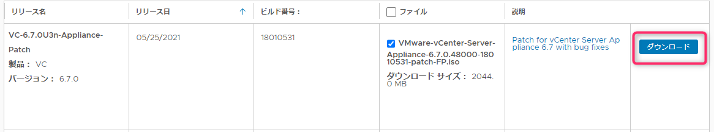
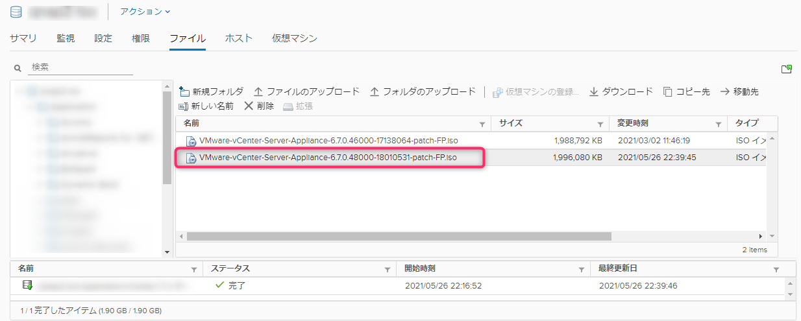

こんにちは、じんないです。

今回は VMware vCenter Server Appliance にパッチを適用する方法をご紹介します。

本記事の執筆時にちょうど **[vCenter Server の脆弱性 CVE-2021-21985、CVE-2021-21986](https://www.jpcert.or.jp/at/2021/at210025.html)** が公開されましたので、その対処として vCenter Server Appliance 6.7 U3n にアップデートする手順です。

> CVE-2021-21985、CVE-2021-21986 の脆弱性が悪用された場合、ポート 443 に接続可能な遠隔の第三者が、vCenter Server が稼働するシステム上で任意のコマンドを実行するなどの可能性があります。


## 環境
- VMware vCenter Server Appliance 6.7 update3

## vCenter Server のバージョンの確認

まず、vCenter Server の現在のバージョンを確認します。

Web ブラウザから `https://<vCenter Server の FQDN>:5480/login` に接続し、VMware Appliance Management コンソールにログインします。

ログイン直後の画面に vCenter Servere Appliance の**バージョン情報**や**ビルド番号**が表示されています。


現在のビルド番号がどの `UpdateXX` に該当するのかは下記の Web サイトと照らし合わせるとよいでしょう。

[VMware vCenter Server のビルド番号とバージョン (2143838)](https://kb.vmware.com/s/article/2143838?lang=ja)

## パッチの準備

つぎに、アップデート用のパッチを [製品パッチ](https://my.vmware.com/jp/group/vmware/patch) からダウンロードします。
※ My VMware アカウントが必要です。

製品に **VC** を指定し、お使いのバージョンを選択してパッチを検索します。


目的のパッチをダウンロードします。今回は例として `VC-6.7.0U3n-Appliance-Patch` をダウンロードしています。このとき、**ビルド番号を控えておくとアップデート後の確認に役立ちます**。



ダウンロードが完了したら、vSphere Client などで vCenter Server Appliance がアクセス可能なデータストアへパッチをアップロードします。アクセスできれば任意のパスで構いません。



vCenter Server Appliance の仮想マシンの設定の編集からデータストアを参照し、前項でアップロードしたパッチをCD/DVDドライブにマウントします。


これで準備は完了です。

## パッチの適用

今回はコマンドラインからパッチを適用します。vCenter Server Appliance へ SSH 接続するために、SSH と bash シェルを有効化します。

VMware Appliance Management コンソールにログインし、[アクセス] > [編集] の順にクリックします。


**SSH ログインの有効化** と **BASH シェルの有効化** にチェックにチェックを入れて [OK] をクリックします。


TeraTerm などのターミナルソフトから vCenter Server Appliance へ SSH 接続します。ここからパッチを適用していきます。

**`software-packages stage --iso`** を実行して iso をステージングします。

ライセンス条項が表示されるので Enter を押しながら下記のところで **`yes`** を入力し同意します。結構長いです。

**`Do you accept the terms and conditions?  [yes/no] yes`**

**`software-packages list --staged`** でステージングしたパッチの内容を確認します。この時 **アップデート対象のビルド番号と一致しているか** 確認しておきましょう。

```
Command> software-packages list --staged
 [2021-05-26T14:13:43.146] :
        kb: https://docs.vmware.com/en/VMware-vSphere/6.7/rn/vsphere-vcenter-server-67u3n-release-notes.html#full_patch
        thirdPartyInstallation: False
        severity: Critical
        version: 6.7.0.48000
        productname: VMware vCenter Server Appliance
        releasedate: May 25, 2021
        TPP_ISO: False
        updateversion: True
        eulaAcceptTime: 2021-05-26 14:12:06 UTC
        leaf_services: ['vmware-pod']
        tags: []
        rebootrequired: True
        name: VC-6.7.0U3n-Appliance-FP
        buildnumber: 18010531 ★ビルド番号確認
        category: Bugfix
        vendor: VMware, Inc.
        summary: Patch for VMware vCenter Server Appliance 6.7.0
        size in MB: 1938
        version_supported: ['']
```

内容に問題なければ **`software-packages install --staged`** でパッチをインストールします。

```
Command> software-packages install --staged
 [2021-05-26T14:14:20.146] : Validating software update payload
 [2021-05-26T14:14:20.146] : Validation successful
 [2021-05-26 14:14:20,419] : Copying software packages  [2021-05-26T14:14:20.146] : ISO mounted successfully
112/112
 [2021-05-26T14:15:04.146] : ISO unmounted successfully
 [2021-05-26 14:15:04,870] : Running test transaction ....
 [2021-05-26 14:15:18,915] : Running pre-install script.....
 [2021-05-26 14:21:33,597] : Upgrading software packages ....
 [2021-05-26T14:24:57.146] : Setting appliance version to 6.7.0.48000 build 18010531
 [2021-05-26 14:24:57,082] : Running pre-patch script.....
 [2021-05-26 14:24:58,104] : Running post-patch script.....
 [2021-05-26T14:25:13.146] : Packages upgraded successfully, Reboot is required to complete the installation.
```

インストールが完了すると再起動が必要と言われるので **`shutdown reboot -r "Install update3n"`** で再起動します。"" の中身は任意のコメントでよいです。

## アップデートの確認

再起動が終わったら VMware Appliance Management コンソールから、バージョンとビルド番号がアップデート対象のものと一致していることを確認します。


後片付けとしてアップデート前に有効化した SSH と bash シェルを無効化し作業は完了です。


ではまた。

## 参考

- [vCenter Server Applianceおよび Platform Services Controller アプライアンスのパッチ適用](https://docs.vmware.com/jp/VMware-vSphere/6.7/com.vmware.vcenter.upgrade.doc/GUID-043EF6BD-78F7-412F-837F-CBDF844F850C.html)