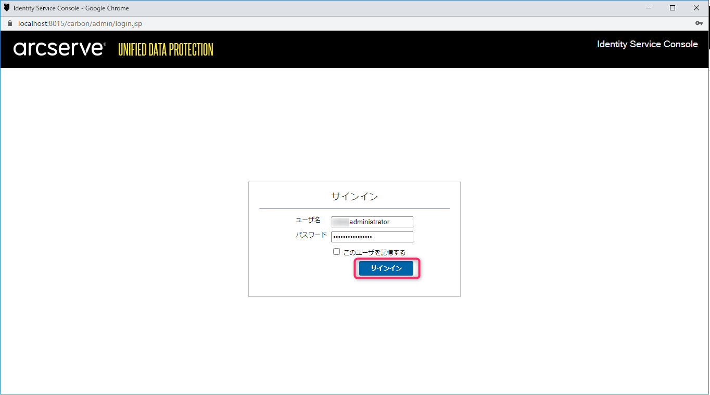

こんにちは、じんないです。

ArcServe UDP7 でバックアップサーバー構成しています。

ドメインの Administrator で **「Windows 認証情報(IWA) を使用してログインすると正しくコンソールが表示されない」** 現象が発生していました。

Windows 認証情報 (IWA; Integrated Windows Authentication) を使用すると、ユーザー名とパスワードを入力することなく現在の Windows でログオン中の認証情報でログインできます。

今回はその回避策を紹介します。

## 想定環境

- OS: Windows Server 2016 Standard
- ログオンユーザー: ドメイン Administrator
- ソフトウェア: ArcServe UDP7

## 関連サービスを再起動するも解消せず

まずは ArcServe UDP7 関連のサービスを再起動しましたが、事象は解消しませんでした。

他の不具合にも使えるので関連サービスの再起動手順を記載しておきます。

コマンドプロンプトを管理者権限で開き、以下のディレクトリに移動します。

`C:\Program Files\Arcserve\Unified Data Protection\Engine\BIN`

**サービスを停止する場合**

`CmdUtil.exe /stopall` を実行します。  
※数分かかる場合があります。

**サービスを開始する場合**

`CmdUtil.exe /startall` を実行します。

## 原因はローカルユーザーとドメインユーザーの名前が同じこと

今回の事象は ArcServe が公開している既知の問題として情報が公開されていました。

> ■IWA （Integrated Windows Authentication、統合 Windows 認証）認証情報を使用すると、Arcserve UDP コンソール ログインが失敗します。  
> 現象  
> Windows アカウントとローカル アカウントのアカウント名が同じで、ドメイン アカウントとして Windows アカウントが使用されている場合。ローカル アカウントを使用している場合にのみ、Arcserve UDP コンソールへのログインが可能です。  

[コンソール関連](https://documentation.arcserve.com/Arcserve-UDP/Available/7.0/JPN/Bookshelf_Files/HTML/Update2/default.htm#Console_Related.htm)

つまり、**ローカルアカウントに Administrator が存在している場合、ドメインの Administrator では Windows 認証情報を使用してログインできない**ようです。

## 解決策

解決策は下記のとおり2パターンあるようですが、今回は「**ローカル アカウントと Windows アカウントの両方に同じ役割を割り当てる**」方をやってみます。

> 解決策  
> この問題を回避するには、以下の解決法のいずれかを使用します。  
> ◆ローカル アカウントを削除します。  
> ◆ローカル アカウントと Windows アカウントの両方に同じ役割を割り当てます。

まずは Windows 認証情報 を使用せず、ArcServe UDP7 コンソールへログインします。

設定 > ユーザー管理 から `Arcserve UDP ユーザー管理コンソールを起動` をクリックします。

新しいウィンドウが開くので `サインイン` します。

左ペイン `リスト` から `役割` をクリックします。

admin の `ユーザーの割り当て` から **ローカルの Administrator** を追加します。

ユーザーの表示を行い、このように admin に **ローカルの Administrator** と **ドメインの Administrator** が表示されていれば OK です。

一度ログアウトし、再度 Windows 認証情報(IWA) を使用してログインしてみます。

正常にコンソールが表示されました。あとはウィザードに沿ってバックアッププランなどを設定していく流れです。

今回の事象は既知の問題のようですので、何かのアップデートで解消されることを望みます。

ではまた。

## 参考

- [Arcserve UDP の関連サービスとプロセスを再起動する方法](https://support.arcserve.com/s/article/209065226?language=ja)

- [コンソール関連](https://documentation.arcserve.com/Arcserve-UDP/Available/7.0/JPN/Bookshelf_Files/HTML/Update2/default.htm#Console_Related.htm)

- [事前定義済みの役割の割り当て](https://documentation.arcserve.com/Arcserve-UDP/Available/7.0/JPN/Bookshelf_Files/HTML/SolG/default.htm#UDPSolnGuide/udp_assign_predef_role.htm)

