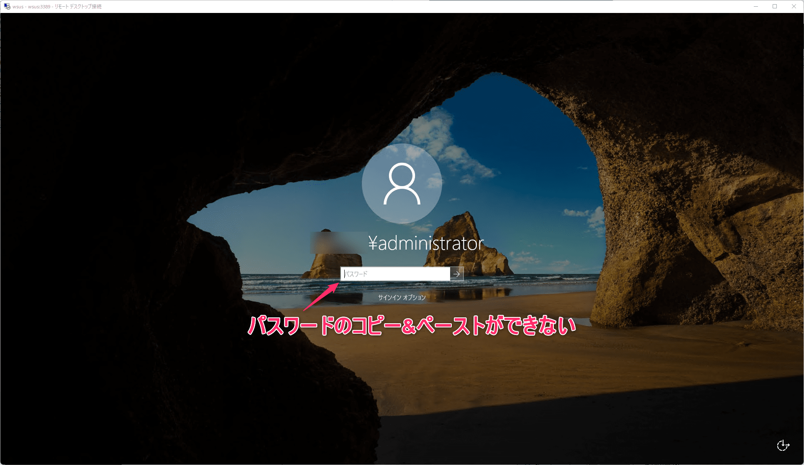
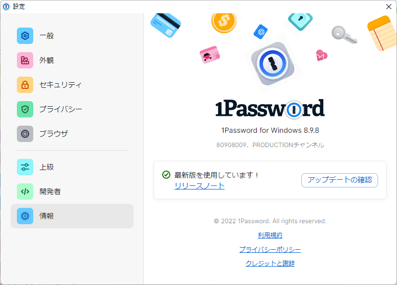
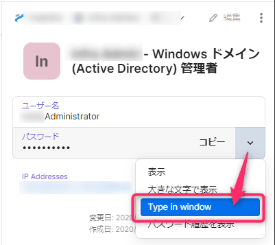
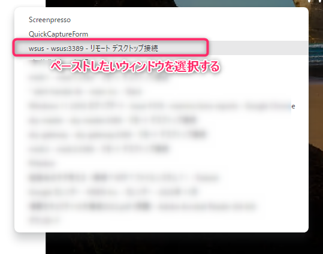
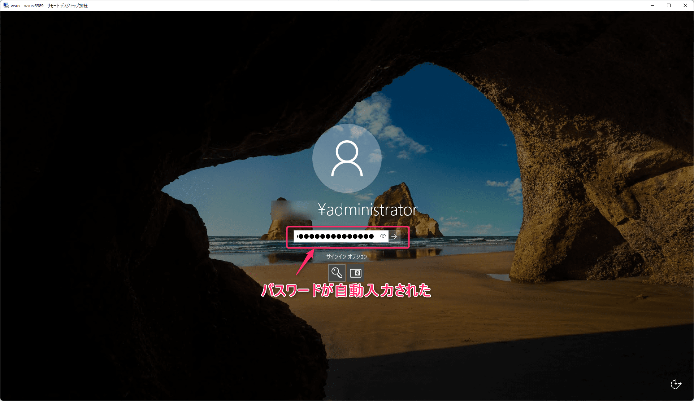
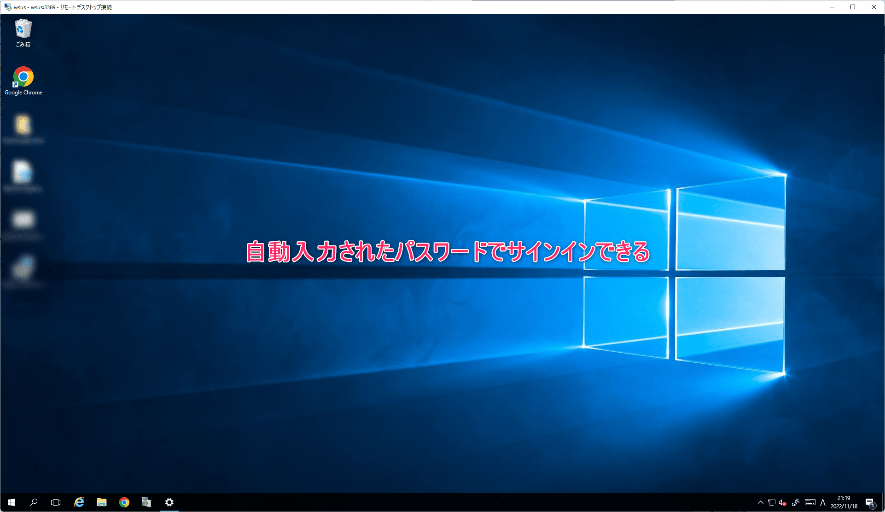
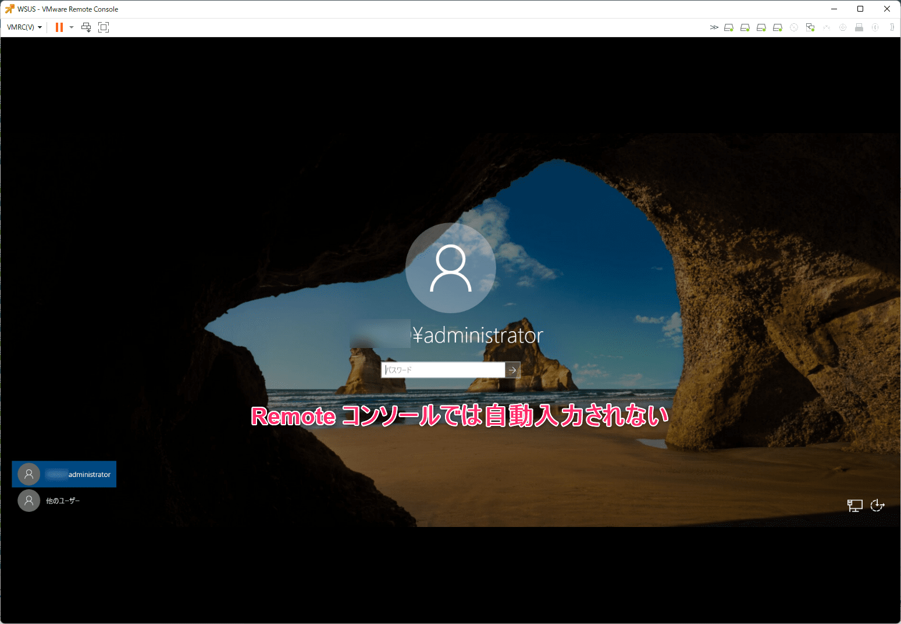

こんにちは、じんないです。

リモートデスクトップで Windows Server を触っていて、ちょっと放置した間に画面ロックされてしまうことありますよね。

この状態になるとコピー＆ペーストができずパスワードを手入力しないといけません。

複雑のパスワードを設定しているときはうんざりしますよね。

**1Password を使ってパスワードを管理している場合、ロック状態の場合でもパスワードを自動入力してくれます**。

## 環境

- 1Password for Windows 8.9.8

## "Type in window" から自動入力

1Paasword からパスワード情報が格納された Vault を選択し、パスワードの `v` から **`Type in window`** をクリックします。

新たにポップアップが表示されるので、パスワードをペーストしたいウィンドウを選択します。  
※ 今回はリモートデスクトップ接続の画面を選択しています。

するとどうでしょう、リモートデスクトップ先のロック画面にパスワードが自動入力されました！

サインインまでは自動でしてくれないので、ポチっと押してサインインします。

複雑なパスワードを入力することなく、サインインできました。

## VMware Remote Console は非対応

VMware Remote Console や Web コンソールでも利用できるのか確認してみましたが、こちらは非対応なようです。

もともとコピー＆ペーストができないコンソールだったので、淡い期待を抱いていましたがやはりだめでした。今後のアップデートに期待です。

## あとがき

いつから利用できるようになったのかわかりませんが、ここ最近のアップデートだったと思います。

リリースノートにはそれらしい記述がなかったので、ご存じの方は教えてください。

- [1Password for Windows | 1Password Releases](https://releases.1password.com/windows/8.9/#changelog)

ではまた。

