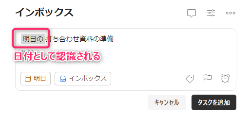
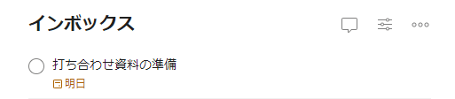
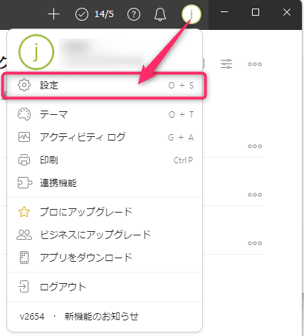
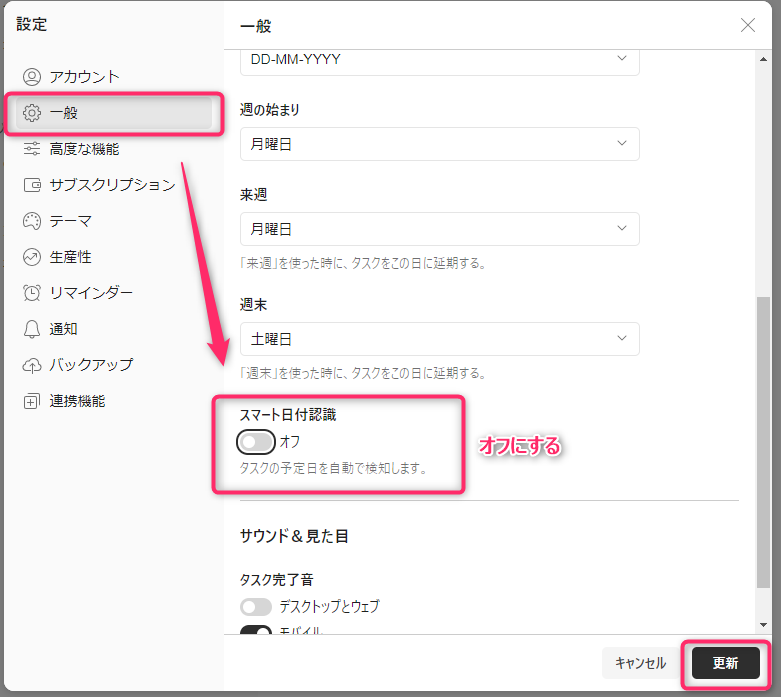
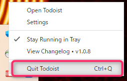
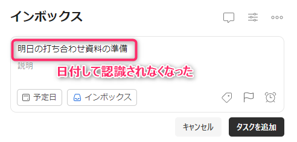
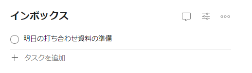

こんにちは、じんないです。

みなさんはどのように日々のタスク管理をされていますか？

私は複数のサービスや媒体を使っています。日時が決まっているものは Goolge カレンダーで、通常のタスクは todoist で管理しています。また、その日のタスクはメモ用紙を使っています。

とりあえずの受け入れ先は todoist を使っているのですが、ときどき困ることがあります。

日付に関連した名前のタスクを追加すると、勝手に反映されてしまうんですね。

この状態でタスクを追加すると `明日の` 部分が消えた状態で登録されてしまいます。

便利な機能ですが、個人的にはそのまま登録できた方がうれしいので、今回はこの機能を無効化する方を紹介します。

## スマート日付認識機能を無効にする

この「日付が勝手に反映される」現象は**スマート日付認識機能**が有効になっているからで、この機能を無効化することで回避できます。

右上のアイコンから `設定` を開きます。

左ペイン `一般` から `スマート日付認識` を **オフ** に変更し、更新します。

タスクトレイから todoist 右クリックし再起動します。

## 動作確認

先ほどと同じように「明日の打ち合わせ資料の準備」を入力します。日付として認識されなくなりました！

タスクとして追加しても問題ありません。これでタスク名に日付が含まれていても大丈夫ですね。

ではまた。

## 参考

- [スマート日付認識機能を有効 / 無効にする](https://todoist.com/ja/help/articles/enabledisable-smart-date-recognition)

