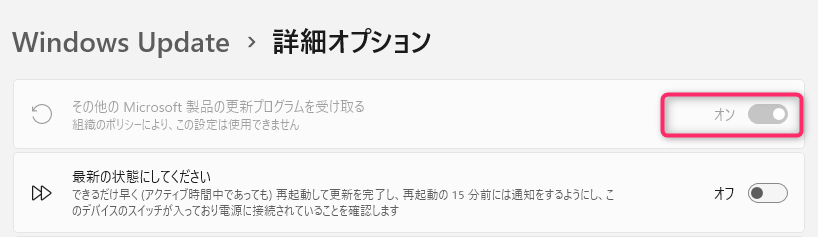
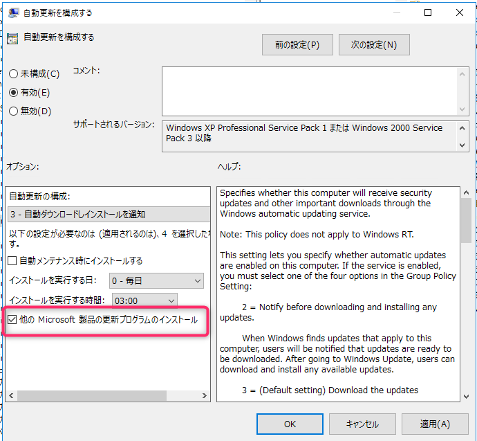
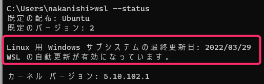
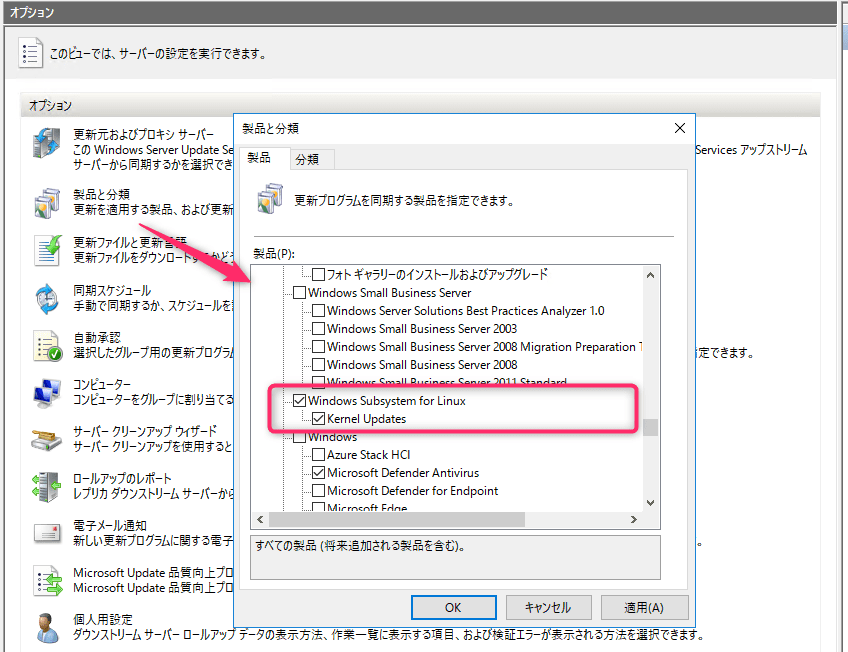
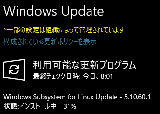

こんにちは、じんないです。

弊社では Windows 更新プログラムの管理に WSUS (Windows Server Update Services) を使用しています。

WSUS では管理者が選択した製品と分類に応じて、配信する更新プログラムをコントロールできます。

**WSL (Windows Subsystem for Linux) のカーネルアップデートも Windows Update から提供される**ようで、その方法を調べてみました。

## 想定環境

- WSUS サーバー：Windows Server 2016
- クライアント： Windows 11 Pro (22H2)
- WSL: Ubuntu (バージョン2)

## Windows Update からインストールするための OS 設定

※この設定はクライアント PC で行います。

まず、WSL のカーネルは Windows Update を経由せずとも、コマンドプロンプトから次のコマンドを実行することでアップデートできます。

`wsl --update`

手動でもかまわない場合はこの方法でよいでしょう。

Windows Update で適用するには、設定から**オプションを有効にする必要**があります。

Windows の [設定] から [Windows Update] > [詳細オプション] を開き、`その他の Microsoft 製品の更新プログラムを受け取る` を **オン** にします。

これで、OS 更新プログラムのほか、WSL のカーネルや Office の更新プログラムもインストールされます。

### グループポリシーから設定する

すでに WSUS を導入されている場合、Active Directory ドメインを構成されていることが多いと思います。

その場合は下記のグループポリシーを設定することで、管理対象のクライアントに一発で反映できます。

`[コンピュータの構成] > [管理用テンプレート] > [Windows コンポーネント] > [Windows Update] > [自動更新を構成する]` 

**`他の Microsoft 製品の更新プログラムのインストール` にチェック**を入れます。

クライアント側で `gpupdate` を実行し、グループポリシーを反映します。

ポリシーが適用されると、コマンドで `wsl --status` を実行したときに自動更新が有効になっている旨の表示に変わると思います。

## WSUS の設定

WSUS から WSL の更新プログラムを配信するには、**同期する製品の設定が必要**です。

WSUS のオプションから [製品と分類] を開き、下記の製品にチェックを入れます。

- [x] Windows Subsystem for Linux
    - [x] Kernel Updates

これで、配信準備は OK です。

## 動作確認

通常どおり更新プログラムを確認するとインストールされます。

※ 上記は Windows 10 での画像です。

ただし、それほど配信頻度は高くないので、タイミングによっては確認が難しいかもしれません。

先に `wsl --update` でアップデートをチェックしておくのもありです。

アップデートがある場合は `wsl --update --rollback` でロールバックし、更新プログラムからインストールされるか確認するのもよいでしょう。

## 参考

- [WSL その219 - WSL 2のLinux kernelをアップデートするには・Linux kernelのバージョンを調べるには - kledgeb](https://kledgeb.blogspot.com/2021/04/wsl-219-wsl-2linux-kernellinux-kernel.html)

