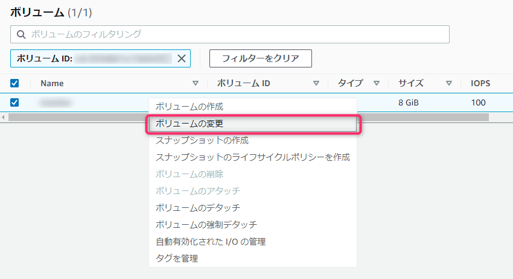
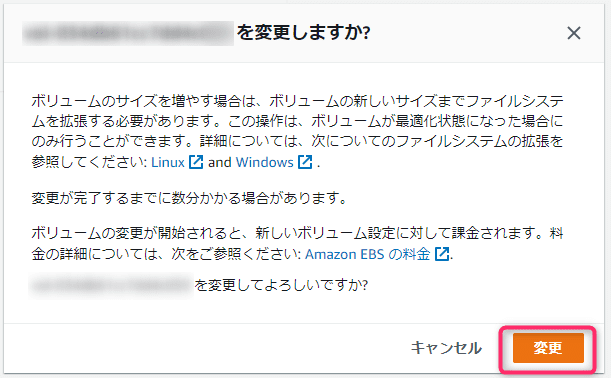

こんにちは、じんないです。

今回は Amazon Linux 2 でディスク容量を拡張する方法を紹介します。

比較的に少ない容量で動くために 8GB でディスクを作成して運用していましたが、容量が必要となってきましたので後から拡張してみようと思います。

大まかには、ボリュームサイズ変更 → パーティション拡張 → ファイルシステム拡張の手順で作業していきます。

OS 再起動は必要ありません。

## 想定環境
- OS: Amazon Linux 2
- ディスク容量
    - 拡張前: 8GB
    - 拡張後: 20GB

`/` パーティションの領域を拡張する手順です。その他の領域を拡張する場合は適宜読み替えてください。 

## 準備

まずは作業前に拡張対象のボリュームのスナップショットを作成してきます。  
※作業が完了し、動作に問題ないことを確認できたら削除しておいてください。

AWS のコンソールから拡張対象のボリュームを右クリックし、**スナップショットの作成** をクリックします。


分かりやすいように適当な説明やタグを設定してスナップショットを作成します。


また、SSH で EC2 インスタンスに接続し `df` コマンドや `lsblk` コマンドで、この時点でのディスク容量を確認しておきます。

```
[ec2-user@jinna-i ~]$ df -h
Filesystem      Size  Used Avail Use% Mounted on
devtmpfs        463M     0  463M   0% /dev
tmpfs           480M     0  480M   0% /dev/shm
tmpfs           480M  392K  480M   1% /run
tmpfs           480M     0  480M   0% /sys/fs/cgroup
/dev/nvme0n1p1  8.0G  7.1G  913M  89% /
tmpfs            96M     0   96M   0% /run/user/1000

[ec2-user@jinna-i ~]$ lsblk
NAME          MAJ:MIN RM SIZE RO TYPE MOUNTPOINT
nvme0n1       259:0    0   8G  0 disk
├ nvme0n1p1   259:1    0   8G  0 part /
└ nvme0n1p128 259:2    0   1M  0 part
```

## ボリュームサイズの変更

事前準備が終わりましたのでディスク容量を拡張していきます。

AWS のコンソールから拡張対象のボリュームを右クリックし、**ボリュームの変更** をクリックします。



任意のサイズを設定し、**変更** をクリックします。  
今回は例として 8 GB → 20 GB へ拡張します。


以下の確認画面が表示されますので、**変更** をクリックします。



ボリュームの状態を確認すると `optimizing (○○%)` となっていますので、完了するまで待ちます。  
※ 今回の場合は東京リージョンでしたので数分で完了しましたが、お使いの環境によっては時間を要するかもしれません。


下記のように `使用中`` と**グリーンラベルになればOK**です。


## パーティションの拡張

`lsblk` コマンドでディスクと各パーティションサイズを確認します。  
`nvme0n1` が 20GB になっていることがわかります。

```
[ec2-user@jinna-i ~]$ lsblk
NAME          MAJ:MIN RM SIZE RO TYPE MOUNTPOINT
nvme0n1       259:0    0  20G  0 disk 　★20GBになった
├ nvme0n1p1   259:1    0   8G  0 part /
└ nvme0n1p128 259:2    0   1M  0 part
```

`growpart` コマンドを使って `/dev/nvme0n1` (`/`) パーティションを拡張します。

```
[ec2-user@jinna-i ~]$ sudo growpart /dev/nvme0n1 1
CHANGED: partition=1 start=4096 old: size=16773087 end=16777183 new: size=41938911,end=41943007
```

再度 `lsblk` コマンドで `/` パーティションのサイズが 20GB になっていることを確認します。

```
[ec2-user@jinna-i ~]$ lsblk
NAME          MAJ:MIN RM SIZE RO TYPE MOUNTPOINT
nvme0n1       259:0    0  20G  0 disk
tqnvme0n1p1   259:1    0  20G  0 part /　★20GBになった
mqnvme0n1p128 259:2    0   1M  0 part
```

ちなみにまだファイルシステムの拡張がされていないので `df` コマンドを実行しても容量は 8GB のままです。

```
[ec2-user@jinna-i ~]$ df -hT
Filesystem     Type      Size  Used Avail Use% Mounted on
devtmpfs       devtmpfs  463M     0  463M   0% /dev
tmpfs          tmpfs     480M     0  480M   0% /dev/shm
tmpfs          tmpfs     480M  392K  480M   1% /run
tmpfs          tmpfs     480M     0  480M   0% /sys/fs/cgroup
/dev/nvme0n1p1 xfs       8.0G  7.1G  912M  89% /
tmpfs          tmpfs      96M     0   96M   0% /run/user/1000
```

## ファイルシステムの拡張

OS から利用できるようにファイルシステムの拡張します。  
Amazon Linux 2 は XFS を使用していますので `xfs_growfs` コマンドでファイルシステムを拡張します。

```
[ec2-user@jinna-i ~]$ sudo xfs_growfs -d /
meta-data=/dev/nvme0n1p1         isize=512    agcount=4, agsize=524159 blks
         =                       sectsz=512   attr=2, projid32bit=1
         =                       crc=1        finobt=1 spinodes=0
data     =                       bsize=4096   blocks=2096635, imaxpct=25
         =                       sunit=0      swidth=0 blks
naming   =version 2              bsize=4096   ascii-ci=0 ftype=1
log      =internal               bsize=4096   blocks=2560, version=2
         =                       sectsz=512   sunit=0 blks, lazy-count=1
realtime =none                   extsz=4096   blocks=0, rtextents=0
data blocks changed from 2096635 to 5242363
```

`df` コマンドでファイルシステムの容量が 20GB になっていることを確認します。

```
[ec2-user@monitor ~]$ df -hT
Filesystem     Type      Size  Used Avail Use% Mounted on
devtmpfs       devtmpfs  463M     0  463M   0% /dev
tmpfs          tmpfs     480M     0  480M   0% /dev/shm
tmpfs          tmpfs     480M  392K  480M   1% /run
tmpfs          tmpfs     480M     0  480M   0% /sys/fs/cgroup
/dev/nvme0n1p1 xfs        20G  7.2G   13G  36% /　★20GBになった
tmpfs          tmpfs      96M     0   96M   0% /run/user/1000
```

以上でディスク容量の拡張は完了です。

動作に問題がなければ作業前に作成したスナップショットを削除しておきましょう。

ではまた。

## 参考

- [ボリュームサイズ変更後の Linux ファイルシステムの拡張 - Amazon Elastic Compute Cloud](https://docs.aws.amazon.com/ja_jp/AWSEC2/latest/UserGuide/recognize-expanded-volume-linux.html)
