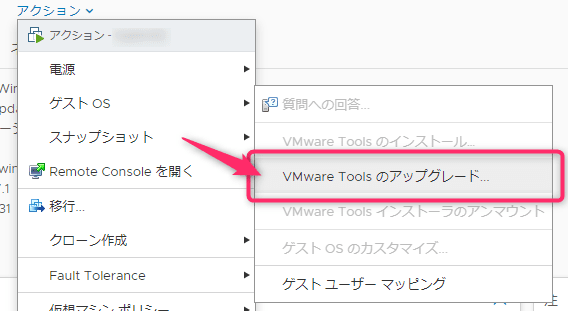

こんにちは、じんないです。

先日、VMware Tools に権限昇格の脆弱性 [CVE-2022-31676](https://www.vmware.com/security/advisories/VMSA-2022-0024.html) が公開されました。

すでに仮想マシン単体や ESXi 本体に適用するパッチがリリースされています。(バージョン 12.1.0 で Fixed)

[VMware Tools のダウンロード - VMware Customer Connect](https://customerconnect.vmware.com/jp/downloads/details?downloadGroup=VMTOOLS1210&productId=1259&rPId=92824)

ESXi へのパッチの適用は、いつもデータストアへパッチをアップロードしコマンドラインから行っていました。

ところが、公式のページにはパッチの適用には **『VMware vSphere Update Manager を使用するのが一般的』** との記載を発見し、さっそく使ってみました。

> ESXi ホストにパッチを適用するには、VMware vSphere Update Manager を使用するのが一般的です。詳細については、『[Installing and Administering VMware vSphere Update Manager](http://pubs.vmware.com/vsphere-60/topic/com.vmware.vsphere.update_manager.doc/GUID-F7191592-048B-40C7-A610-CFEE6A790AB0.html)』を参照してください。

## 想定環境

- VMware vSphere 6.7 Update 3
    - vCenter 管理環境

## パッチの適用

パッチの適用はおおむね以下の流れで行うようです。

1. ベースラインの作成
2. ホストへの添付
3. ステージング
4. 適用

### ベースラインの作成

vSphere Client から Update Manager を開き、ベースライン > 新規 から**新しいベースラインを作成**します。

名前を適当に入力したあと、内容は `パッチ` を選択します。

今回は目的のパッチだけ適用したいので、`以下の基準に一致するパッチで、このベースラインを自動的にアップデートします` のチェックを**外し**ます。

目的のパッチを選択します。今回の例では `VMware Tools 12.1.0 Async Release` を選択しています。

サマリを確認して終了します。

### ホストへの添付

vCenter Server > アップデート > ホストの更新 > 添付 から、**ベースラインまたはベースライングループの添付** を開きます。

前項で作成したベースラインを ESXi ホストへ添付します。今回の例では `VMware Tools` を添付しています。

### ステージング

添付されたベースラインを選択し、`ステージ` をクリックします。

パッチ適用対象の ESXi ホストを選択し、ステージします。

### 適用

ステージが完了したらいよいよ ESXi ホストへ適用していきます。

ベースラインを選択し、`修正` をクリックします。 

パッチ適用対象の ESXi ホストを選択し、修正します。

このとき、vCenter Server Appliance が稼働するホストでは修正ステータスが「修正不可」の表示になりましたが、特に問題はありませんでした。

タスクが完了すればパッチ適用完了です。

## パッチ適用の確認

パッチの適用が完了すると、仮想マシンのアクションから VMware Tools のアップグレードが選べるようになります。

正常に VMware Tools 12.1.0 へアップグレードできました。

コマンドラインとどっちが楽かと言われれば一長一短あるように思えますが、**パッチがダウンロードされている点**と、**root アカウントでコンソールログインしなくてもよい点**がメリットかと思います。

もう少し使ってみて慣れようと思います。

ではまた。

## 参考

- [ホストへのパッチの適用 | VMware Docs](https://docs.vmware.com/jp/VMware-vSphere/6.0/com.vmware.vsphere.update_manager.doc/GUID-F05B68DB-109D-419E-9DDE-E994941A561B.html)
