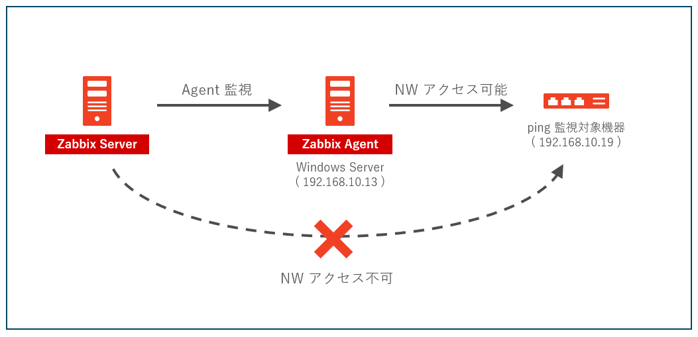

こんにちは、じんないです。

Zabbix の **UserParameter** を使って、Zabbix Agent をインストールしている Windows Server から**リモートホストに ping 監視する方法**を紹介します。

## 想定環境



上図のような環境を想定しています。

- **Zabbix Server からは監視対象機器にアクセスできない**
- **Agent 監視している Windows Server からは監視対象機器にアクセスできる**

**構成情報**

- Zabbix Server 5.0 LTS
- Zabbix Agent 5.0 LTS
    - OS: Windows Server 2016 Standard
    - IP アドレス: `192.168.10.13`
- 監視対象機器
    - IP アドレス: `192.168.10.19`


## 監視方法

以下のような流れで監視します。

1. Windows Server (192.168.10.13) から監視対象機器 (192.168.10.19) へ ping 実行
1. ping 応答の結果に応じた戻り値 ( 0 or 1) を Zabbix Server へ返却
1. 戻り値が `1` であれば疎通あり、`0` であれば疎通なし（障害としてトリガー）として判断

※ 3. のトリガー設定については割愛します。

まずは、2. の ping 応答の結果に応じた戻り値を返す方法を考えます。

通常、Windows から ping を実行すると下記のような応答メッセージになると思います。

**疎通があるときの応答**

```
C:\Users\Administrator>ping -n 1 192.168.10.19

192.168.10.19 に ping を送信しています 32 バイトのデータ:
192.168.10.19 からの応答: バイト数 =32 時間 <1ms TTL=64

192.168.10.19 の ping 統計:
    パケット数: 送信 = 1、受信 = 1、損失 = 0 (0% の損失)、
ラウンド トリップの概算時間 (ミリ秒):
    最小 = 0ms、最大 = 0ms、平均 = 0ms
```

**疎通がないときの応答**

```
C:\Users\Administrator>ping -n 1 192.168.10.19

192.168.10.19 に ping を送信しています 32 バイトのデータ:
192.168.10.13 からの応答: 宛先ホストに到達できません。

192.168.10.19 の ping 統計:
    パケット数: 送信 = 1、受信 = 1、損失 = 0 (0% の損失)、
```

疎通があるときは下記の一文が応答されるので、この有無を `find /c "<検索文字列>"` でチェックします。

`192.168.10.19 からの応答: バイト数 =32 時間 <1ms TTL=64`

検索文字列には `TTL` を使いました。

**疎通があるとき → 1 を出力**

```
C:\Users\Administrator>ping -n 1 192.168.10.19 | find /c "TTL"
1
```

**疎通がないとき → 0 を出力**

```
C:\Users\Administrator>ping -n 1 192.168.10.19 | find /c "TTL"
0
```

この値 ( 0 or 1 ) を戻り値として Zabbix Server へ返却します。

## UserParameter の設定

`zabbix_agentd.conf` に `UserParameter` を設定することで **Zabbix Agent がインストールされているホスト上で任意のコマンドが実行**できます。

フォーマットは下記のとおりです。

`UserParameter=<key>,<command>`

- **key: アイテムキーを設定します。任意の名前で OK です。**
- **command: 実行するコマンドを指定します。**

前項で確認した疎通チェック用のコマンドを `UserParameter` として `zabbix_agentd.conf` に追記し、Zabbix Agent のサービスを再起動します。

(設定例)
`UserParameter=remote.ping[*],ping -w 1000 -n 1 $1 | find /c "TTL"`

アイテムキーは例として `remote.ping` にしました。アイテムを使用するときは `[*]` に IP アドレスを設定することで `$1` で設定した IP アドレスを参照できます。

また、`-w 1000` で ping のタイムアウトを1000ミリ秒に設定し、疎通がない場合にタイムアウトすることを防いでいます。

### 動作確認

Zabbix Server にログインし、`zabbix_get` コマンドで動作チェックします。

**疎通があるとき**

```
# zabbix_get -s 192.168.10.13 -k "remote.ping[192.168.10.19]"
1
```

**疎通がないとき**

```
# zabbix_get -s 192.168.10.13 -k "remote.ping[192.168.10.19]"
0
```

期待どおりの動作になりました。

あとは戻り値が `0` である場合にトリガーされるよう設定すれば OK です。

### タイムアウトになる場合

`zabbix_get` でアイテムの取得に時間がかかる場合、下記のようなタイムアウトになることがあります。

> ZBX_NOTSUPPORTED: Timeout while executing a shell script.

その場合は `zabbix_agentd.conf` の `Timeout` を増やしてみてください。

デフォルトは3秒、最大は30秒に設定できます。

```
# Timeout=3
Timeout=30
```

ではまた。

## 参考

- [5 User parameters | Zabbix Documentation](https://www.zabbix.com/documentation/5.0/en/manual/config/items/userparameters)
