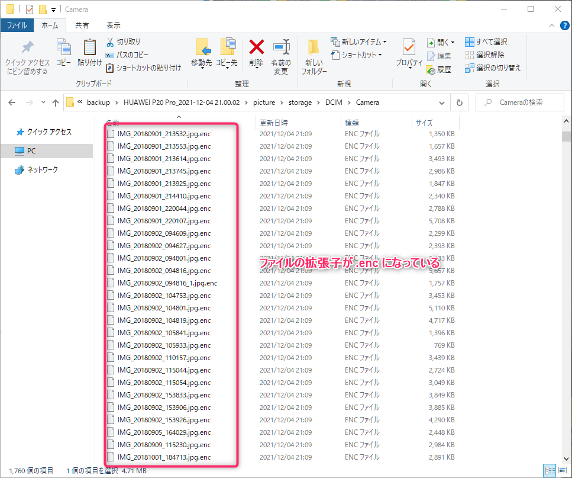
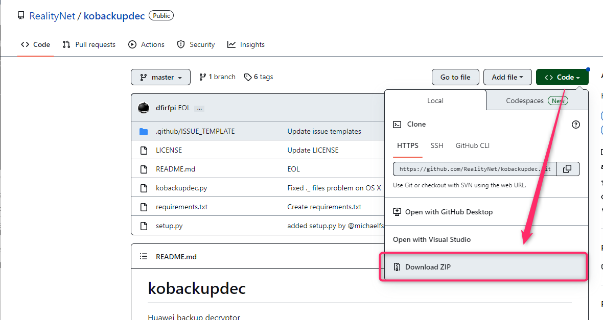
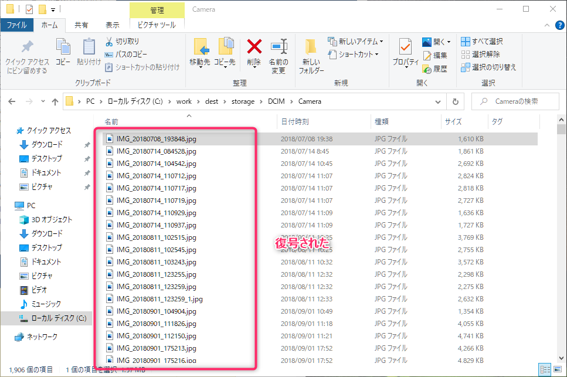

こんにちは、じんないです。

私は以前、[HUAWEI P20 Pro](https://consumer.huawei.com/jp/phones/p20-pro/specs/) を使っていました。

スマートフォンの管理には [HiSuite](https://consumer.huawei.com/jp/support/hisuite/) と呼ばれるソフトウェアが提供されており、ファイルの管理やバックアップが行えます。

ふと、過去のデータを参照したくなりバックアップデータをのぞいてみたのですが、すべてのデータが `.enc` 形式で暗号化されています。



HiSuite があれば復号できるのかと思っていましたが、どうやら元の端末が必要なようです。

端末はすいぶん前に売却していたので困っていましたが、[GitHub](https://github.com/RealityNet/kobackupdec) に HiSuite でバックアップしたデータを復号できる Python スクリプトが公開されているのを発見しました。

なんともまぁピッタリな用途で感激しました。

## 想定環境

- Windows 10
- Python 3.11.0
- pip 22.3.1

HiSuite によるバックアップデータがそのまま残っていることを前提としています。  

## 準備
### Python3 のインストール

Python の公式ページから最新版をインストールしておきます。  
執筆時の最新版は `3.11.0` です。

- https://www.python.org/downloads/

インストールできたらコマンドプロンプトからバージョン確認しておきましょう。

```cmd
C:\work>py --version
Python 3.11.0
```

`pip` と `setuptools` をアップグレードしておきます。

```cmd
python -m pip install --upgrade pip setuptools
```

`pycryptodome` パッケージが必須要件となっているため、これもインストールします。

```cmd
C:\work>pip install pycryptodome
```

### スクリプトの展開

[RealityNet/kobackupdec: Huawei backup decryptor](https://github.com/RealityNet/kobackupdec) へアクセスし、`Code` から `Download ZIP` をクリックしてダウンロードします。



ダウンロードしたファイルは適当なフォルダへ解凍しておきましょう。私は `C:\work` へ展開しました。

```cmd
C:\work>dir
 ドライブ C のボリューム ラベルがありません。
 ボリューム シリアル番号は 7C8B-5034 です

 C:\work のディレクトリ

2022/12/04  17:46    <DIR>          .
2022/12/04  17:46    <DIR>          ..
2022/12/04  17:25    <DIR>          .github
2022/12/04  17:25            39,105 kobackupdec.py
2022/12/04  17:25             1,114 LICENSE
2022/12/04  17:25             4,311 README.md
2022/12/04  17:25                13 requirements.txt
2022/12/04  17:25               517 setup.py
               5 個のファイル              45,060 バイト
               3 個のディレクトリ  43,530,944,512 バイトの空き領域
```

コマンドプロンプトを展開した `C:\work` で開き、Python スクリプトが実行できることを確認します。下記ではコマンドのヘルプを参照しています。

```cmd
C:\work>py kobackupdec.py -h
usage: kobackupdec.py [-h] [-e] [-w] [-v] password backup_path dest_path

Huawei KoBackup decryptor version 20200705

positional arguments:
  password         user password for the backup
  backup_path      backup folder
  dest_path        decrypted backup folder

options:
  -h, --help       show this help message and exit
  -e, --expandtar  expand tar files
  -w, --writable   do not set RO pemission on decrypted data
  -v, --verbose    verbose level, -v to -vvv
```

## バックアップデータの復号

使用法は GitHub の Example を見るのが早いですが、コマンド例としては下記となります。

```cmd
py kobackupdec.py -vvv <バックアップ時に指定したパスワード> "<バックアップデータのパス>" "<復号したファイルの出力先>"
```

`-vvv` は詳細にログを出すモードを指定しているもので、なくても大丈夫です。

`<バックアップ時に指定したパスワード>` は HiSuite でバックアップ実行時に入力したパスワードです。端末ロックのパスワードではないので注意しましょう。

`"<バックアップデータのパス>"` は通常以下のようなパスになります。パスにスペースがあるとエラーになるので、ダブルクオーテーションでくくるようにしましょう。

`C:\Users\<ユーザー名>\Documents\HiSuite\backup\HUAWEI P20 Pro_2021-12-04 21.00.02`  
※日時の部分はバックアップ実行日時が入ります。

`"<復号したファイルの出力先>"` はコマンド実行時に作成されるので、あらかじめ作成しておく必要はありません。

準備ができたらコマンドを実行します。容量やファイル数によっては数十分かかります。

コマンドが終了したら、`"<復号したファイルの出力先>"` で指定したフォルダを参照します。

無事、`.enc` の拡張子が外れて復号できていました！



何気なく撮った写真でもその場その場の思い出になっていたり、重要な情報が残っていたりするもんです。

9割以上諦めていましたが、このスクリプトに救われました。ありがとうございます！

## 参考

- [RealityNet/kobackupdec: Huawei backup decryptor](https://github.com/RealityNet/kobackupdec)
- [Huawei backup - decrypt](https://www.linkedin.com/pulse/huawei-backup-decrypt-gherardo-magnini)
