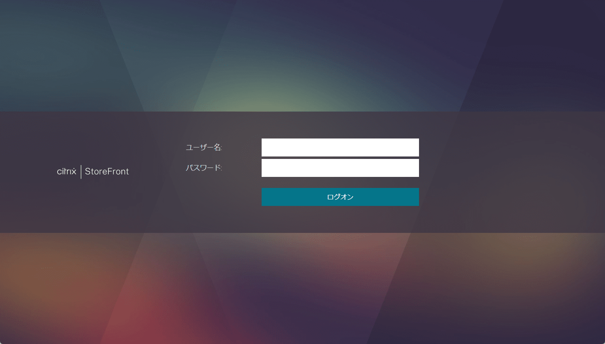

こんにちは、じんないです。

Citrix Virtual Apps 1912 LTSR で公開デスクトップシステムを構成しています。

先日、Citrix Workspace App から公開デスクトップへ接続しようとした際、下図の**ようにくるくると回っていつまで経っても接続できない状態**となりました。

## 想定環境

- Citrix Virtual Apps 1912 LTSR CU4
- Citrix Workspace Apps 22.10.5.14
- Windows 11 Pro (22H2)

## Windows Update を最新にしてみる

**Windows Update が最新でない場合**に、同様な事象がありました。

[設定] > [Windows Update] から更新プログラムをチェックし、**最新の状態になっているか**確認しましょう。

## Receiver for Web から接続できるか

Receiver for Web を有効化している場合は、ブラウザから以下の URL へアクセスすることで公開デスクトップへ接続できます。

`https://<StoreFront の FQDN>/Citrix/StoreWeb/`

ログオン後、[Citrix Workspace Launcher を開く] をクリックし **Citrix Workspace App が起動するか**確認します。

今回のケースでは Receiver for Web からは公開デスクトップへ接続できましたので、Citrix Workspace App 側の問題であることが分かりました。

## Receiver Clean-Up Utility でアンインストールする

[Receiver Clean-Up Utility](https://support.citrix.com/article/CTX137494/receiver-cleanup-utility) を使用することで、**Citrix Workspace App を完全にアンインストール**できます。

その後、Citrix Workspace App を再インストールし、事象が解消するか確認します。

**使用方法**

1. 管理者権限で `ReceiverCleanupUtility.exe` を実行します
2. ユーティリティーが終了したら、PC を再起動します
3. Citrix Workspace App を再インストールします

Citrix Workspace App の最新版は下記よりダウンロードください。

[Download Citrix Workspace App for Windows, Mac and Chrome - Citrix](https://www.citrix.com/products/receiver.html)

私の環境ではこちらの対応で解消しました。

同じ事象でお困りの方のお役に立てれば幸いです。

ではまた。

## 参考

- [Receiver Clean-Up Utility](https://support.citrix.com/article/CTX137494/receiver-cleanup-utility)
