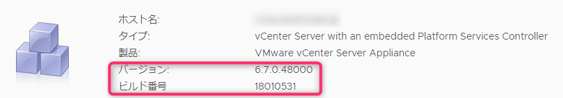
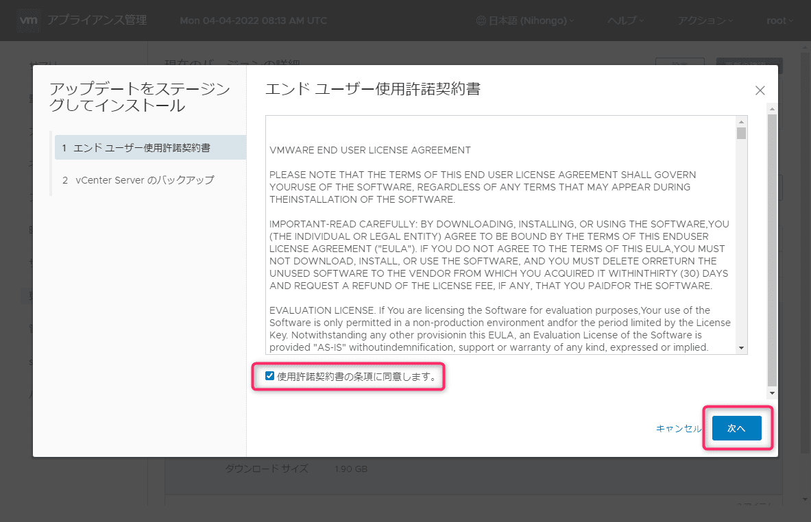

こんにちは、じんないです。

以前 [\[VMware\] vCenter Server Appliance にパッチを適用する](https://mseeeen.msen.jp/patch-the-vcenter-server-appliance-67/) という記事を投稿しました。

事前にアップデートモジュール (パッチ) の iso をダウンロードし、SSH で接続する流れです。

この手順でもアップデートできますが、**vCenter Server Appliance がインターネットに接続できる環境であれば  Web GUI からダウンロード → インストールまで可能**です。

## 想定環境

- VMware vCenter Server Appliance 6.7 update3

vCenter Server Appliance が**インターネットに接続していること**を前提としています。

## Web GUI を使用したアップデート

Web ブラウザから下記の URL へ接続し、VMware Appliance Management コンソールにログインします。

`https://<vCenter Server の FQDN>:5480/login`

ログイン直後の画面に vCenter Servere Appliance の**バージョン情報**や**ビルド番号**が表示されていますので確認しておきましょう。

今回は例として下記のバージョンにアップデートする手順を紹介します。

- アップデート前のバージョン： `6.7.0.48000`
- アップデート後のバージョン： `6.7.0.52000`

左ペインから [更新] > "インストールするバージョンを選択" > [ステージングしてインストール] の順にクリックします。 

[更新前のチェックを実行] をクリックすることで、所要時間を予測できるようですが今回は割愛しました。

使用許諾契約書に同意します。

バックアップの確認画面です。パッチ適用前にバックアップを取得することをおすすめします。
問題なければチェックを入れて完了します。

インストールが完了するまで待機します。

インストールが完了しました。
先の画面に予測ダウンタイムが746分と表示されており少々心配しておりましたが、**実際には7分程度で完了**しました。

最後に目的のバージョンになっているかを確認して終了です。
vCenter Server Appliance がインターネットに接続できる環境であれば、こちらの手順のほうがアップデートにかかる手間が断然少ないですね。

## 参考

- [アプライアンス管理インターフェイスを使用した vCenter Server Appliance へのパッチ適用](https://docs.vmware.com/jp/VMware-vSphere/6.7/com.vmware.vcenter.upgrade.doc/GUID-E2E359B1-5834-4BFF-AEFE-6CEBFC8CC3D5.html)

上記の公式ページで以下のような記載があるので、カスタムリポジトリを構成することでインターネットに接続できない環境でも同様の手順でアップデートができるようです。
複数の vCenter Server が稼働している環境であれば、恩恵が得られそうですね。機会があれば試してみたいと思います。

> URL ベースのパッチ適用を実行するには、リポジトリ URL で使用可能なパッチを確認して、パッチをインストールします。アプライアンスのビルド プロファイルのデフォルトの VMware リポジトリ URL が vCenter Server Appliance に事前に設定されます。デフォルトの VMware リポジトリ URL またはカスタムのリポジトリ URL（データ センター内で実行されているローカル Web サーバ上に以前ビルドしたリポジトリ URL など）を使用するようにアプライアンスを構成できます。
