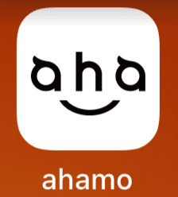
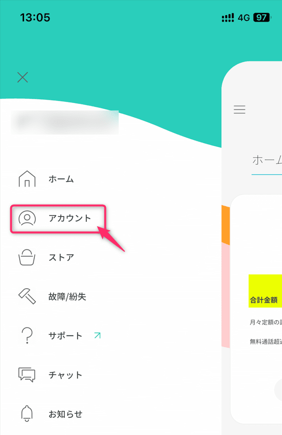
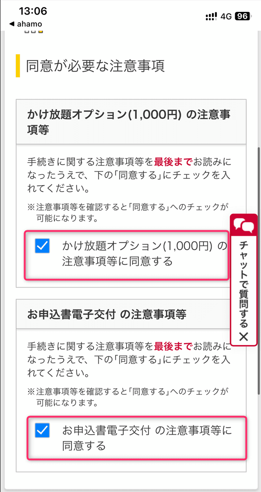

こんにちは、じんないです。

ahamo には標準で5分の無料通話がついていますが、**月額1,100円(税込)で国内通話がかけ放題になる「[かけ放題オプション](https://faq.ahamo.com/faq/show/3?category_id=13&site_domain=default)」** があります。

これまで「かけ放題オプション」を使用していたのですが、解約する運びとなりました。

ただ、解約の手順が ahamo アプリや公式サイトを見てもよくわからないので最短で解約できる手順を紹介します。

## 想定環境

- ahamo かけ放題オプションを契約している
- ahamo アプリを端末にインストールしている
- ネットワーク認証番号を把握している
- 端末は iPhone (iOS 16)

## 解約手順

ahamo アプリを起動します。

左上の `三` から `アカウント` を開きます。

かけ放題オプションの `↗` をクリックします。

`「かけ放題オプション(1,000円)を解約する` に**チェックが入っていることを確認**し、申込書の交付方法を選択して次へ進みます。

注意事項を2点同意して、次へ進みます。

手続き内容を確認して、最後に「この内容で手続きを完了する」をクリックすればOKです。

申し込み月の月末で「かけ放題オプション」が解約されます。

## ネットワーク認証番号が分からない場合

ahamo の各種申し込みをする場合、d アカウントのネットワーク認証番号を求められることがあります。今回のケースではかけ放題オプションの `➚` をクリックしページ遷移した場合です。

分からない場合は、ドコモインフォメーションセンターへ問い合わせする流れになりますが、**「ahamo は対応していない」と打ち切られます**。

下記のいずれかで対応してくれるようですので、お困りの方は試してみてはどうでしょうか。

- [ahamo のチャット相談](https://ahamo.com/chat/index.html)から問い合わせする
- ドコモショップでネットワーク認証番号を再設定

ドコモショップでも対応してくれるのは意外でした。照会はできないが再設定のみ受け付けているとのことです。

お役に立てれば幸いです。

ではまた。
