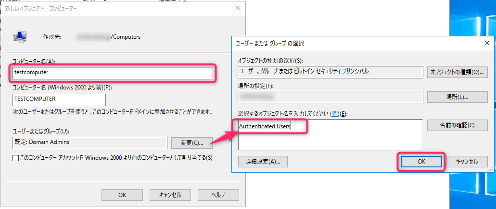

こんにちは、じんないです。

Active Directory では**一般のドメインユーザー (Domain Users権限) でもコンピューターをドメインに参加させる権限があります**。

しかし、その台数の上限値は決まっており、**一般のドメインユーザーで10台**です。

上限値を超えた場合は以下のようなエラーが出てコンピューターをドメインに参加できません。

> ドメイン "ドメイン名" を参加中に次のエラーが発生しました：
>
> このコンピューターをドメインに参加させることができませんでした。
> このドメインに作成できるコンピューター アカウントの最大数を超えています。
> システム管理者に問い合わせて最大数をリセットするか、または増やしてください。

一般のドメインユーザーがドメイン参加させることのできる上限値を増やすには、**ドメインの設定変更が必要**です。今回はその設定方法を紹介します。

ドメインの設定を変更したくない場合（運用でカバーする場合）の回避策も紹介していますので、併せてご参照ください。

※ **ドメインの設定変更を誤ると OS の再インストールが必要**になる場合があります。設定を変更する場合は十分に注意してください。

## 想定環境

- ドメインコントローラー OS: Windows Server 2016 Standard
- ドメインの機能レベル：Windows Server 2016
- フォレストの機能レベル：Windows Server 2016

### ドメインユーザーがドメイン参加させられる上限値を増やす

[Windows 管理ツール] から [ADSI エディター] を起動します。

`DC=<ドメイン>` で表示されたオブジェクトを右クリックし、[プロパティ] を開きます。

`ms-DS-MachineAccountQuota` で設定されている値が一般のドメインユーザーがドメイン参加させることのできる上限値です。この値を任意の値に変更します。

※ この設定はドメイン全体に影響があります。**特定のユーザーのみに適用はできません**。

これで一般のドメインユーザーがドメイン参加させられるコンピューターの上限値を変更できました。

再度ドメイン参加を試してみてください。

## 設定を変更せずにできる回避策
### ドメインの管理者が参加させる

当たり前ですが、一番よいのは**ドメインの管理者 (Domain Admins) がドメイン参加させる**ことです。

なお、`Domain Admins` グループのメンバーは制限なくドメイン参加させることができます。

この権限だけを委譲できるか調べてみましたが、そのような情報はありませんでした。

### 事前にコンピューターオブジェクトを作成しておく

他には事前にコンピューターオブジェクトを作成しておく方法があります。

ドメインの管理者があらかじめコンピューターオブジェクトを作成することで、一般のドメインユーザーでも制限なく参加させることができます。

[Active Directory ユーザーとコンピューター] からコンピューターを新規作成します。

デフォルトの所有者が `Domain Admins` になっているため、[ユーザーまたはグループ]を `Authenticated Users` に変更します。

OK をクリックして完了します。

あとはクライアント側でドメイン参加するだけです。一般のドメインユーザーでも制限なくドメイン参加させることができます。

いずれにしてもドメインの管理者による対応が必要ですので、ドメインの管理者が作業するのが良いのかなと思います。

運用方法に応じて使い分けてみてください。

## 参考

[Default workstation number a user can join to the domain - Windows Server | Microsoft Learn](https://learn.microsoft.com/en-us/troubleshoot/windows-server/identity/default-workstation-numbers-join-domain)
