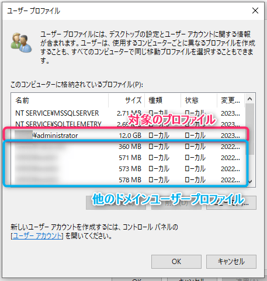
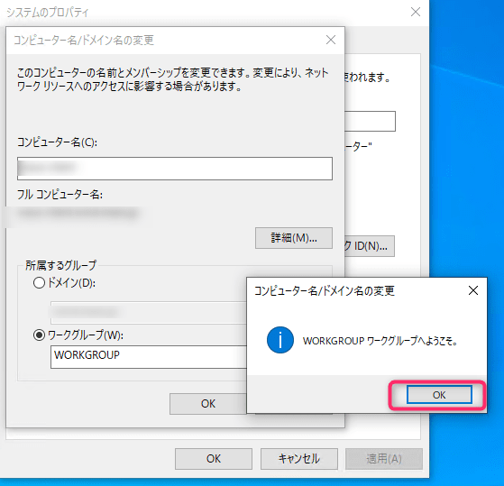
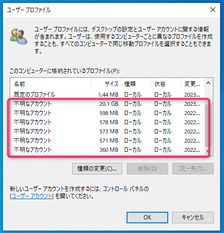
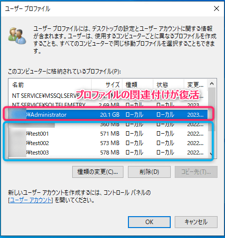

こんにちは、じんないです。

Windows では OS のシステム領域のほか、ユーザーの個人領域が `C:\Users` 配下に作られます。

この**個人領域のことをユーザープロファイル (以下、プロファイル)** といい、デスクトップやドキュメントフォルダ等が含まれます。

Linux では `/home` 配下に作成され、ホームディレクトリと呼ばれます。

プロファイルはその名のとおり、個人の領域なので他のユーザーはアクセスできません。（ローカルの管理者ユーザーを除く）

このプロファイルはローカルやドメイン問わずユーザーごとに作成されます。

この度、ドメインで運用中の PC があり、ドメインに再参加させる機会がありました。

すでに**ドメインのプロファイルが存在する場合に、一度ドメインから離脱し、再度参加した時に元のプロファイルが引き継げるのか**が気になり調査してみました。

今回はその結果と確認内容を記事にしてみます。

## 想定環境

- OS: Windows 10 Pro
- バージョン: 21H2
- 調査対象のユーザー： ドメイン Administrator

## 結論

先に結論を言うと**問題なく元のユーザープロファイルを引き継げます**。

ただし、いくつか条件があるので詳細は以降に記載します。

## 作業前の確認

まずは対象のプロファイルを確認します。

コマンドプロンプトから `ser user` を実行すると現在のプロファイルを確認できます。

```cmd{6}
C:\Users\administrator>set user
USERDNSDOMAIN=<ドメイン名>
USERDOMAIN=<NetBIOS ドメイン名>
USERDOMAIN_ROAMINGPROFILE=<NetBIOS ドメイン名>
USERNAME=administrator
USERPROFILE=C:\Users\administrator
```

`USERPROFILE=` に記載されているパスがプロファイルの場所です。

その他にどのようなプロファイルが存在するのかは以下の画面から確認できます。

`[システムのプロパティ] > [詳細設定] > [ユーザープロファイル] > [設定]` 

※ ローカルの管理者権限が必要です。



## ドメインの離脱と再参加

一度、ドメインから離脱しワークグループへ参加します。



※ ドメインの離脱と再参加の手順は割愛します。

ローカルユーザーでログオンし、もう一度システムのプロパティからプロファイルの一覧を確認するとドメインユーザープロファイルがすべて `不明なアカウント` となっています。



Windows はユーザーやセキュリティグループなどのオブジェクトを**一意の SID (Security Identifier) で管理**しています。

ドメイン離脱すると、この SID の関連付けがなくなり、上図のような表示となってしまいます。

ではもう一度ドメイン参加してみます。


再度システムのプロパティからプロファイルの一覧を確認すると、ユーザーの関連付けが復活していました。



ドメインの Administrator でログオンするとデスクトップに配置していたファイルなどが復元されています。

アプリケーションの起動も問題ありませんでした。

プロファイルの格納場所も元どおりです。

```cmd{6}
C:\Users\administrator>set user
USERDNSDOMAIN=<ドメイン名>
USERDOMAIN=<NetBIOS ドメイン名>
USERDOMAIN_ROAMINGPROFILE=<NetBIOS ドメイン名>
USERNAME=administrator
USERPROFILE=C:\Users\administrator
```

## プロファイルを引き継げないパターン

逆に引き継げないパターンは以下のとおりです。

1. 意図的にプロファイルを削除した
2. ドメイン上から対象のユーザーを削除した (再作成を含む)

ドメイン上から対象のユーザーを削除し、もう一度同じユーザーを作成した場合も引き継ぐことができません。

これは、**再作成することで SID が異なってしまうため**です。たとえ同性同名のユーザーであってもです。

このあたりは注意が必要ですね。

ただ単にドメインの離脱と再参加をする場合は、問題なく元のプロファイルを引き継げるでしょう。

ではまた。
