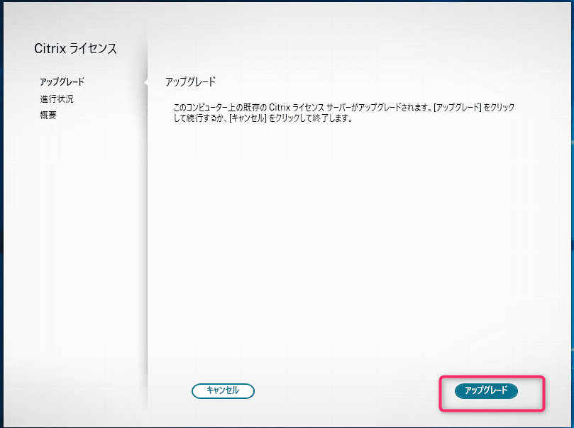

こんにちは、じんないです。

Citrix では2023年4月1日からオンプレミス環境におけるライセンステレメトリデータの収集が開始されます。

それに伴い、ライセンスサーバーのアップデートも必要になっており、2023年3月31日までに対応しなければなりません。

[Required License Server Update](https://support.citrix.com/article/CTX477636/required-license-server-update)

ライセンステレメトリデータの収集を有効化しない場合、**製品サポートを受けられなくなる**のでアップデートは必須と言えます。

また、ライセンステレメトリデータの収集は、ライセンスサーバーをバージョン `11.17.2.0 Build 42000` へアップデートすることで自動的に有効化されます。

今回は**ライセンスサーバーのアップデートの流れ**と、ライセンステレメトリデータが**正常にアップロードされているかの確認手順**を紹介します。

重要なことなので先に書いておきますが、**ライセンスサーバーのアップデートに伴う OS の再起動は不要**です。

なお、オンプレミスのライセンスサーバーを利用していないクラウドサービスご利用の方はアクションの必要はありません。

## 製品サポートを受けるためにやること

1. 2023年3月31日までにライセンスサーバーをバージョンを 11.17.2 Build 42000 以降にアップデート 
2. 継続的なライセンスサーバーのアップデート（新しいライセンスサーバーのリリースから6ヵ月以内にアップデートが必要）

## 想定環境

- Citrix Virtual Apps 1912 LTSR CU4

ライセンステレメトリデータを自動的にアップロードするためには、**ライセンスサーバーがインターネットに接続できる必要**があります。

ファイアウォールでアウトバウンドを制限している場合は以下の通信を許可してください。

送信元 | 宛先 | ポート/プロトコル
-- | -- | --
ライセンスサーバー | cis.citrix.com | 443/tcp

インターネットへの通信が禁止されている場合は、手動でライセンステレメトリデータをアップロードできるようです。詳細は以下を参照してください。

[How to manually upload Telemetry data to CIS](https://support.citrix.com/article/CTX472950/how-to-manually-upload-telemetry-data-to-cis)


## ライセンスサーバーのアップデート手順

まず、ライセンスサーバーをアップデートします。

ライセンスサーバーソフトウェアは以下からダウンロードしてください。※ ログインが必要です。

[License Server for Windows - Version 11.17.2.0 Build 42000 - Citrix](https://www.citrix.com/downloads/licensing/license-server/license-server-version-111720-42000-for-windows.html)

`CitrixLicensing.exe` を管理者として実行します。


`アップグレード` をクリックします。



以下のように表示されていることを確認し、完了します。

> Citrix ライセンスサーバーが正しくアップグレードされました。


Citrix License Manager を起動し、ライセンスサーバーのバージョンが `11.17.2.0 Build 42000` へアップデートされていることを確認します。


## 正常にアップロードされているかの確認方法

ライセンステレメトリデータが正常にアップロードされているかは、ライセンスサーバーのログを確認して判断します。

ライセンスサーバーのログは以下に出力されます。このログをテキストエディター等で開きます。

`C:\Program Files (x86)\Citrix\Licensing\LS\Logs\log_ctxuploader.log`

ログの一番下に最後のアップロードに関するログが出力されます。

ここに `CTX_UPLOADER_SUCCESS` という文字列が記録されている場合、**正常にアップロードできている**と判断できます。

参考までに弊社で確認した際のログを記載します。

```{7}
<?xml version='1.0' encoding='utf8'?>
<UploadResponse><uuid>6ef3d554-be75-11ed-a859-000d3a021e8d</uuid><ChunkMax>10485760</ChunkMax><ChunkOptimal>262144</ChunkOptimal></UploadResponse>}
SSL closed successfully
Socket closed successfully
Upload successful
}
cmd_stderr                : {<CtxUploaderResult><Code>CTX_UPLOADER_SUCCESS</Code><Msg></Msg><t>1678364711</t><UploadType>CTX_UPLOAD_TYPE_COMPLIANCE</UploadType></CtxUploaderResult>}
cmd_exitcode              : 0
exitReason                : REASON_NORMAL
exitReasonSpecific        : REASON_NORMAL
size_child_consumed_stdin : 0

}
successful
Finish time UTC={2023-03-09T12:25:11Z} LOCAL={03/09/2023 21:25:11}
```

`cmd_stderr` に出力されているのですが、サポートセンターに確認すると問題ないとのことでした。

ライセンステレメトリデータのアップロードは Citrix License Server の起動後、1日1回の頻度で行われるようです。

以上で一連の対応は完了です。

新しいライセンスサーバーのリリースがどのような頻度なのかは不明ですが、運用の手間が増えるのは間違いなさそうですね。

ひとまず、2023年3月31日までに対応が必要とのことですので、まだの方はお急ぎください。

ではまた。
