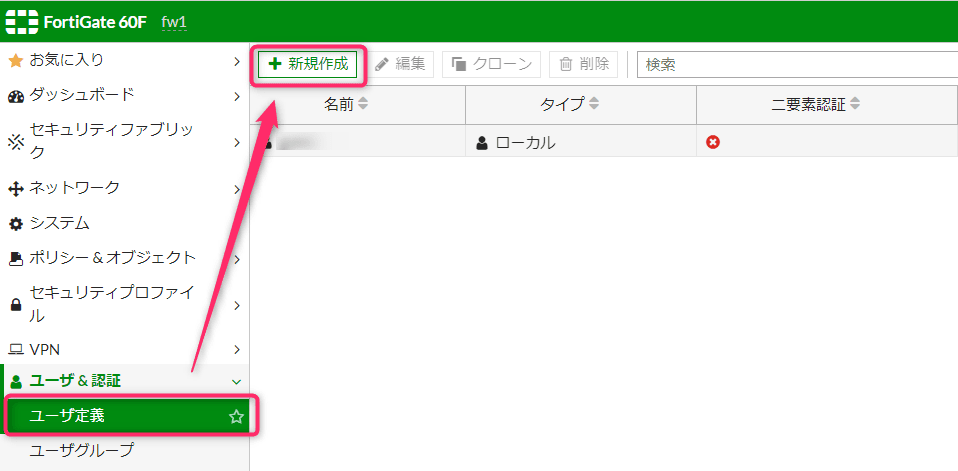
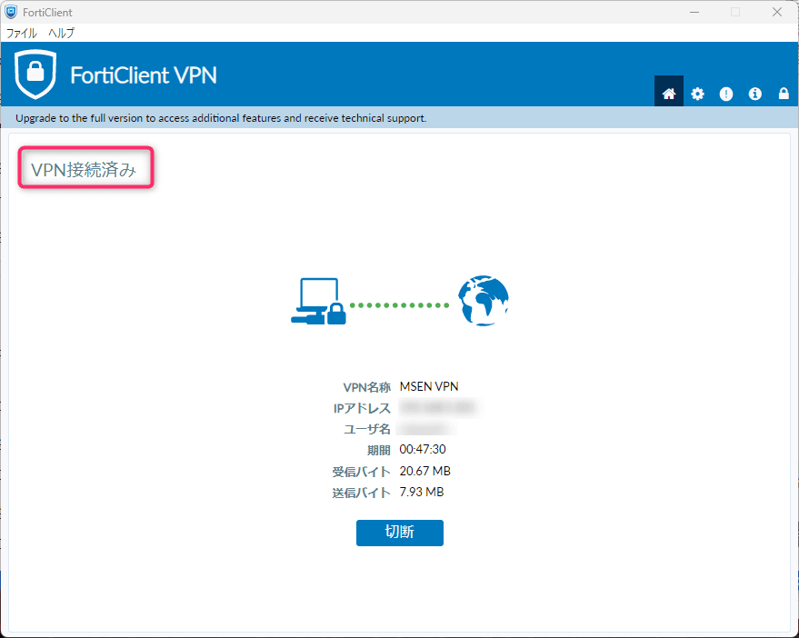

こんにちは、じんないです。

昨今のコロナ禍によるテレワークの増加に伴い、VPN を使用して社内の環境へアクセスするケースも増加しています。また、それに伴って **VPN 装置の脆弱性を悪用した攻撃も増加**しています。

[2023年も続くランサムウエア攻撃の脅威、狙われ続ける病院とVPN装置 | 日経クロステック（xTECH）](https://xtech.nikkei.com/atcl/nxt/column/18/02294/00005/)

脆弱性への対処として最新のパッチを適用することももちろんですが、**VPN 接続のセキュリティを向上させることも必須**と言えるのではないでしょうか。

今回は FortiGate 60F で SSL VPN に二要素認証を設定してみます。二要素認証に必要なトークンは **slack** (メール経由) へ通知させてみようと思います。

## 想定環境

- FortiGate60F
- Forti OS v6.4.11
- FortiClient VPN 7.0.7.0345
- slack を利用している

すでに ユーザー名・パスワードによる SSL VPN が構成されていることを前提としてます。

## 準備
### SMTP サーバーの設定

まず、トークンを送信するために **SMTP サーバーを設定が必要**です。

FortiGate の Web インタフェースへログインし左ペイン `システム > 設定` から SMTP サーバーを設定します。


### slack メールアドレスの取得

slack を開きトークン受信用のメールアドレスを取得します。slack でないくてもよい方はお持ちのメールアドレスでかまいません。

自分のダイレクトメッセージチャンネルの右クリックメニューから、`会話の詳細を表示する` を開きます。


インテグレーションタブから `この会話にメールを送信する` をクリックします。


自分のチャンネルへ投稿されるメールアドレスを取得します。後で使用しますのでメモしておきましょう。**このメールアドレスは後からでも参照できます**。


## 二要素認証の設定
### ユーザー定義の設定

左ペイン `ユーザー&認証 > ユーザー定義` から `新規作成` をクリックします。



今回は LDAP ユーザーを設定します。このあたりはお使いの環境に合わせて読み替えてください。

`リモート LDAP ユーザー` を選択し次へ進みます。


認証先の LDAP サーバーを指定し、次へ進みます。


二要素認証を設定するユーザーを選択し、右クリックメニューから `選択したものを追加` しサブミットします。


### 二要素認証の有効化とメールアドレスの設定

ターミナルソフトから FortiGate のコマンドラインインタフェースへログインします。

※ E メールベースの二要素認証は**コマンドラインインタフェースからのみ**有効化できるようです。

以下のコマンドを入力し二要素認証の有効化とトークン送付先のメールアドレスを設定します。

```bash
fw1 # config user local

fw1 (local) # edit <ユーザー名>

fw1 (ユーザー名) # set two-factor email

fw1 (ユーザー名) # set email-to <slack のメールアドレス>

fw1 (ユーザー名) # end
```

ユーザーの数だけ繰り返し設定します。

Web インタフェースへ戻り、前項で作成したユーザーの編集画面を開きます。**E メールベースの二要素認証が有効化**され、メールアドレスが設定されていることが確認できます。


## 動作確認

通常どおり FortiClient VPN からユーザー名とパスワードを入力し接続します。


するとトークンを入力する項目が表示されるので slack に通知されるトークンを入力し、OK をクリックします。


slack へはこのように通知されます。


入力したトークンに誤りがなければ接続が完了します。



## トークンの有効期限が切れる場合

メールの遅延やトークンの入力間違い等で二要素認証に失敗し接続できないことがあります。**トークンの有効期限は60秒**です。

FortiGate のコマンドラインインタフェースから以下のコマンドを実行することでトークンの有効期限を延長できます。

今回の例ではタイムアウトを120秒に設定しました。

```bash
fw1 # config system global

fw1 (global) # set remoteauthtimeout 120

fw1 (global) # set two-factor-email-expiry 120

fw1 (global) # end
```

今のところデフォルトでも特に問題なく接続できていますが、時間切れになる場合は試してみてはどうでしょうか。

ではまた。

## 参考

- [Emailを使ったワンタイムパスワード設定～FortiGateのVPNで使える二要素認証～｜技術ブログ｜C&S ENGINEER VOICE](https://licensecounter.jp/engineer-voice/blog/articles/20210129__fortigatevpn_emailfortitoken.html)
- [Troubleshooting Tip: SSL-VPN and two-factor expiry... - Fortinet Community](https://community.fortinet.com/t5/FortiGate/Troubleshooting-Tip-SSL-VPN-and-two-factor-expiry-timers/ta-p/191661?externalID=FD47443)
