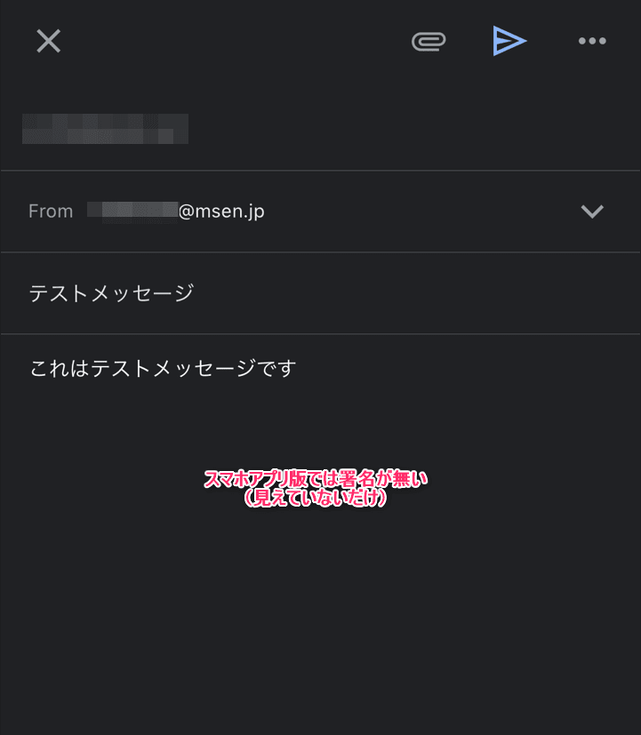

こんにちは、じんないです。

弊社では社用メールに Gmail を使用しています。

基本は PC からブラウザで使用していますが、移動中などはスマホアプリから使用しています。

iOS の Gmail スマホアプリからメール送信や返信を行った場合に **PC 版の署名が勝手に引き継がれます**。また、返信であっても新規メール用の署名設定が挿入されてしまいます。

PC 版のように編集時に表示されていればよいのですが、**メールを送った後でないと気付けない**のもやっかいなところです。

以前 Android を使っていた時は、このような現象はなかったように思うのですが。

今回はスマホアプリ版において PC 版の署名設定を無効にする方法を紹介します。

## 想定環境

- OS バージョン: iOS 16.1.1
- アプリバージョン: 6.0.230205.1642214

## 現象

まず、PC 版の署名設定は以下のようになっています。

- 新規メール用
    - 自分の署名
- 返信/転送用
    - 署名なし

少し長いですが、下図が新規メール用の署名です。

続いて、スマホアプリから新規メールを送ると下図のようになります。この時点では署名は入っていません。

ところが届いたメールを見ると署名が入っています。

次は、スマホアプリからメールを返信した場合はどうでしょう。新規メール送信時と同じく、この時点では署名は入っていません。

ところが届いたメールを見ると、新規メールと同じく署名が入っています。PC 版では返信/転送用は `署名なし` に設定しているのですが、それも効いていないようです。

## 署名設定を無効にする方法

スマホアプリでの署名設定を無効にするには**モバイル署名を有効**にする必要があるようです。

Gmail スマホアプリから左上の `三` を開きます。

下の方にある `設定` を開きます。

`署名設定` を開きます。

`モバイル署名` をオンにします。

スマホアプリからメール送信時に署名を挿入したい場合は、署名を設定します。今回はなしで設定しました。

## 動作確認

モバイル署名を有効後、新規メールを送信すると署名がなくなっていました。

返信時も署名がありません！これでOKですね。

冒頭でも書きましたが、Android 版ではこのような現象はなかったように思えます。親和性の問題なんでしょうか。

これでスマホアプリからでも気にせずメールが送れそうです。

ではまた。
