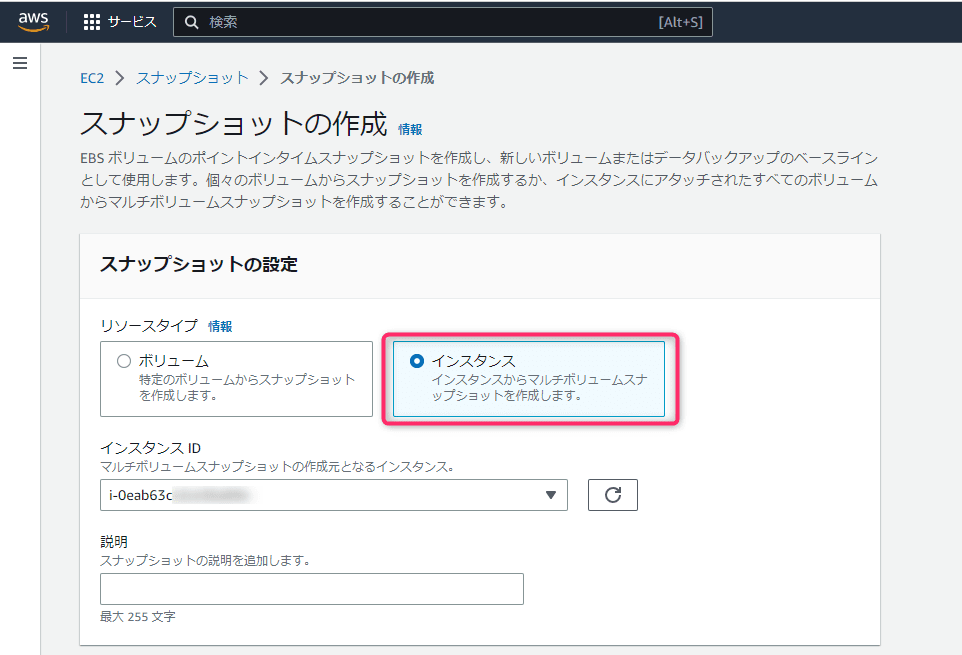
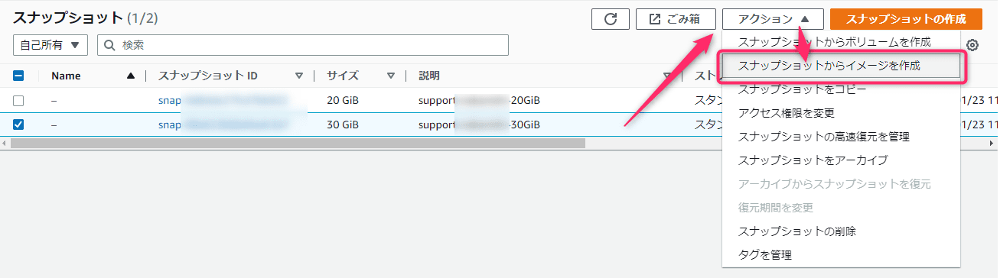
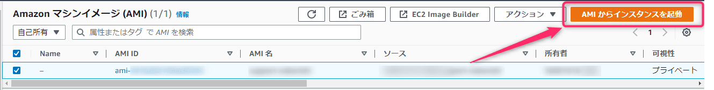
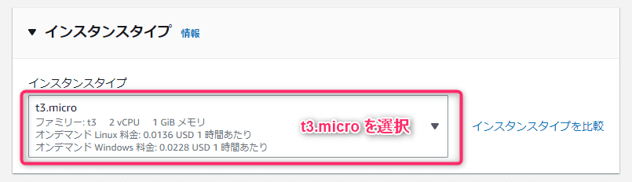

こんにちは、じんないです。

AWS 環境において Amazon EC2 (Amazon Elastic Compute Cloud) を利用されている方も多いのではないでしょうか。

今回は**特定のリージョンで稼働させている EC2 インスタンスを別のリージョンへ移行する方法**を紹介します。

## 想定環境

- 移行元のリージョン：ap-northeast-1 (東京)
- 移行先のリージョン：ap-northeast-3 (大阪)
- EBS ボリューム構成
    - OS 領域：30 GiB `/dev/xvda`
    - データ領域：20 GiB `/dev/sdf`

Amazon EC2 サービスの基本操作ができる方を読者対象としています。詳細な手順は割愛していますのであらかじめご了承ください。

## スナップショットの作成とコピー

まず、左ペインのスナップショットから [スナップショットの作成] をクリックし、**インスタンスのスナップショット**を取得しておきます。EBS ボリュームが1つの場合はボリュームのスナップショットでも問題ありません。

また、ライフサイクルマネージャーによる定期的なスナップショットを作成している場合、そのスナップショットを使うこともできます。

スナップショットのステータスが `完了済み` になるまで待ちます。

スナップショットの作成が完了したら、移行先のリージョンへコピーします。

対象のスナップショットを選択し、アクションから `スナップショットをコピー` をクリックします。**複数ある場合にまとめて移行できないところが残念なポイント**です。

送信先のリージョンを選択し、スナップショットをコピーします。今回は大阪リージョン `ap-northeast-3` へコピーします。

リージョンを切り替えてスナップショットを確認し、スナップショットのステータスが `完了済み` になっていれば OK です。

## スナップショットからマシンイメージ (AMI) を作成

コピーしたスナップショットからマシンイメージ (AMI) を作成します。OS 領域が格納されたスナップショットを選択し、アクションから `スナップショットからイメージを作成` をクリックします。

ルートデバイス名は元のマウントポイントと合わせます。今回の例では `/dev/xvda` です。

ボリュームが複数ある場合は、ボリュームを追加しイメージを作成します。この時も同様にマウントポイントに注意しましょう。今回の例では `/dev/sdf` へ変更しています。

**もともとあったボリュームがすべてそろわないとインスタンスの起動ができない**ので気を付けてください。

左ペイン AMI から作成したマシンイメージを確認できます。

## AMI から EC2 インスタンスを作成

作成した AMI から EC2 インスタンスを起動します。

インスタンスタイプは元のもとの同一の `t3.micro` を選択しました。違うタイプのものでも大丈夫だと思いますが、サービスが起動しないなど予期せぬトラブルを回避するために**同一以上のものを選ぶことを推奨**します。

キーペアは新たに作成するか、既存のものを使用するか選択します。今回の例では新たに作成しました。

起動したインスタンスのステータチェックが合格すれば完了です。

作成した（または既存の）キーペアでインスタンスに接続できることを確認しておきましょう。

## 別リージョンへ移行できないもの
### セキュリティグループ

セキュリティグループは別リージョンへのコピーができそうにないので、新規作成の必要があります。

同じインバウンドルール、アウトバウンドルールを設定しましょう。

> あるセキュリティグループから、同じ AWS リージョン内で作成された新しいセキュリティグループにルールをコピーすることができます。

[既存のセキュリティグループから新しいセキュリティグループへルールをコピーする](https://aws.amazon.com/jp/premiumsupport/knowledge-center/vpc-copy-security-group-rules/)

### Elastic IP アドレス

Elastic IP (固定のグローバル IP) アドレスもまた、別リージョンリージョンへ移行できないようです。

固定のグローバル IP アドレスが必要な場合は、DNS のレコード切り替えで対応しましょう。

> Elastic IP アドレスは特定のリージョン専用であり、別のリージョンに移動することはできません。

[Elastic IP アドレス - Amazon Elastic Compute Cloud](https://docs.aws.amazon.com/ja_jp/AWSEC2/latest/UserGuide/elastic-ip-addresses-eip.html)

## AMI を作成してからコピーする方法も

今回紹介した例では スナップショットを別リージョンへコピーし、その後インスタンスを起動する方法でした。

マシンイメージ (AMI) の作成まで同一リージョンでしておいて、その後 AMI を別リージョンへコピーする方法でも可能なようですね。

[Amazon EC2 で、ある AWS リージョンから別の AWS リージョンに AMI をコピーする](https://aws.amazon.com/jp/premiumsupport/knowledge-center/copy-ami-region/)

お好きな方法で試していただければと思います。

ではまた。
