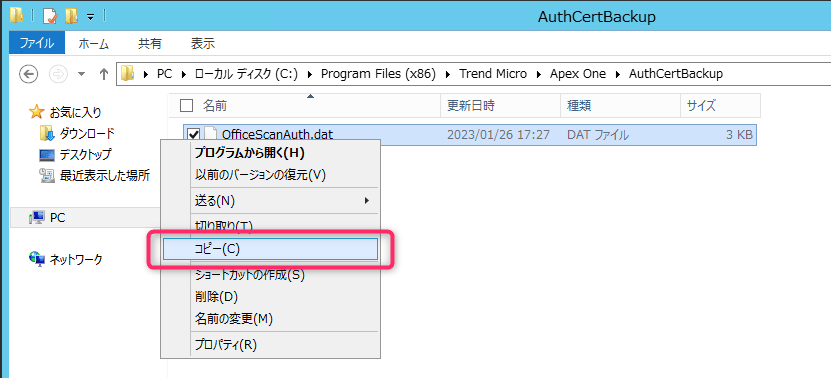
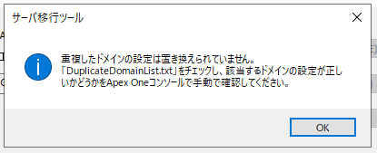

こんにちは、じんないです。

Trend Micro Apex One 2019 (以下、Apex One) では管理サーバーの移行用に **Server Migration Tool** が用意されています。

今回は **Server Migration Tool を使って Apex One を移行する方法**を紹介します。

## 想定環境

- **移行元**
    - OS: Windows Server 2012 R2
    - バージョン：Trend Micro Apex One 2019 ビルド 11564
- **移行先**
    - OS: Windows Server 2022
    - バージョン：Trend Micro Apex One 2019 ビルド 11564

Apex One では予期せぬトラブルを防止するために、移行元と移行先で**最新バージョンを使用することが推奨**されています。

## 移行のシナリオ

移行のシナリオは下記の2パターンがあります。

1. **移行前後でコンピューター名と IP アドレスが同じ場合**
2. **移行前後でコンピューター名と IP アドレスが異なる場合**

それぞれ以下のような特徴があります。

**前者の場合**
- コンピューター名と IP アドレスが同じなため、エージェントの移行作業が実質ない。
- コンピューター名と IP アドレスを切り替えたあとに新規インストール作業する必要があるため、サービスのダウンタイムが長い。

**後者の場合**
- 移行元サーバーを稼働させながら移行先サーバーを構築できるため、切り替え時のサービスダウンタイムが短い。
- エージェント移行の際、すべてのエージェントの参照先が移行先サーバーに切り替わるまで移行元サーバーを停止できない。
※ 上記はエージェントの再インストールで新しい参照先に変更できるようです。

今回は `1. 移行前後でコンピューター名と IP アドレスが同じ場合` を例にシナリオを紹介します。

具体的には下記のような流れです。

1. 移行元サーバーの設定をバックアップ
   1. 設定のバックアップ
   2. サーバー証明書のバックアップ
2. コンピューター名と IP アドレスを変更（引き継ぎ）
3. 移行先サーバーに Apex One をインストール
   1. インストール時に証明書をリストア
4. 移行先サーバーで設定をリストア
5. Apex One エージェントの移行

公式ページにも概要は載っているのですが、具体的にいつどのようにするのかの情報が不十分でしたので、そのあたりのポイントに触れたいと思います。

- [サーバを新しくする際に旧サーバの設定を移行し、バージョンアップを実施する方法| Trend Micro Business Support](https://success.trendmicro.com/jp/solution/1313912)

詳細な手順は割愛していますのでご了承ください。

## 移行の流れ
### 設定のバックアップ

Server Migration Tool を移行元サーバーで実行し、設定をバックアップします。

Server Migration Tool は Apex One にバンドルされており、通常は以下のパスに格納されています。

`C:\Program Files (x86)\Trend Micro\Apex One\PCCSRV\Admin\Utility\ServerMigrationTool\ServerMigrationTool.exe`

`ServerMigrationTool.exe` を管理者として実行し、設定を任意の場所にエクスポートします。

エクスポートしたファイルは移行先サーバーの任意の場合に格納しておきます。

### サーバー証明書のバックアップ

公式のページでは `certificateManager` コマンドを使用するようなことも書いているのですが、セキュリティ観点から**比較的新しいバージョンでは使えない**ようです。

[サーバ認証機能の概要および証明書の更新(変更)/バックアップ方法について | Trend Micro Business Support](https://success.trendmicro.com/jp/solution/1107184)

本環境 (ビルド 11564) では `OfficeScanAuth.dat` というファイルを移行元サーバーからコピーするだけで OK でした。

以下のパスに格納されています。

`C:\Program Files (x86)\Trend Micro\Apex One\AuthCertBackup\OfficeScanAuth.dat`

バックアップした dat ファイルは移行先サーバーの任意の場所に格納しておき、Apex One インストール時にインポートします。

## Apex One のインストール

コンピューター名と IP アドレスを変更後、移行先サーバーで Apex One をインストールします。手順は公式のマニュアル等を参照してください。

Apex One のインストールの途中で、サーバー証明書のインポート画面が出てきます。

先に格納しておいた `OfficeScanAuth.dat` を指定し、バックアップパスワードを入力しインポートします。

パスワードが分からない場合は、新しい証明書を生成するしかないようです。

ちなみに、このサーバー証明書が移行できなかった場合にどのような影響があるのかは分かりませんでした。

### 設定のリストア

Server Migration Tool を移行先サーバーで実行し、設定をリストアします。

バージョンによって異なるかもしれませんが、Server Migration Tool の格納場所は同じでした。

以上で、Apex One の移行は完了です。Apex One コンソールから設定が移行されているか確認してください。

移行前後でコンピューター名と IP アドレスが同じ場合は、移行先サーバーへとエージェントが順次接続されます。

エージェントツリーからエージェントが登録されるか確認しておきましょう。

## こんな画面が表示されたら

設定のリストアの際に以下のような画面が表示されることがあります。

インポート時に、ドメインツリーに構成された**ドメインがすでに存在する場合**に表示されるようです。

この場合、重複されたドメイン情報が移行されないため、**ドメインに紐づく検索設定などが移行されません**。

同ディレクトリに出力された `DuplicateDomainList.txt` で記載されているドメインを削除し、再試行してください。

同様のダイアログがでなければ成功です。

念のため検索設定等が引き継がれているか確認しておきましょう。

ではまた。

## 参考

- [サーバを新しくする際に旧サーバの設定を移行し、バージョンアップを実施する方法| Trend Micro Business Support](https://success.trendmicro.com/jp/solution/1313912)
