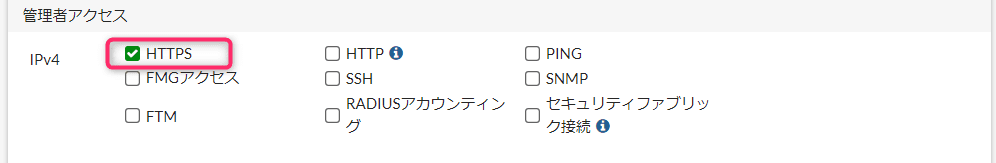
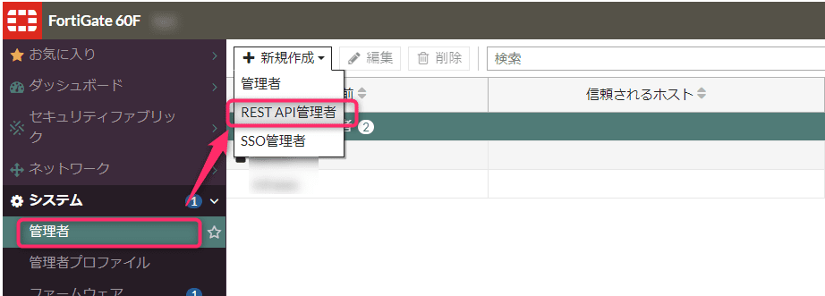
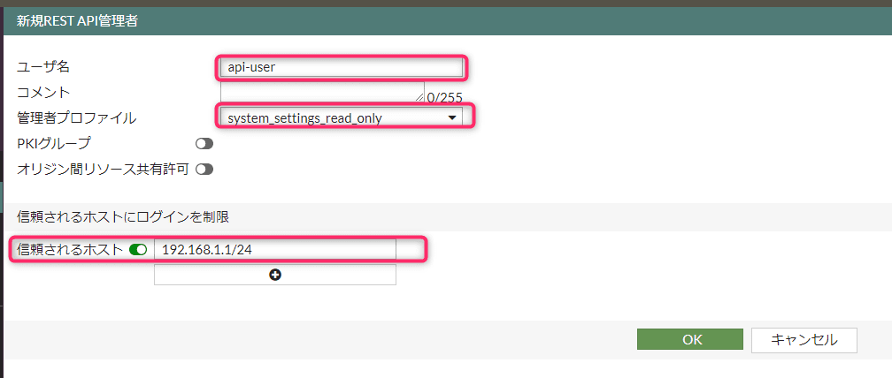
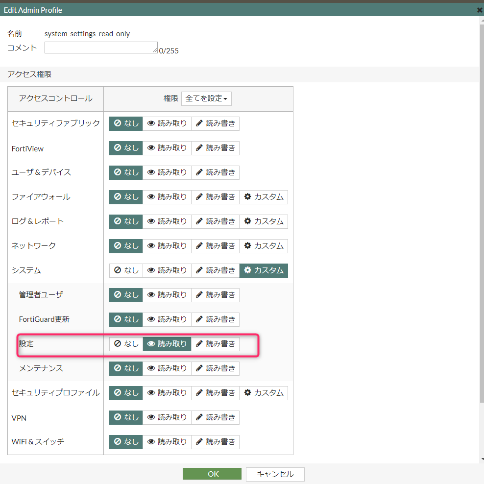
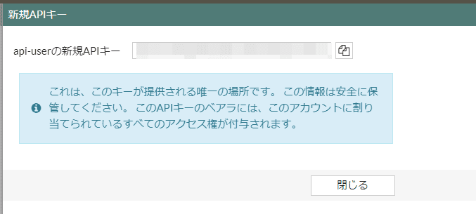

こんにちは、じんないです。

昨今のコロナ禍によるテレワークの増加に伴い、VPN を使用して社内の環境へアクセスするケースも増加しています。また、それに伴って **VPN 装置の脆弱性を悪用した攻撃も増加**しています。

[JPCERT コーディネーションセンター](https://www.jpcert.or.jp/) の Weekly Report でも FortiOS の脆弱性に関する情報が増えています。

脆弱性が公表された場合、いち早くパッチを適用する必要があります。FortiGate などのファイアウォール装置はインターネットとイントラネットネットの境界であることが多く、より早急な対応が望まれます。

脆弱性が公表された場合に必要な情報として **「どの FortiGate がどの FortiOS バージョンで稼働しているのか」** を把握しておく必要があります。

自社の FortiGate を管理しているだけならまだしも、お客様の環境の FortiGate を複数管理している場合、大変になってきます。

そのような問題を解消すべく、本記事では **Zabbix から FortiOS のバージョンを監視する方法**を紹介します。

Zabbix Proxy などの整備は必要ですが各サイトでの FortiOS のバージョンが Zabbix で一元管理できると便利ですね。

まずは前編として **FortiGate REST API を使って FortiOS のバージョンを取得する方法**を紹介します。

※ 後編ではこの API を使って Zabbix から FortiOS のバージョンを監視する方法を紹介予定です。

## 想定環境

- モデル: FortiGate 60F
- FortiOS: FortiOS v6.4.12

## 管理者インタフェースの有効化

まず、REST API を使う準備として管理者インタフェースの設定が必要です。

REST API を実行するインタフェース設定の [管理者アクセス] で `HTTPS` を有効化しておきましょう。



## REST API 管理者アカウントの作成

次に、REST API を実行する管理者アカウントを作成します。

[システム] > [管理者] > [新規作成] から `REST API 管理者` を選択します。



ユーザー名、管理者プロファイル、信頼されるホストを設定し作成します。



管理者プロファイルではバージョン取得に必要な最小の権限をもったプロファイルの作成をおすすめします。

私が試した環境では以下のアクセス権限で可能でした。

[システム] > [カスタム] > [設定] を `読み取り` で作成。



作成すると API キーが発行されますので控えておきましょう。




## API を実行してみる

では実際に API を実行してみます。前項で設定した信頼されるホストからしか実行できないので注意しましょう。

コマンドプロンプトを起動して FortiOS のバージョンを取得します。

`curl -k -X GET https://<FortiGate FQDN>/api/v2/monitor/system/status/?access_token=<API キー>`

レスポンスは👇のような感じです。

```cmd{15}
C:\Users\jinna-i>curl -k -X GET https://<FortiGate FQDN>/api/v2/monitor/system/status/?access_token=<API キー>
{
  "http_method":"GET",
  "results":{
    "model_name":"FortiGate",
    "model_number":"60F",
    "model":"FGT60F",
    "hostname":"<ホスト名>"
  },
  "vdom":"root",
  "path":"system",
  "name":"status",
  "status":"success",
  "serial":"<シリアル番号>",
  "version":"v6.4.12",
  "build":2060
}
```

バージョン情報が取得できています。

REST API は FortiGate CLI と以下のような関係があるようです。

REST API URL | 対応コマンド | 使い方
-- | -- | --
/api/v2/cmdb | config xx yy | /cmdb/xx/yy
/api/v2/monitor | get xx yy | /monitor/xx/yy

[FortiGateのREST APIを利用してみた - Qiita](https://qiita.com/kkmiura/items/80d8f8d1f3db0d07ec32)

FortiGate CLI で `get system status` を実行するとバージョン情報が取得できるので今回はその API を使用しました。

以上で FortiGate REST API を使って FortiOS のバージョンが取得できました。

次回はこの REST API を使って Zabbix からバージョンを監視してみます。

それではまた。


## 参考

- [REST API administrator | FortiGate / FortiOS 6.4.12](https://docs.fortinet.com/document/fortigate/6.4.12/administration-guide/399023/rest-api-administrator)


- [Using APIs | FortiGate / FortiOS 6.4.12](https://docs.fortinet.com/document/fortigate/6.4.12/administration-guide/940602)
