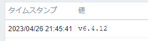

こんにちは、じんないです。

前回の記事では **FortiGate REST API を使って FortiOS のバージョンを取得する方法** を紹介しました。

今回はその続編として **Zabbix から FortiGate REST API を実行して FortiOS のバージョンを監視する方法** を紹介します。


## 想定環境

- Zabbix Server: 6.0 LTS
- モデル: FortiGate 60F
- FortiOS: FortiOS v6.4.12

前提条件として **Zabbix Server から FortiGate の管理インタフェース (HTTPS) にアクセスできる** 必要があります。

## アイテムの作成
### マスタアイテムでバージョン情報を取得

まずは FortiGate のバージョンを取得するための元となるアイテムを作成します。

- 名前： 任意の名前で OK
- タイプ： `HTTP エージェント`
- キー： 任意の名前で OK
- データ型： `テキスト`
- URL： `https://<FortiGate FQDN>/api/v2/monitor/system/status/`
- リクエストメソッド： `GET`
- ヘッダー：
    - 名前： `Authorization`
    - 値：`Bearer <API キー>`


URL と API キーは画像のようにマクロ化しておくとテンプレート化したときに便利だと思います。単一ホストに割り当てる場合は直接設定しても問題ありません。

この状態で json 形式のデータが取得できているか確認します。最新データを参照し以下のように取得できていれば OK です。


### 依存アイテムで json データをパース


先のマスタアイテムで取得した情報は以下でした。

```json
{
  "http_method":"GET",
  "results":{
    "model_name":"FortiGate",
    "model_number":"60F",
    "model":"FGT60F",
    "hostname":"<ホスト名>"
  },
  "vdom":"root",
  "path":"system",
  "name":"status",
  "status":"success",
  "serial":"<シリアル番号>",
  "version":"v6.4.12",
  "build":2060
}
```

このままでは情報量が多く見にくいので、依存アイテムを作成し json データをパースしたあと必要な情報のみを取得していきます。

- 名前： 任意の名前で OK
- タイプ： `依存アイテム`
- キー： 任意の名前で OK
- データ型： `テキスト`
- マスタアイテム： 前項で作成したマスタアイテム

ヒストリやトレンドデータの保存期間は任意に設定してください。


[保存前処理] タブから保存前処理の設定を追加します。実際に json をパースするのはこの部分です。

- 名前：`JSONPath`
- パラメーター：`$.version`


最新データから作成したアイテムの値を確認します。

問題なければ以下のようにバージョン情報が取得できていると思います。



少し応用編ですが、次はモデル名を取得してみます。モデル名 `model_name` は先ほどの `version` と異なり、`results` の子属性です。

```json{4}
{
　：略
  "results":{
    "model_name":"FortiGate",
    "model_number":"60F",
    "model":"FGT60F",
    "hostname":"<ホスト名>"
  },
　：略
}
```

依存アイテムの作成までは変わらないので割愛しますが、`results` 下の `model_name` を取得するように設定します。

- 名前：`JSONPath`
- パラメーター：`$.results.model_name`


問題なければモデル名も正常に取得できると思います。


そのほか、`JSONPath` でサポートされるパラメーターは公式のドキュメントを参照願います。

[3 jsonPath機能](https://www.zabbix.com/documentation/6.0/jp/manual/config/items/preprocessing/jsonpath_functionality)

## ダッシュボードへの追加

取得したアイテムの情報はダッシュボードへ追加しておくと見やすくていいですね。

今回は OS バージョンの他、モデル名やモデルナンバー、シリアルナンバーの情報を合わせて取得しました。


シリアルナンバーも取っておくと、サポートなどへの問い合わせの際に便利ですね。

## 参考

- [16 HTTP agent](https://www.zabbix.com/documentation/6.0/jp/manual/config/items/itemtypes/http)
- [2 アイテムの値の保存前処理](https://www.zabbix.com/documentation/6.0/jp/manual/config/items/preprocessing)
- [3 jsonPath機能](https://www.zabbix.com/documentation/6.0/jp/manual/config/items/preprocessing/jsonpath_functionality)
