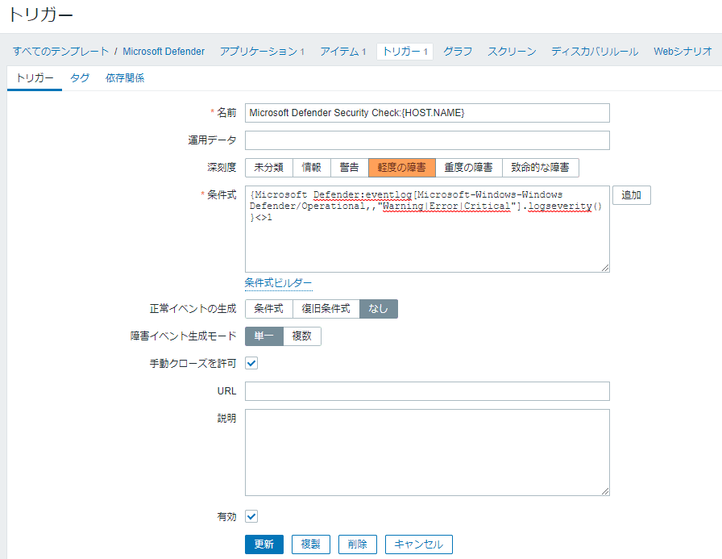

こんにちは、じんないです。

Windows には **Microsoft Defender (Windows Defender) というセキュリティ対策ソフトウェアが標準でインストール**されています。

クライアント OS のみならずサーバー OS にもインストールされています。無償ということもあって、使用されている方も多いのではないでしょうか。

今回は **Microsoft Defender がウィルス等のセキュリティ脅威を検出した際に、Zabbix で検知できるようにしたい**と思います。

## 想定環境

- Windows Server 2019 Standard
- Zabbix Server 4.0 LTS

### 前提

- 対象のコンピューターに Zabbix Agent がインストールされていること
- Agent → Server のアクティブチェックが可能な環境であること

## 脅威検出時にどのようなイベントが記録されるのか

まずは、ウィルス等のセキュリティ脅威検出時に Microsoft Defender がどのような動作をするのか確認してみます。

テストウィルス [Eicar](https://www.eicar.org/) をダウンロードすると、**リアルタイム保護により瞬時に削除**されました。

脅威として検出された履歴は `設定 > 更新とセキュリティ > Windows セキュリティ` から確認できます。

このとき、どのようなイベントログが記録されるのか確認します。

イベントビューアーから以下のイベントを開きます。

`アプリケーションとサービスログ > Microsoft > Windows > Windows Defender > Operational`

テストウィルスをダウンロードした際のイベント ID `1116` (警告) が記録されており、検知時の詳細情報が確認できました。

以上からウィルス等のセキュリティ脅威検出をチェックするには **これらのイベントの発生を Zabbix で監視**すればよさそうです。

## Zabbix の設定

それでは実際に Zabbix で監視するための設定を入れていきます。

### 監視アイテムの作成

まずは Zabbix からイベントログを監視するアイテムを作成します。

今回は例として以下のアイテムを作成しました。監視データの肥大化を防ぐために深刻度 `Warning, Error, Critical` のログのみを監視対象としています。

- 名前：`Microsoft Defender Security Check` ※ 任意の名前でOK
- タイプ：`Zabbix エージェント(アクティブ)`
- キー：`eventlog[Microsoft-Windows-Windows Defender/Operational,,"Warning|Error|Critical"]`

### トリガーの作成

作成したアイテムで**深刻度 `1(情報)` 以外のイベントが記録された場合にトリガー**させます。

イベント ID `1116` を決め打ちしてもよかったのですが、その他の警告やエラーもトリガーしたかったのでこのような設定にしています。

深刻度の数値は [1 Supported trigger functions](https://www.zabbix.com/documentation/4.0/en/manual/appendix/triggers/functions) に記載されています。

> N - severity (integer, useful for Windows event logs:  
>  1 - Information  
>  2 - Warning  
>  4 - Error  
>  7 - Failure Audit  
>  8 - Success Audit  
>  9 - Critical  
>  10 - Verbose).  

- 名前：`Microsoft Defender Security Check:{HOST.NAME}` ※ 任意の名前でOK
- 深刻度: `軽度な障害` 
- 条件式: `{Microsoft Defender:eventlog[Microsoft-Windows-Windows Defender/Operational,,"Warning|Error|Critical"].logseverity()}<>1`
- 正常イベントの生成：`なし`
- 手動クローズを許可: `チェックオン`

トリガーされた場合は都度詳細を確認したいので正常系のイベント生成はなしで作成しています。

## 動作確認

先ほどと同じようにテストウィルス [Eicar](https://www.eicar.org/) をダウンロードし、トリガーされることを確認します。

ヒストリからイベントの詳細を確認できます。イベントログと同じ内容が参照できますね。

アクションでメール通知設定等を行っている場合は以下のようにアラートメールが通知されます。

これでウィルス等のセキュリティ脅威検出を Zabbix で監視できました。

ではまた。

## 参考

- [1 Supported trigger functions](https://www.zabbix.com/documentation/4.0/en/manual/appendix/triggers/functions)
