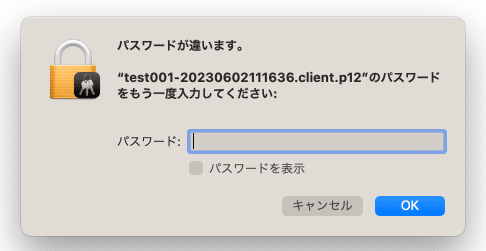

こんにちは、じんないです。

AlmaLinux 9.2 でプライベート認証局を構成し、SSL VPN で使用するクライアント証明書 (pkcs#12形式) を発行していました。

しかし、Windows 端末には正常にインポートできますが、**Mac 端末にはインポートできない**という事象が発生しました。

Mac 端末に取り込むと「パスワードが違います。」というエラーが出ます。



何度試してもインポートできず、パスワードを打ち間違えている様子もなさそうです。

Windows 端末にインポートしたものと同じ証明書を使っているので、証明書がおかしいということも考えにくいです。

いろいろと調査していると **OpenSSL のバージョン (暗号化アルゴリズム) が関係していそう**だとわかりましたので、そのあたりをまとめておきます。


## 想定環境

- **プライベート認証局 (CA)**
    - OS: AlmaLinux 9.2
    - OpenSSL: openssl-3.0.7-6.el9_2
- **Mac 端末**
    - モデル: MacBook Air (M1, 2020)
    - OS: Ventura 13.3.1

## 証明書の MAC が SHA256 になっていることが原因か

原因の切り分けとして、別の環境 (AlmaLinux 8.8) でエクスポートした p12 形式の証明書インポートしてみると何事もなくインポートできます。

以下のコマンドでエクスポートした p12 証明書ファイルの info を見てみます。

`openssl pkcs12 -in [p12 形式の証明書ファイル] -noout -info`

**AlmaLinux 9.2 で発行した証明書（インポートできない方）の info**

```shell
MAC: sha256, Iteration 2048
MAC length: 32, salt length: 8
PKCS7 Encrypted data: PBES2, PBKDF2, AES-256-CBC, Iteration 2048, PRF hmacWithSHA256
Certificate bag
PKCS7 Data
Shrouded Keybag: PBES2, PBKDF2, AES-256-CBC, Iteration 2048, PRF hmacWithSHA256
```

**AlmaLinux 8.8 で発行した証明書（インポートできる方）の info**

```shell
MAC: sha1, Iteration 2048
MAC length: 20, salt length: 8
PKCS7 Encrypted data: pbeWithSHA1And40BitRC2-CBC, Iteration 2048
Certificate bag
PKCS7 Data
Shrouded Keybag: pbeWithSHA1And3-KeyTripleDES-CBC, Iteration 2048
```

結果を比較してみると **メッセージ認証符号 (MAC) のアルゴリズムが異なっています**。

AlmaLinux 9.2 は `OpenSSL 3.0.7` がインストールされており、AlmaLinux 8.8 では `OpenSSL 1.1.1` がインストールされています。

Red Hat の公式ページを見てみると **Red Hat 9 系からシステム全体のセキュリティが強化**されています。その一環で `HMAC (Hash-based Message Authentication Code)` のアルゴリズムも変更されているようです。

[4.7. セキュリティー Red Hat Enterprise Linux 9 | Red Hat Customer Portal](https://access.redhat.com/documentation/ja-jp/red_hat_enterprise_linux/9/html/9.0_release_notes/enhancement_security)

> HMAC (Hash-based Message Authentication Code) での SHA-1 の使用を除く、SHA-1 を使用した無効な TLS アルゴリズムおよび SSH アルゴリズム

以下の GitHub Issue にも同様な報告がされていました。

[Support for PKCS12 certificates that use SHA256 HMAC · Issue #19374 · hashicorp/terraform-provider-azurerm](https://github.com/hashicorp/terraform-provider-azurerm/issues/19374)

Apple の公開情報を見てもそれらしいものがありませんが、インポートできない問題はどうもこのあたりが関係していそうです。

以下のページを見ると macOS 13 系からは逆に SHA-1 がダメなようにも見られますが。

[iOS 13 および macOS 10.15 における信頼済み証明書の要件 - Apple サポート (日本)](https://support.apple.com/ja-jp/HT210176)

> TLS サーバ証明書および発行元の CA は、SHA-2 ファミリーのハッシュアルゴリズムを署名アルゴリズムに用いる必要がある。SHA-1 で署名された証明書は、TLS 通信では信頼されなくなります。

## MAC が SHA-1 の証明書を発行して回避

まず、p12 形式の証明書ファイルを作成する場合、以下のようなコマンドでエクスポートします。

`openssl pkcs12 -export -inkey [秘密鍵ファイル] -in [公開鍵ファイル] -out [p12 形式の証明書ファイル]`

このときに以下のように **`legacy` オプションを付与する** ことで、旧アルゴリズムを使用できます。

`openssl pkcs12 -legacy -export -inkey [秘密鍵ファイル] -in [公開鍵ファイル] -out [p12 形式の証明書ファイル]`

AlmaLinux 9.2 の方で、 `legacy` オプションを付与すると MAC が `sha1` になりました。

```shell
Enter Import Password:
MAC: sha1, Iteration 2048
MAC length: 20, salt length: 8
PKCS7 Encrypted data: pbeWithSHA1And40BitRC2-CBC, Iteration 2048
Certificate bag
PKCS7 Data
Shrouded Keybag: pbeWithSHA1And3-KeyTripleDES-CBC, Iteration 2048
```

※ info を確認するときも以下のように `legacy` オプションを追加する必要がありますので注意してください。

`openssl pkcs12 -legacy -in [p12 形式の証明書ファイル] -noout -info`

**`legacy` オプションを付与してエクスポートした p12 形式の証明書は、正常に Mac 端末にインポートできました。**

OpenSSL の公式情報によると `legacy` オプションの有無で以下のような暗号化アルゴリズムを用いるようです。

- **`legacy` オプションあり**
    - 証明書の暗号化アルゴリズム： `RC2_CBC` または `3DES_CBC`
    - 秘密鍵の暗号化アルゴリズム： `3DES_CBC`
- **`legacy` オプションなし**
    - 証明書の暗号化アルゴリズム： `AES_256_CBC`
    - 秘密鍵の暗号化アルゴリズム： `AES_256_CBC`

> Use legacy mode of operation and automatically load the legacy provider. If OpenSSL is not installed system-wide, it is necessary to also use, for example, -provider-path ./providers or to set the environment variable OPENSSL_MODULES to point to the directory where the providers can be found.
> 
> In the legacy mode, the default algorithm for certificate encryption is RC2_CBC or 3DES_CBC depending on whether the RC2 cipher is enabled in the build. The default algorithm for private key encryption is 3DES_CBC. If the legacy option is not specified, then the legacy provider is not loaded and the default encryption algorithm for both certificates and private keys is AES_256_CBC with PBKDF2 for key derivation.

[/docs/man3.0/man1/openssl-pkcs12.html](https://www.openssl.org/docs/man3.0/man1/openssl-pkcs12.html)


## あとがき

今回は証明書側の暗号化アルゴリズムを脆弱にした対応となっていますので、本来であれば OS 側で対応する必要がありそうですね。このあたりは各 OS の証明書要件に依存しそうでしょうか。

今後のバージョンアップで対応が変化しそうなので動向をつかんでおきたいです。

このあたりは私もまだまだ理解が浅い部分なのでこれを機に深めたいと思います。

## 参考

- [4.7. セキュリティー Red Hat Enterprise Linux 9 | Red Hat Customer Portal](https://access.redhat.com/documentation/ja-jp/red_hat_enterprise_linux/9/html/9.0_release_notes/enhancement_security)
- [Support for PKCS12 certificates that use SHA256 HMAC · Issue #19374 · hashicorp/terraform-provider-azurerm](https://github.com/hashicorp/terraform-provider-azurerm/issues/19374)
- [FAQ for YAMAHA RT Series / IPsec&IKE&VPN](http://www.rtpro.yamaha.co.jp/RT/FAQ/IPsec/normal-encryption-algorithm.html)
- [App Service(Web Apps/Functions)に自己証明書がアップロードできない - Qiita](https://qiita.com/yuna-s/items/47ea0d9e4ad4408e21a1)
