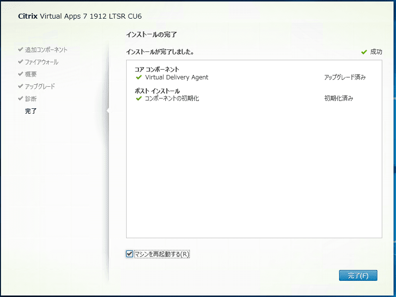

こんにちは、じんないです。

**Citrix Virtual Apps** では累積アップデート (CU:Cumulative Update) が定期的にリリースされ、バグ修正やセキュリティアップデートが行われます。

システムの安定稼働のためにも**累積アップデートは適用することをおすすめします**。

先日、累積アップデート CU6 がリリースされました。

[Cumulative Update 6 (CU6) | Citrix Virtual Apps and Desktops 7 1912 LTSR](https://docs.citrix.com/en-us/citrix-virtual-apps-desktops/1912-ltsr/whats-new/cumulative-update-6.html)

権限昇格の脆弱性（CVE-2023-24483）の修正も含まれているとのことで、早めの適用が望ましいです。

[Citrix Virtual Apps and Desktops Security Bulletin for CVE-2023-24483](https://support.citrix.com/article/CTX477616/citrix-virtual-apps-and-desktops-security-bulletin-for-cve202324483)

CU6 のアップデート評価をしているときに、**Vitual Delivery Agent (以下、VDA) のアップデートでエラーが発生**しました。

エラー内容と弊社で実施した切り分け、回避策を紹介します。

## 想定環境

- Citrix Virtual Apps 1912 LTSR CU6

## エラー概要

VDA アップデート時のエラー内容は以下のとおりです。

> 構成ツール E:\x64\Virtual Desktop Components\IcaConfigurationTool\IcaConfigConsole.exe が失敗しました。
> エラーコード：－4


エラーの詳細です。

```
Error Id: XDMI:B376B5FF

例外:
    Error Source : Citrix Studio
    
    StackTrace: Citrix.MetaInstaller.Exceptions.MetaInstallerException 構成ツール E:\x64\Virtual Desktop Components\IcaConfigurationTool\IcaConfigConsole.exe が失敗しました。エラー コード: -4
       場所 Citrix.MetaInstaller.ConfigUtilities.ExecuteIcaConfigurationTool(String commandLineParams, Boolean useInstalledTool)
       場所 Citrix.MetaInstaller.Vda.Components.IcaTS.Install(InstallationContext context)
       場所 Citrix.MetaInstaller.InstallationManager.InstallComponent(IInstallableComponent component, InstallationContext installContext)
```

上記をソフトウェアサポートへエスカレーションしましたが、具体的な原因の究明には至りませんでした。

## インストールメディアによる切り分け

まず、GUI を用いた CU6 のアップデート方法は以下の2パターンです。

1. CU6 インストールメディア (DVD) の使用
2. CU6 iso イメージファイルのマウント

公式の手順ではどちらでもよいとされています。

> インストーラーを使用するには、次の手順に従います：
> 
> 全製品インストーラーのグラフィカルインターフェイスを実行するには、マシンにログオンし、メディアを挿入するか、新しいリリース用のISOドライブをマウントします。AutoSelectをダブルクリックします。

[環境のアップグレード | Citrix Virtual Apps and Desktops 7 2203 LTSR](https://docs.citrix.com/ja-jp/citrix-virtual-apps-desktops/2203-ltsr/upgrade-migrate/upgrade.html#%E3%82%A2%E3%83%83%E3%83%97%E3%82%B0%E3%83%AC%E3%83%BC%E3%83%89%E6%89%8B%E9%A0%86)

今回はエラーは **`2. CU6 iso のマウント` でアップデートしているときに発生**しました。

切り分けとして DVD ドライブへインストールメディアをセットしたところ、正常にアップデートできました。

※ 正確には VMware 仮想マシン設定で CD/DVD ドライブにデータストア内の iso イメージファイルをセットしました。



### 原因推測

VDA を含む Citirix コンポーネントのアップデート時は途中で数回再起動が必要です。

iso をマウントすると空きドライブへ自動的にマウントされますが、**再起動するとマウントが外れてしまいます**。

再起動後はインストールメディアを参照するダイアログが出るため、マウント後のフォルダーを参照するとアップデートが継続されるしくみになっています。


特にエラーも発生しないので問題ないように見えますが、インストール情報の引き継ぎがうまくいかないのかもしれないですね。

XenDesktop Setup ログにも以下のようなログが含まれていました。

```
17:30:07.1841 $ERR$ : XenDesktopSetup:Failed to find instalation media at E:\x64
```

公式の手順では iso のマウントはサポートされているので別の問題かもしれないですね。

## VDA Cleanup Utility と再インストール

本エラーが発生したときに、VDA Cleanup Utility を実行し、VDA を再インストールすると解消した事例があるようです。Citrix でも VDA のインストールやアップデートが失敗する場合は、VDA Cleanup Utility の使用を推奨しています。

[VDA Cleanup Utility](https://support.citrix.com/article/CTX209255/vda-cleanup-utility)

ただし、VDA Cleanup Utility を実行すると **VDA がアンインストールされるため注意が必要**です。

VDA と Delivery Controller 間の通信を TLS で暗号化している場合なども、**VDA 側に設定したレジストリ情報が消えます**。

本番環境ではリスクを伴いますので、よく検証してから使用することをおすすめします。

VDA と Delivery Controller 間の通信を TLS で暗号化する際の設定は以下で紹介していますので参考にしてください。

[\[Citrix Virtual Apps\] Receiver for HTML5 で HTTPS 接続を有効化する | MSeeeeN](https://mseeeen.msen.jp/enable-https-connection-in-receiver-for-html5/)

## あとがき

累積アップデートは数回経験していますが、毎回何らかのトラブルがあってヒヤヒヤしています。

VDA に限らず Citirx コンポーネントのアップデート時にエラーが発生した場合は、インストールメディアによる切り分けも試してみてください。

それではまた。
