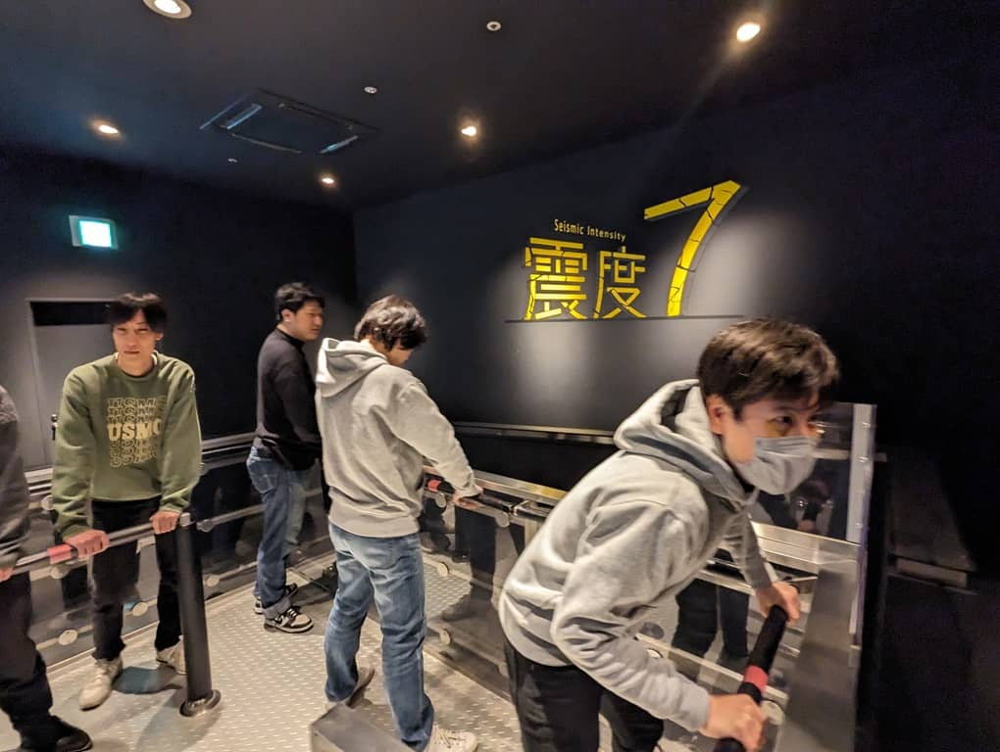

こんにちは、じんないです。

弊社は2016年から **ISO 27001 ISMS (情報セキュリティマネジメントシステム)** の認証を取得しています。

年に一度、事業継続を考えて緊急事態を想定した訓練を実施しています。

これまでに、**通信回線の長期的な停止** や **基幹系情報システムの停止**、さらには新型コロナウィルスのような **伝染病の流行** などをテーマに訓練しました。

2023年度は災害に着目し、防災訓練をテーマとしました。

MSEN 事務所がある大阪市福島区エリアは南海トラフ地震による津波浸水の被害も想定されており、通常の防災に加えて津波からの避難も想定する必要があります。

大阪市阿倍野区にある [大阪市立阿倍野防災センター](https://www.abeno-bosai-c.city.osaka.jp/tasukaru/) では体験型の防災学習施設があり、津波を想定した訓練も実施できます。

2023年度の事業継続計画訓練として防災訓練を受けてきましたので、その様子をお届けしたいと思います。

なお、この大阪市立阿倍野防災センターは無料で利用できます。

## 体験内容

[体験コース](https://www.abeno-bosai-c.city.osaka.jp/tasukaru/Content/course.pdf) はいくつかあり、今回は一番充実している **A コース (2時間)** を受講しました。

A コースでは以下の体験ができます。

(1) 大阪防災情報ステーション  
(2) タスカルシアター  
(3) 減災を学ぶ  
(4) 消火を学ぶ  
(5) 煙を学ぶ  
(6) 津波避難を学ぶ  
(7) がれきの街  
(8) 避難支援を学ぶ  
(9) 救助を学ぶ  
(10) 震度7体験  
(11) 救護を学ぶ  

※ A, B, C コースでは **津波避難を学ぶ** ことができます。

大阪防災情報ステーションでは大阪府の地形特性や浸水被害想定エリア、活断層について詳しく解説いただきました。

消火器の使い方や鍋から出火した炎に向けて噴射するバーチャル消火体験もできました。

煙を学ぶでは実際に煙が充満した空間から避難する訓練ができました。上部に停滞する煙の動きがよくわかり、**低い姿勢で避難** する必要性を感じました。

津波の避難では津波避難ビルへの逃げる訓練をしました。ここ福島区では南海トラフ地震で約3m級の津波が押し寄せると言われているため、**最低でも3階以上へ避難する** 必要がありそうです。

車イスでの段差やデコボコ道の避難も体験しましたが、前輪が引っかかったり意外と難しかったです。「段差降りますよ」など、**適度な声掛けの必要性も感じました**。

阪神淡路大震災や南海トラフ地震を想定した震度7の揺れを体験しました。

揺れ方が全然違うことにびっくりです。揺れが長く続く南海トラフ地震では被害が大きくなるように感じました。

いつか来るのかと思うと心配でなりません。

## 所感

2時間という長丁場でしたが、かなり充実した体験だったと思います。

参加したメンバーも防災リテラシーが高まったのではないでしょうか。

災害はいつ起こるかわかりませんし、あらためて日ごろから訓練をしておくことの大切さを実感しました。

まずは **「自身が助かる人となり（自助）」** 、 **「他を助ける人となる（共助）」** ことが大事であるとインプットした1日でした。

このような訓練は定期的に行っていきたいと思います。

## フォローアップ教育

月次の情報セキュリティ教育で、**津波避難ビル** や **可搬式ポンプ**、**AED の設置場所** などをあらためて確認しました。

大阪市から公開されている防災マップにこれらの情報が記載されていますので、皆さんも最寄りの設置場所を確認してみるといいかもしれません。

[大阪市福島区：海老江東地域・海老江西地域防災マップをリニューアルしました！ （…>防災>防災からのお知らせ）](https://www.city.osaka.lg.jp/fukushima/page/0000616613.html)

今後も活動情報を発信していきます！
