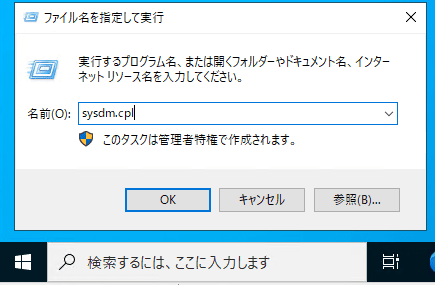
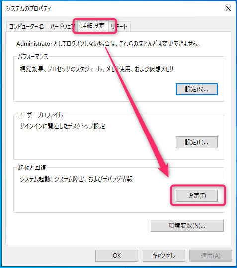
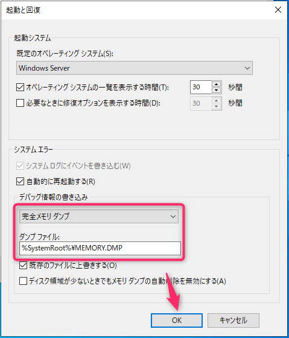
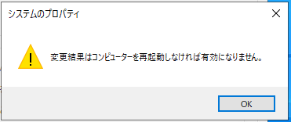
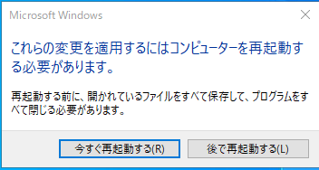
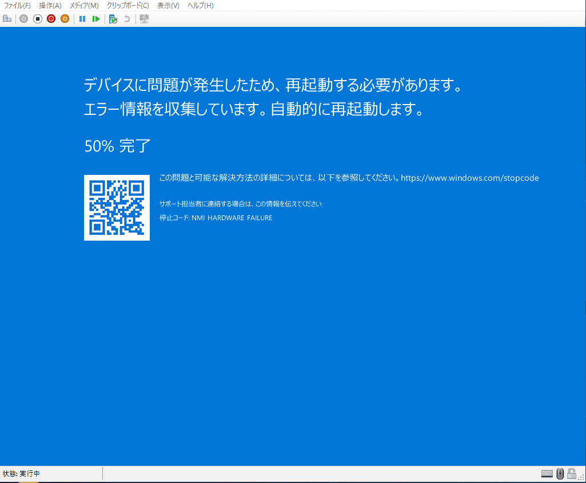
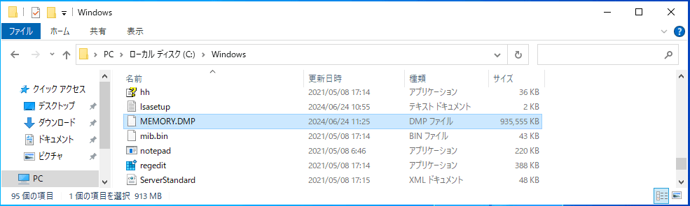

こんにちは、じんないです。

以前に VMware ESXi 上の仮想マシンでメモリダンプを採取する方法を紹介しました。

[ESXiホスト上で稼動している仮想マシンのメモリダンプを取得する | MSeeeeN](https://mseeeen.msen.jp/memory-dump-on-vm-on-esxi/)

今回は Microsoft Hyper-V 上の仮想マシンでメモリダンプを採取する方法を紹介します。

事前にメモリダンプの設定をしておくことで、**Hyper-V ホスト側から PowerShell コマンドを実行するだけでメモリダンプの採取が可能** です。

以下のようなツールを使用してブルースクリーンを発生させることも可能ですが、サーバーにはできるだけ余計なツールやソフトウェアのインストールは避けたいものです。

[NotMyFault - Sysinternals | Microsoft Learn](https://learn.microsoft.com/ja-jp/sysinternals/downloads/notmyfault)

## 想定環境

- Hyper-V ホスト OS : Windows Server 2016 Standard 
- 仮想マシンゲスト OS : Windows Server 2022 Standard

## メモリダンプの出力設定

まずはメモリダンプを出力する設定をします。デフォルトで自動メモリダンプが採用されていますので、必要に応じて変更してください。

今回の例ではメモリの情報をすべて出力する `完全メモリダンプ` を設定します。


ファイル名を指定して実行から `sysdm.cpl` を実行し、システムのプロパティを開きます。



詳細設定タブの起動と回復から `設定` を開きます。 



デバッグ情報の書き込み欄で **メモリダンプの種類** と **ダンプファイルの出力先を指定** し、OK します。



デフォルトでは `%SystemRoot%\MEMORY.DMP` に出力されます。
※ `%SystemRoot%` はデフォルトで `C:\Windows` です。

設定の反映には OS の再起動が必要になるため、ダイアログに従い再起動します。





## PowerShell からメモリダンプを採取

PowerShell からメモリダンプを採取しますが、**この作業は Hyper-V ホスト側で実施します**。仮想マシン側ではないので注意が必要です。

PowerShell を管理者権限で開き、以下のコマンドを実行します。

```ps1
Debug-Vm -name <仮想マシン名> -InjectNonMaskableInterrupt -Confirm:$false -Force
```

コマンドの実行と同時にブルースクリーンになり、メモリダンプを生成します。



100% になると OS が再起動されるので、所定の場所にメモリダンプが生成されていることを確認します。

あとは必要に応じてダンプファイルを解析します。



メモリダンプを生成する手順は以上です。

お力になれれば幸いです。

## 参考

- [Debug-VM (Hyper-V) | Microsoft Learn](https://learn.microsoft.com/ja-jp/powershell/module/hyper-v/debug-vm?view=windowsserver2022-ps)

