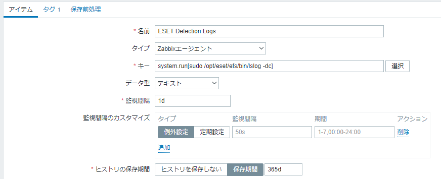
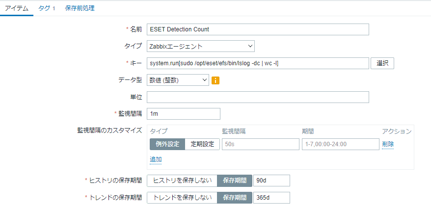
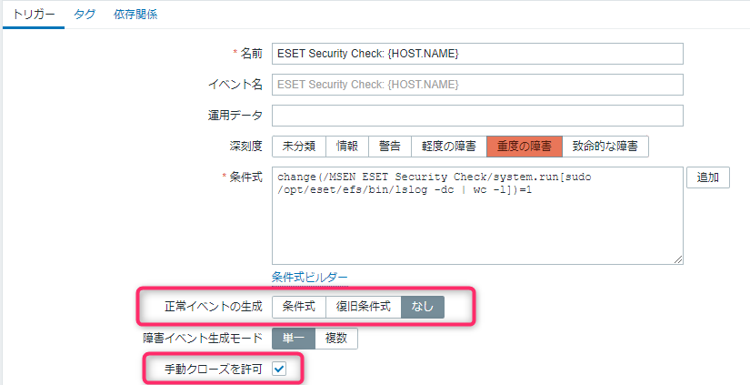

こんにちは、じんないです。

前回紹介した以下の記事のアップデート版になります。

[Zabbix から ESET File Security for Linux v7.2 のウイルス検出を監視する | MSeeeeN](https://mseeeen.msen.jp/monitor-eset-file-security-virus-detection-from-zabbix/)

今回のアップデート版では**前回まで必要だった cron 設定やログファイルの用意はいりません**。

アイテムやトリガーも見直してシンプルになっていますので、もし使われている方はアップデートいただければ幸いです。

なんとなく始めた運用ですが、意外と続いていることに自分でも驚いています。

そろそろソフトウェア側で対応してほしいです（笑）。

## 想定環境

- 監視対象サーバー
    - Rocky Linux 9.3
    - ESET Server Security for Linux 10.2.41.0
- 監視サーバー
    - Zabbix Server 6.0 LTS

## OS 側の設定
### sudoers の追加

Zabbix ユーザーが以下のコマンドを管理者権限で実行できるよう `visudo` を使って `/etc/sudoers` に追加します。

`/opt/eset/efs/bin/lslog`


```bash{2}:title=/etc/sudoers
## Zabbix Agent for ESET Security Check
zabbix ALL=(ALL)        NOPASSWD: /opt/eset/efs/bin/lslog
```

### Zabbix Agent の設定

Zabbix Agent からコマンドを実行できるよう設定ファイルを変更します。

`AllowKey=system.run[*]` がコメントアウトされているので、解除します。

```:title=/etc/zabbix_agentd.conf
AllowKey=system.run[*]
```

`*` ではなく実行できるコマンド明示的に指定する方がよりセキュアになると思います。

必要に応じて変更してください。

## Zabbix Server 側の設定
### 監視アイテムの作成

作成するアイテムは以下の2つです。
- **ESET Detection Logs**
- **ESET Detection Count** （トリガーあり）

#### ESET Detection Logs

`sudo /opt/eset/efs/bin/lslog -dc` の結果を**テキストとして保存するだけのアイテム**です。

あまりデータの差分が多くないので監視間隔は1日にしています。

※ `sudo /opt/eset/efs/bin/lslog -dc` の詳細は以下の記事をご参照ください。

[\[RHEL8\] ESET File Security for Linux v7 をインストールする | MSeeeeN](https://mseeeen.msen.jp/how-to-install-eset-file-security-for-linux-v7/)

- 名前: ESET Detection Logs
- タイプ: Zabbixエージェント
- キー: system.run[sudo /opt/eset/efs/bin/lslog -dc]
- データ型: テキスト
- 監視間隔: 1d
- ヒストリの保存期間: 365d



#### ESET Detection Count

`sudo /opt/eset/efs/bin/lslog -dc` の**行数をカウントするアイテム**です。`sudo /opt/eset/efs/bin/lslog -dc`  にパイプで `wc -l` をつなげているだけです。

先ほどの ESET Detection Logs と異なり、**数値の変更を瞬時に確認したいため**監視間隔は1分に設定します。

- 名前: ESET Detection Count
- タイプ: Zabbixエージェント
- キー: system.run[sudo /opt/eset/efs/bin/lslog -dc | wc -l]
- データ型: 数値（整数）
- 監視間隔: 1m
- ヒストリの保存期間: 90d



### トリガーの作成

change 関数を使用して前項のアイテム `ESET Detection Count` でチェックした値が **前回と値と異なる場合にトリガー** させるよう設定します。

「正常イベントの生成」はなしにすることで自動復旧させないようにし、ログを確認した後に障害をクローズするようにします。

- 名前: ESET Security Check: {HOST.NAME}
- 深刻度: 重度の障害
- 条件式: `change(/<テンプレート名>/system.run[sudo /opt/eset/efs/bin/lslog -dc | wc -l])=1`
- 正常イベントの生成: なし
- 手動クローズを許可: チェック



トリガーが設定できたら [Download Anti Malware Testfile - EICAR](https://www.eicar.org/download-anti-malware-testfile/) からテストウィルスをダウンロードし動作確認します。

トリガーされれば成功です！

第3弾はないと思いますが、アップデート版があればまた紹介したいと思います。
