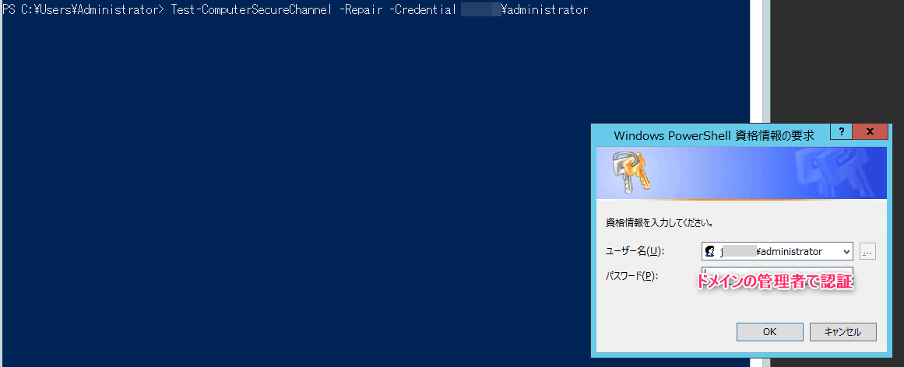

こんにちは、じんないです。

Active Directory ドメイン環境の Windows Server へログオン時に以下のエラーが出てドメインユーザーでログオンできないときがあります。

"このワークステーションとプライマリ ドメインとの信頼関係に失敗しました"。


ドメインコントローラーとメンバーサーバー間で信頼関係を得るためのセキュアチャネルが破損している場合に生じます。

長らく Active Directory と通信できなかった場合（コンピューターアカウントのパスワード期限切れ）や、バックアップやスナップショットから復元した場合に発生するケースが多いと思います。

多くの場合ドメイン再参加することで復旧しますが、PowerShell コマンドからも復旧できるため、その方法を紹介します。

## 想定環境

- OS: Windows Server 2012 R2

今回紹介する OS は若干古いですが、新しい OS でも利用可能な方法と思います。

## PowerShell による復旧手順

ドメインユーザーでログオンできないサーバーにローカルユーザーでログオンします。

PowerShell で以下のコマンドを実行し、まずはセキュアチャネルの状態を確認します。

```ps1
Test-ComputerSecureChannel -verbose
```

ここで `False` が返ってきた場合、セキュアチャネルの破損を意味します。


以下のコマンドでセキュアチャネルを復旧します。

```ps1
Test-ComputerSecureChannel -Repair -Credential <ドメイン>\<ドメイン管理者ユーザー名>
```




再度状態確認コマンドを実行し、`True` が返ってくれば OK です。

```ps1
Test-ComputerSecureChannel -verbose
```


一度、サインアウトしドメインユーザーでログオンできるようになっていることを確認します。


クライアント端末など容易にドメイン再参加できる場合はよいですが、サーバーの場合そうもいかない場合も多いです。

そのようなときは今回の PowerShell コマンドによる復旧をお試しください。

お力になれれば幸いです。

## 参考

- [Test-ComputerSecureChannel (Microsoft.PowerShell.Management) - PowerShell | Microsoft Learn](https://learn.microsoft.com/ja-jp/powershell/module/microsoft.powershell.management/test-computersecurechannel?view=powershell-5.1)
