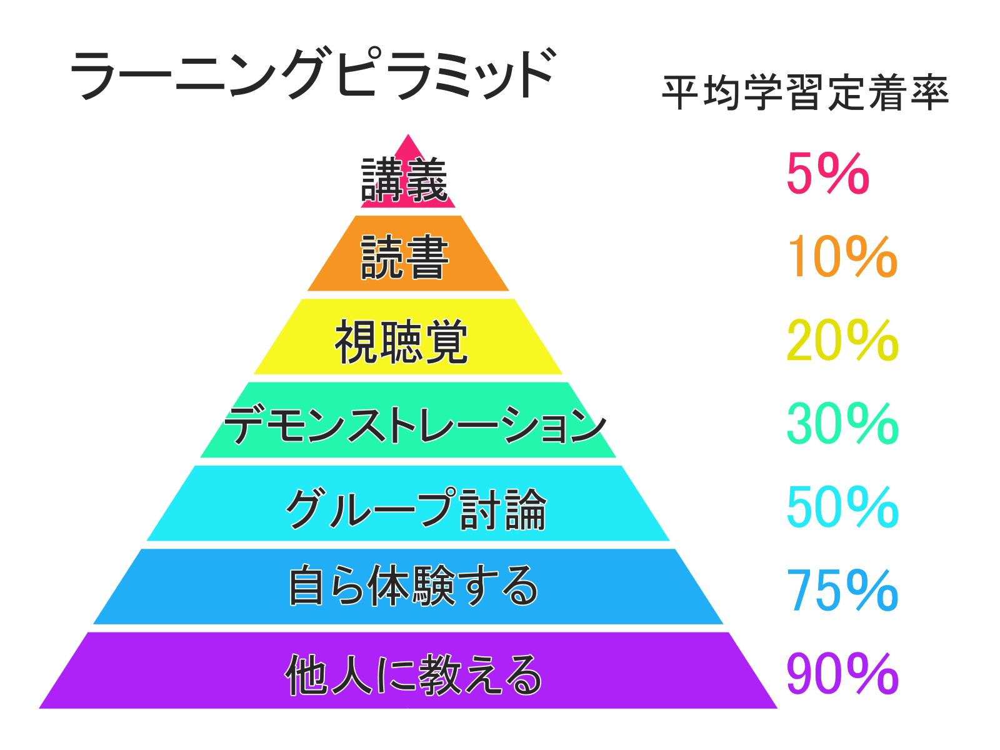

はじめまして。2020年8月からMSENで働かせていただいています、じゅんじゅんと申します。

タイトルにもあるように、私はエンジニアとしての業務は未経験で、入社前はテックキャンプ（旧テックエキスパート）にてプログラミングを3か月学習していました。

今回の記事では**未経験からエンジニア転職を目指す方々**へ向けて、**入社する前にもっとやっておけば、勉強しておけばよかったと思ったこと**を、私個人の目線からではありますがご紹介しようと思います。主に以下の3点です（もちろん他にもたくさんあるとは思いますが、キリがないので今回はこれだけ）。

## SQL
最も勉強しておけばよかったと思ったのは圧倒的にSQLです。これは未経験からエンジニアになられた他の方々も口を揃えておっしゃっている印象があります（なのにやらなかった）。その一方で、**実務以外で学ぶのは難しい**、とも感じました。

実務では数えきれないほどのテーブル、ビューがあり、どのテーブルをどの条件でどう結合させれば欲しいデータのみを取得できるか、ということを考えるのですが、このようなデータベースの環境を自分でそろえるのが難しく、実務を想定した学習がしづらいからです。

また、Ruby on Railsのような、ORMを使用してデータベースを操作するフレームワークを学んでいる場合、生のSQLを書く機会がありません。実際、テックキャンプでもSQLは代表的な構文の紹介に留まり、開発においてはRailsのORMであるActive Recordを活用していました。

以上の理由から独学では学びにくいと感じたSQLですが、ここで私がお勧めする学習教材が**基本情報技術者試験、データベースの午後問題**です。各問題にしっかりとした設定があり、実務を想定しやすい内容になっています。実務で使う構文もたくさん出てくるので、いい練習になっています。

ちなみに現在、基本情報技術者試験合格に向け勉強中です。データベースはしっかり高得点を取っていきたいです。

## GitHub
GitHubに関してはテックキャンプのチーム開発で経験していましたし、転職活動中の個人アプリ開発でも毎日コミットしていたので、ある程度活用できていると勘違いをしてしまっていました。**特に勉強不足だと感じた部分は、ミスやトラブルが発生した（というか発生させた）ときの対処法**です。

これらもSQLと同様、独学で体験する機会は少ないかもしれませんが、あらゆる状況を想定して、対処法を確認しておくだけでも実際の業務で慌てることは少なくなると思います。

また、個人アプリ開発においても、以下の3点は意識しておくといいです。

- 作業によってブランチを切る
- 適切なコミットメッセージを書く
- コマンドでGitを操作する

特に3つ目はテックキャンプ生ならGithub DesktopというGUIツールに慣れていると思いますが、現場によって使用するツールは違いますし（弊社はSourceTree）、インターネットで調べたときはコマンドが紹介されていることが多いので、**まずはコマンドで慣れてからGUIを活用するという手順の方が後々困ることが減る**かと思います。

私は逆でしたので、実務を通して勉強中です。

## 知識のアウトプット
業務中、「これどういう意味？」と聞かれることがよくあります。自分では勉強してわかっていたつもりでしたが、覚えていたのは単語の名前だけで、それがいざどういうものかを説明しようとすると言葉が出てこないことが多々ありました。**理解したつもりになっていただけで、真には理解できていなかったから**です。これは**インプットに対して、アウトプットが圧倒的に足りていなかった**ことが原因と思われます。

これは**ラーニングピラミッド**といって、アメリカ国立訓練研究所が発表した研究結果で、**7つの学習方法を知識の定着率順に並べたもの**です。これを見ると、**単に講義を聴くだけだと学習定着率はたったの5%と低く、学習したことを誰かに教えると90%と高く**なります。つまり、**講義を聴く、読書などのような受動的な学習ではなく、自ら体験する、他人に教えるといった能動的な学習の方がより頭に残る**ということです。

よってプログラミングを独学で学んでいる方は、以下の3点を積極的に行いましょう。

- 学んだことを誰かに話す
- インプットしたことをTwitter、ブログなどで発信する
- 自分でアプリを開発する

## まとめ
以上が私が特に入社する前にやっておけばよかったと思ったことです。いずれにしても、**独学のうちからしっかりと実務で使うことを想定して勉強することが大事**です。

これからも業務内外問わず、学んだことをアウトプットしていこうと思いますのでよろしくお願い致します。