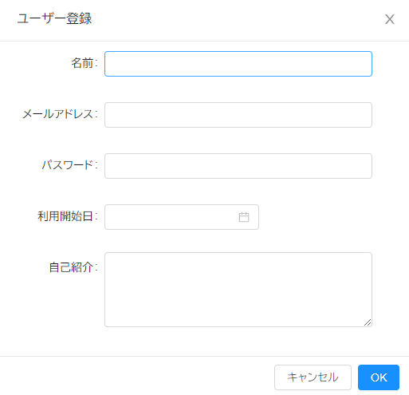
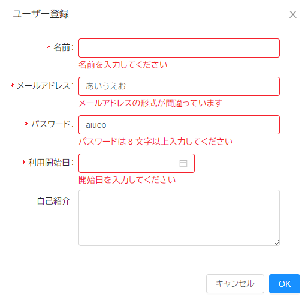
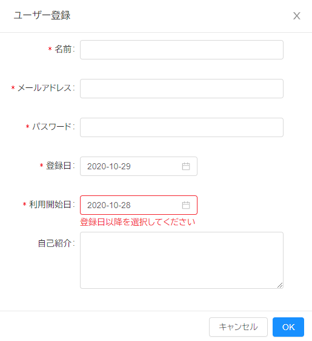

こんにちは。じゅんじゅんです。現在開発中のサービスではフロントエンドに **Nuxt.js** を採用していますが、 さらに UI フレームワークとして **[Ant Design Vue](https://www.antdv.com/docs/vue/introduce/)** を使用しています。

たくさんのコンポーネントが最初から備わっていてとても便利なのですが、日本語の記事が少なく、ほぼ公式ドキュメントだけが頼りという状況でしたので、せっかくなので記事にしてみようと思いました。

今回はその **Ant Design Vue でバリデーションを設定し、フォームの入力チェックを行う処理**を紹介します。書き方さえわかれば**簡単に入力チェックが可能**になり、**エラーメッセージの表示などもすぐにできる優れもの**です。

## バージョン
Nuxt.js 2.14.0
Vue.js 6.14.8
Ant Design Vue 1.6.4


## 入力フォーム

今回はとある web サイトでユーザー登録をする際の入力チェックの実装を考えてみます。こちらがユーザー情報の入力フォームです。ここでは **`FormModel`** コンポーネントを `modal` の中で使用しています。詳しくは [Ant Design Vue/FormModel](https://www.antdv.com/components/form-model/)をご覧ください。



```
  <a-modal
    v-model="visible"
    title="ユーザー登録"
    centered
    :mask-closable="false"
    @ok="onSubmit"
  >
    <a-form-model :model="form" :label-col="{ span: 6 }" :wrapper-col="{ span: 16 }">
      <a-form-model-item label="名前">
        <a-input v-model="name" />
      </a-form-model-item>
      <a-form-model-item label="メールアドレス">
        <a-input v-model="form.email" />
      </a-form-model-item>
      <a-form-model-item label="パスワード">
        <a-input v-model="form.password" />
      </a-form-model-item>
      <a-form-model-item label="利用開始日">
        <a-date-picker
          v-model="form.start_date"
          format="YYYY-MM-DD"
          placeholder
        />
      </a-form-model-item>
      <a-form-model-item label="自己紹介">
        <a-textarea v-model="form.introduction" :rows="4" :auto-size="{ minRows: 4, maxRows: 10 }" />
      </a-form-model-item>
    </a-form-model>
  </a-modal>
```
**それぞれのフォームにバリデーションを設定し、バリデーションに引っかかったらそのフォームの下にエラーメッセージを表示させることを目標とします。**

## バリデーションを行うための準備
バリデーションを設定するための準備を行います。OK ボタンを押すと発火する `onSubmit` メソッドを以下のように記述します。

```JS
methods: {
  onSubmit() {
    this.$refs.inputForm.validate(valid => {
      if (valid) {
        alert('登録が完了しました！');
      } else {
        console.log('登録に失敗しました...');
        return false;
      }
    });
  },
```

`async` で書くとこのようになります。

```JS
methods: {
  async onSubmit() {
    try {
      await this.$refs.inputForm.validate();
      alert('登録が完了しました！');
    } catch { 
      console.log('登録に失敗しました...');
      return;
    }
  }
},
```

また、ユーザー登録フォームの `a-form-model` に `ref="inputForm"` 、 `:rule="rules"` を追加します。
```
<a-form-model ref="inputForm" :model="form"　:rules="rules" :label-col="{ span: 6 }" :wrapper-col="{ span: 16 }">
```
メソッド内の `$refs.inputForm` により、HTML の `ref` 属性の値を参照するので、ここでは  `ref="inputForm"` のある `a-form-model` 全体をバリデーションすると指定しています。

`:rules="rules"` により、`data` の中で `rules` というオブジェクトを作り、その中で各フォームに対してバリデーションを設定できるようになります。

## バリデーションを設定する
`rules` に入力チェックする内容を記述していきますが、その前に `a-form-model-item` に `prop` 属性を追加します。この値が `rules` オブジェクトのキーに対応しています。

```
<a-form-model-item label="名前" prop="name">
  <a-input v-model="name" />
</a-form-model-item>
<a-form-model-item label="メールアドレス" prop="email">
  <a-input v-model="form.email" />
</a-form-model-item>
<a-form-model-item label="パスワード" prop="password">
  <a-input v-model="form.password" />
</a-form-model-item>
<a-form-model-item label="利用開始日" prop="start_date">
```

`rules` の中に入力チェックする内容を記述していきます。
```JS
rules: {
  name: [
    { required: true, message: '名前を入力してください', trigger: 'change' },
  ],
  email: [
    { required: true, message: 'メールアドレスを入力してください', trigger: 'change' },
    { type: 'email', message: 'メールアドレスの形式が間違っています', trigger: 'blur' },
  ],
  password: [
    { required: true, message: 'パスワードを入力してください', trigger: 'change' },
    { min: 8, message: 'パスワードは 8 文字以上入力してください', trigger: 'blur' },
  ],
  start_date: [
    { required: true, message: '開始日を入力してください', trigger: 'change' },
  ],
},

``` 
`required: true` があるものはその値が必ず入力されている必要があります。

 `type` は、 `string` や `array` などのデータ型かどうかや、 `email` や `url` などのフォーマットで入力されているかを検証できます。具体的には以下のものが検証できます。

| | |
|-|-|
|string|文字列（デフォルトで設定されています）|
|number|数値|
|boolean|ブール値|
|method|関数|
|regexp|正規表現|
|integer|整数|
|float|浮動小数点数|
|array|配列|
|object|オブジェクト|
|enum|列挙体|
|date|日付|
|url|URL|
|hex|16 進数|
|email|メールアドレス|
|any|全てのタイプ|

`min` は最低でも指定した文字数が入力されているか検証します。 `message` は表示するエラーメッセージです。

 `trigger` はエラーメッセージがどのタイミングで表示されるかを表していて、 `change` は**値が変更されたとき**、 **`blur` は値が変更されてフォーカスが外れたとき**になります。ここで `email` の `type` と `password` の `min` が `blur` になっていますが、ここを `change` にしてしまうと、 **1 文字入力されるごとにエラーメッセージが表示されてしまう**ので、ユーザーが入力し終えてから検証が行われるよう `change` にしています。

ここまでの記述だけで、エラーメッセージをこんな感じで表示させることができました。




## バリデーションを自作する
備わっているオプションだけでは検証しきれない場合、自分でバリデーションを作ることもできます。今回は例として、**利用開始日に登録日より前の日付が入力されているとエラーメッセージが表示される**ようにします。 `rules` の `start_date` に `validator` を追加し、その中にエラーを表示させる条件を記述します。

```JS
rules: {
  registration_date: [
    { required: true, message: '登録日を選択してください', trigger: 'change' },
  ],
  start_date: [
    { required: true, message: '利用開始日を選択してください', trigger: 'change' },
    {
      validator: (rule, value, callback) => {
        try {
          if (moment(value).isBefore(this.form.registration_date, 'day')) {
            throw new Error('end date is before start date');
          }
        } catch (err) {
          callback(err);
          return;
        }
        callback();
      },
      message: '登録日以降を選択してください',
      trigger: 'change',
    },
  ],
```

ちなみに今回は日付を扱うために `Moment.js` を利用しているので、 モジュールを `import` しています。
```JS
<script>
import moment from 'moment';
```

この記述により、利用開始日に登録日より前の日付を入力すると無事にエラーメッセージが表示されました。



## 感想
公式をしっかり読み解けば簡単にあらゆる機能が実装できるのでとても便利でした。前回、エラーを解決するためのヒントは公式ドキュメントをしっかり読むことで得られると感想に書きましたが、それだけでなく**実装に詰まったときも、それが実現できる機能が公式ドキュメントを根気よく探せば見つかることが多いと感じました**。公式ドキュメントを読み解く力がまだまだ乏しいので、 Ant Design Vue 以外の技術に関しても公式を読んで理解をしていくよう心掛けます。