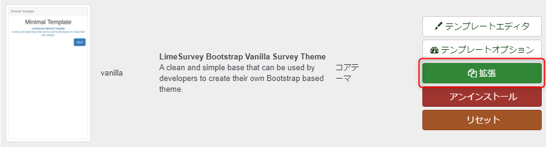
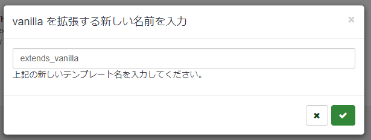
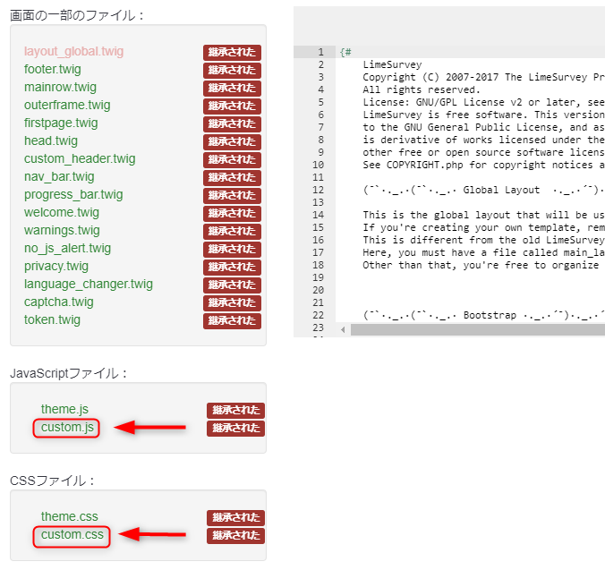
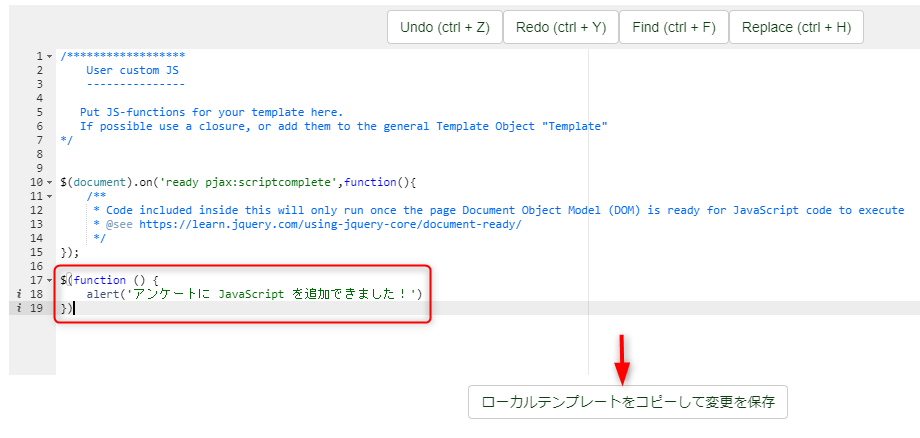
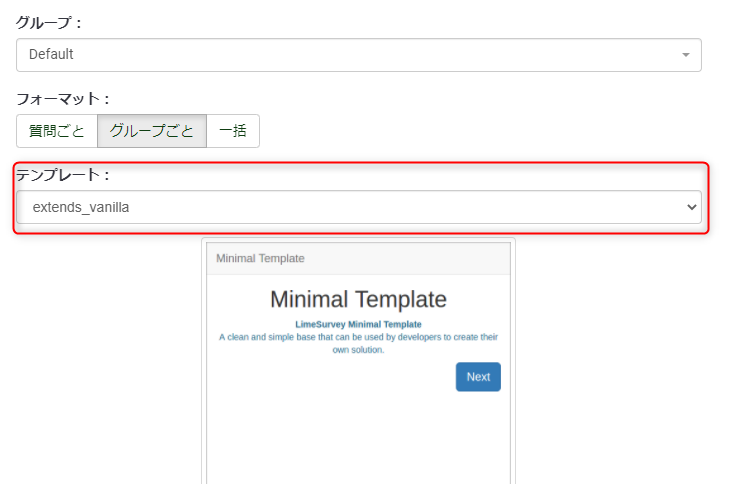
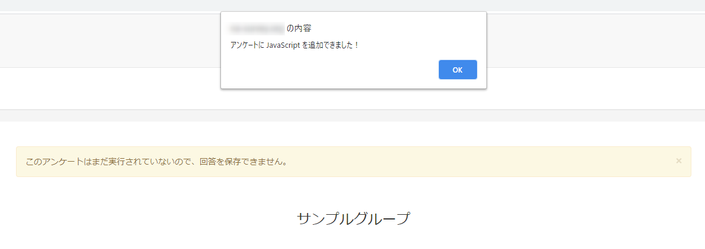

こんにちは。じゅんじゅんです。 [LimeSurvey](https://www.d-ip.jp/limesurvey/) は**質問と回答を設定するだけでしっかりしたアンケートサイトを構築することができるオープンソースのアンケートシステム**です。すでにアンケートに必要な機能は盛り込まれていますが、場合によっては自分で CSS を書いてスタイルを変更したり JavaScript で動作を設定したいことがあると思います。

今回は **LimeSurvey の元のシステムに対して CSS と JavaScript を追加する方法**をご紹介します。

## 追加するための流れ
アンケートの作成をした後、トップページのヘッダーから「設定」→「テンプレート」と進んでいきます。その中で、CSS などを追加したいアンケートに設定を引き継ぎたいテンプレートを選び、「拡張」をクリックします。今回は vanilla を選択します。

適当に名前を入力して右下のチェックをクリックします。今回はそのまま extends_vanilla という名前にします。

これで vanilla の設定を引き継いだ extends_vanilla というテンプレートが作成され、そのテンプレートのエディタ画面に遷移されます。この画面の左側に、LimeSurvey の既存の設定ファイルが並んでいます。その中に `custom.js` 、 `custom.css` というファイルがあると思います。

これらのファイルを編集することで、このテンプレートに設定されているアンケートに対して CSS 、JavaScript を反映させることができます。試しに `custom.js` を編集してみましょう。 jQuery が最初から使えるようになっているので、以下のように `alert` を記述してみます。編集が終わったら「ローカルテンプレートをコピーして変更を保存」を押します。

「ローカルテンプレートをコピーして変更を保存」を押すことで、 `custom.js` の右の「継承された」という部分が「ローカル」に変わります。これでこの `custom.js` はこのテンプレート (今は extends_vanilla) 専用の `js` ファイルになりました。

では実際にアンケートを開いて `alert` が表示されるか確認してみましょう。その前にアンケートの編集画面から「一般設定」を選択し、右側の「テンプレート」の部分を作成した extends_vanilla に設定しておきます。

これで準備が整ったのでアンケートを開きます。

無事 `alert` が表示され、記述した JavaScript がアンケートに反映されたことがわかります。

## まとめ
質問設定画面の「ソース」の部分で `script` タグを使うことで JavaScript を書くこともできますが、各ページ共通の動作など、アンケート全体に設定したい場合はこちらの方法を使う必要があります。また、各質問の中で `id` 属性や `class` 属性を設定しておいて、その内容を `custom.js` や `custom.css` にまとめて記述しておくこともできます。

これで **Limesurvey の便利なシステムを利用しつつ、カスタマイズしてオリジナリティのあるアンケートサイトを作成することができる**ようになります。

## 参考
[LimeSurvey マニュアル - テーマエディター](https://manual.limesurvey.org/Theme_editor/ja)