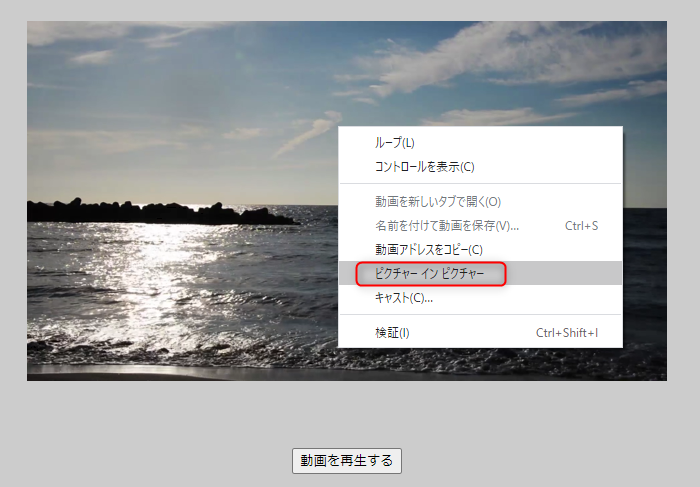
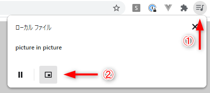
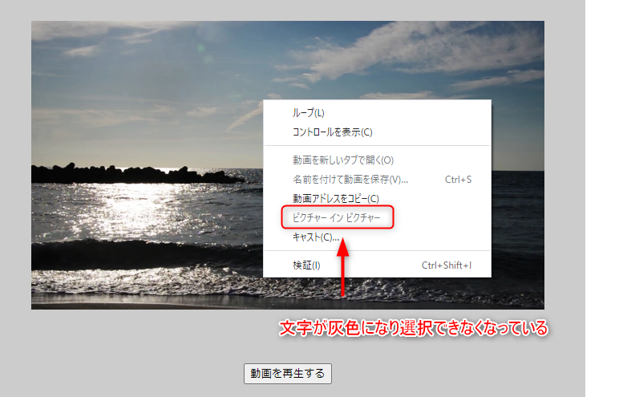
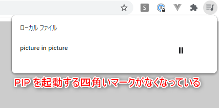

こんにちは、じゅんじゅんです。 **YouTube などの動画を小窓にし、別の画面やアプリの上に重ねて表示させることができるピクチャーインピクチャー**という機能があります。動画を表示させたまま別の作業を行うことができる便利な機能ですが、アプリやシステムによってはユーザーにそれをさせたくない場合があるかもしれません。

この機能はユーザーが無効化するのは難しくないのですが、開発者がプログラム側から無効化しようとしたとき、それなりに試行錯誤が必要でした。ということで今回は HTML の `video` タグで埋め込んだ動画のピクチャーインピクチャー機能 (以下 PIP と表記します) を**プログラム側から**無効する方法をご紹介します。


## PIP に対応しているブラウザ
現在、 PIP に対応している主なブラウザは以下の4種です。

- Google Chorme
- Firefox
- Microsoft Edge
- Safari

## PIP を無効化する方法
### Google Chrome の場合
HTML を以下のように記述し、Google Chrome で `video` タグを使って動画を表示させてみます (style の記述は割愛します) 。
```HTML
<body>
  <div class="container">
    <video id="sample" src="sample-mov.mp4"></video>
    <br />
    <button class="btn">動画を再生する</button>
  </div>

  <script>
    const btn = document.querySelector('button');
    const video = document.getElementById('sample');
    btn.addEventListener('click', () => {
      video.play();
    });
  </script>
</body>
```

Chrome で PIP を使用する方法は2種類あります。1つは動画上で右クリック ⇒ 「ピクチャー イン ピクチャー」をクリックする方法です。



もう1つの方法は、動画を再生したとき、アドレスバーの右に現れる音符のついたマークをクリック ⇒ 現れるボックスの左下の四角いマークをクリックする方法です。



これらの無効化は、 `video` タグに `disablePictureInPicture` 属性を追加することでできます。
```
<video id="sample" src="sample-mov.mp4" disablePictureInPicture></video>
```

これだけで、以下のように PIP を使用できなくなりました。





### Firefox の場合
残念ながら、 2021年3月現在 **Firefox で PIP を無効化する機能はありません**。 Firefox も PIP を使用する方法が2種類あり、1つは Chrome と同様に画面を右クリックし、「ピクチャー イン ピクチャー」をクリックする方法です。

これは **`disablePictureInPicture` 属性を追加をしても選択できてしまいます**。一応、 `video` タグに `oncontextmenu="return false;"` を追加して**右クリック自体を無効にする**ことで PIP の使用を防ぐという方法はあります。

厄介なのがもう1つの機能で、以下の画像のように、**カーソルを動画にホバーさせることで PIP を起動させるボタンが表示されます。これを無効化する機能はありません**。


ただ、条件によっては可能な方法が1つあります。[Firefox の PIP サポートページ](https://support.mozilla.org/ja/kb/about-picture-picture-firefox) にこのような記述があります。

> この機能は、多くのウェブ動画で動作するよう設計されます。ホバーしても切り替えボタンが表示されない動画もあるでしょう。十分なサイズと、再生時間のある**音声が含まれた動画のみ**で表示されます。

つまり、特に**音声が必要ではない動画に限り、動画から音声データを削除する**ことで PIP 起動ボタンが表示されなくなります。

動画の音声データを削除する方法については動画編集ソフトでもできますが、今回はコマンドで簡単に動画や音声の編集ができる [ffmpeg](https://www.ffmpeg.org/) を使った方法をご紹介します。詳しいインストールのやり方などは省略します。

やり方は単純で、以下のコマンドを実行するだけです。`-an` というのが音声無しで出力を行うオプションです。
```
ffmpeg -i 音声を削除したい動画 -vcodec copy -an 音声削除後の動画
```

正攻法ではありませんが、これで音声が必要ない動画に限り Firefox でも PIP を無効にすることができました。


### Microsoft Edge 、 Safari の場合
Microsoft Edge 、 Safari の場合、`video` タグの動画で PIP を使用するには画面を右クリックし、「ピクチャー イン ピクチャー」をクリックする方法のみです。

Edge については `disablePictureInPicture` 属性をつけることで「ピクチャー イン ピクチャー」の文字が選択できなくなるのですが、 Safari については Firefox と同様、選択できるままです。ですので Safari の場合は `oncontextmenu="return false;"` を追加して右クリックを無効にする必要があります。

## 感想
PIP 自体は便利な機能ですが、その機能が不要な場合を想定し、 `disablePictureInPicture` 属性のように簡単に無効化できる方法を用意しておくことは大事なことだと思いました。 Firefox では、記事内で紹介した方法以外では現状はユーザー向けの無効化の方法しかないようなので、開発の段階で無効にしておける機能が出てほしいですね。