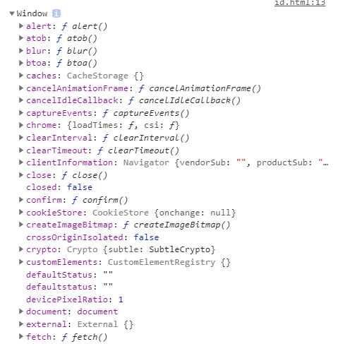
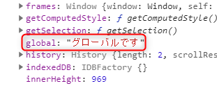

こんにちは、じゅんじゅんです。先日、社内の勉強会で JavaScript の DOM について発表を行いました。社内での発表とはいえとても緊張しました（笑）。説明やスライドなど課題がたくさん見つかったので、回数をこなして上達したいと思います。

DOM 操作についての練習問題を作成しているとき、書き間違いから**偶然 `getElementById` で取得をしていないにも関わらず id 属性で要素を参照できてしまう**ことに気づきました。今回はなぜこのようなことが起こるのかについてお話しします。

## 実際のコード
実際のコードがこちらです。
```HTML
<div id="element"></div>

<script>
element.textContent = 'こんにちは、じゅんじゅんです';
</script>
```

これだけでしっかり「こんにちは、じゅんじゅんです」というテキストが表示されます。 `getElementById` などのメソッドを使わず、直接 id 属性から `textContent` プロパティを変更できてしまいました。

この現象を説明するためには **window オブジェクト**についてお話ししておく必要があります。

## window オブジェクトについて
ブラウザ上の情報は全てオブジェクトとして扱うことができ、総称してブラウザオブジェクトと呼びます。**全てのブラウザオブジェクトの親**となるものが [window オブジェクト](https://developer.mozilla.org/ja/docs/Web/API/Window)です。言わばブラウザそのものです。`console.log(window)` とするか、デベロッパーツールの Console で `window` と打つことで以下のように確認できます。



JavaScript に元々入っているメソッド・プロパティがずらっと並んでいます。よく使う `alert` メソッドや `document` プロパティ (これが `window` に読み込まれたものが `document` オブジェクト) もありますね。

## id 属性で要素が参照できる理由
以上を踏まえて、表題の件の理由を説明します。 HTML で id 属性が指定されている場合、**自動で id の属性値と同名のプロパティが window オブジェクトに追加されます**。そして、最初に紹介したコードで説明すると、

```JS
<script>
element.textContent = 'こんにちは、じゅんじゅんです'
</script>
```

 の `element` のように id 属性が直接指定された場合、その id 属性を持つ要素である 

```HTML
<div id="element"></div>
```

 が参照されることになります。

window のプロパティやメソッドを記述する場合、本来頭につけるべき `window` が省略できるので、 id 属性から直接要素を参照しているように見えたのですね。きちんと書くとこうなります。

```JS
<script>
window.element.textContent = 'こんにちは、じゅんじゅんです';
</script>
```

## 極力使わない方がいい
一見、 `getElementById` などの要素を取得するメソッドを省略できるのでこちらの方が楽に見えますが、**この書き方はあまりお勧めされていません**。HTML Standard の [§7.3.3 Named access on the Window object](https://html.spec.whatwg.org/multipage/window-object.html#named-access-on-the-window-object) に、「一般的にこの書き方に依存したコードは脆弱なので、代わりに `document.getElementById` や`document.querySelector` を使ってください」という記述があります。

唐突ですが、ここでグローバル変数を宣言してみます。 `let` や `const` を記述しないことでグローバル変数になります。

```JS
<script>
global = 'グローバルです';
</script>
```

もう一度 window オブジェクトを確認してみると、今宣言した `global` という変数が window オブジェクトのプロパティとして登録されています。



ブラウザ内では window オブジェクトがグローバルオブジェクトなので、実は**グローバル変数、グローバル関数というものは window オブジェクトのプロパティ、メソッドのこと**なのです。 **window プロパティとして追加された id 属性はグローバル変数になるので、名前の衝突が起こりやすくなります**。例えば、以下のように先に同名の window プロパティを宣言していると、後から id 属性を設定しても window プロパティに追加されず、要素の参照ができません。

```HTML
<script>
  window.element = '';
</script>

 <div id="element"></div>

<script>
  element.textContent = 'こんにちは、じゅんじゅんです';
</script>
```

この場合、下の `script` タグ中の `element` は `div` タグを参照できていないので `textContent` プロパティを呼ぶことができず、画面には何も表示されません。

また、 JavaScript 上で同名の要素を定めている場合、そちらが優先して参照されます。以下では `querySelector` メソッドを使用して `element` という変数に代入した `h1` 要素にテキストが追加されています (点線の下) 。

```HTML
<div id="element"></div>
<p>---------------------------</p>
<h1></h1>

<script>
  const element = document.querySelector('h1');
  element.textContent = 'こんにちは、じゅんじゅんです';
</script>
```


このように非常に不安定な状態となります。**コード自体は短くはなりますがそもそも正しい動作をしなくなる可能性が高くなるので、使用するメリットは少ない**と思います。きちんと `getElementById` を使うようにしましょう。

## 感想
偶然見つけた現象でしたが、調べてみるといろいろと新しい発見がありました。引き続きアンテナを立てつついろんなところから知識を吸収していきます。

## 参考
> - [JavaScript: getElementById()メソッドを使わずにid属性値で要素を参照する](https://qiita.com/FumioNonaka/items/0d4e014314e7ac572d0f)
> - [Why is document.getElementById not needed? [duplicate]](https://stackoverflow.com/questions/25931810/why-is-document-getelementbyid-not-needed)
> - [windowオブジェクトとグローバルの実態について](https://wp-p.info/tpl_rep.php?cat=js-application&fl=r9)