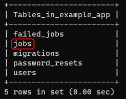
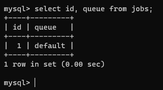
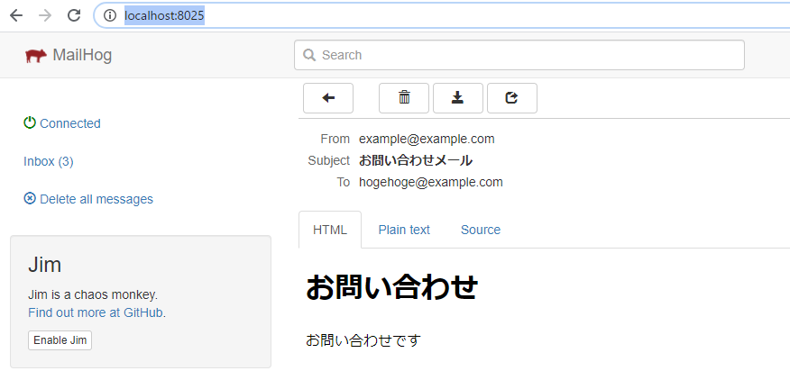

こんにちは、じゅんじゅんです。先月、業務で Laravel を使用した開発を行いました。業務で Laravel (というか PHP も) を扱うのは今回が初めてだったので、日々勉強をしながらの開発でした。

その中で**メール送信機能**を実装する機会がありましたが、ユーザーの待ち時間を短くするため、**データベース (MySQL) をキューとして使用し、非同期で処理**されるように実装を行いました。今回はその方法をご紹介します。

## 開発環境
今回の開発環境は以下のようになります。環境を構築するツールとして Laravel Sail を使用しています。

- PHP: 8.0
- Laravel: 8.12
- MySQL: 5.7

## Laravel Sail とは
[Laravel Sail](https://laravel.com/docs/8.x/sail) とは、Docker で Laravel を動作させる開発環境を簡単に構築することができるツールです。 Docker に慣れていなくても数回のコマンドを叩くだけで環境が構築されるので驚きです。構築方法についてはこちらがわかりやすいです。

> [Laravel Sail なら Docker 開発環境がコマンド 2 撃で構築できる。PHP/MySQLからキューやメール環境までオールインワン](https://www.ritolab.com/entry/217)

今回、上記のページを参考に `alias sail="./vendor/bin/sail"` というエイリアスを設定していますので、今後記載するコマンドの `sail` は `./vendor/bin/sail` と同義です。

## そもそもキューとは何か
**キュー**とは**先入れ先出し (FIFO: First in First out) 方式のデータ構造**のことです。基本情報のアルゴリズムの分野でも出てきますね。メール送信や大きなデータを取り扱う処理などはキューにジョブ（タスク）として放り込み、非同期処理にすることでユーザーの待ち時間を短くすることができます。今回はメール送信処理をジョブとします。

Laravel では、[Laravel 8.x キュー](https://readouble.com/laravel/8.x/ja/queues.html) にもあるように、キューとして MySQL などのデータベース、 Redis 、 Amazon SQS などが使用できます。表題にもあるように今回は MySQL を使用するのでデータベースを選択します。

ということで、メール送信処理をジョブ、MySQL に作成した `jobs` テーブルをキューとし、処理がレコードとして格納されるようにしていきます。 

## メール送信処理を実装

### メール送信クラスの実装

まずは `sail up -d` でコンテナを立ち上げた後、以下のコマンドを実行し、`Mailable` クラスを継承した `ContactMail` というクラスを作成します。
```
sail artisan make:mail ContactMail
```

これで `app/Mail/ContactMail.php` というファイルができるので、以下のように記述します。
```php
class ContactMail extends Mailable
{
    use Queueable, SerializesModels;

    public function __construct()
    {
        //
    }

    public function build()
    {
        return $this->from('example@example.com')
                    ->view('emails.contact')
                    ->subject('お問い合わせメール');
    }
}
```

`Mailable` クラスの `build` メソッド内で `from` メソッドを使用することでメールの送り元のアドレスを設定できます。ここでは `example@example.com` としています。

`view` メソッドで、送信するメールテンプレートファイルを設定できます。`subject` メソッドではメールのタイトルを設定できます。ここでは「お問い合わせメール」というタイトルで `emails.contact` というテンプレートをメールの本文に使用するように設定します。

### 本文テンプレートの準備

では本文になるテンプレートファイルを作成します。 `resources/views/emails/contact.blade.php` というファイルを作成し、以下のように簡単に記述しておきます。
```HTML
<body>
    <h1>お問い合わせ</h1>
    <p>お問い合わせです</p>
</body>
```
これで送信するメールが用意できました。

### ルートの設定

次にメール送信を実行する処理を記述します。こちらも簡単に API を叩いたらメールが送信されるようにします。 `Routes/api.php` を以下のように記述します。

```php
<?php
use Illuminate\Support\Facades\Route;
use App\Http\Controllers\ContactMailController;

Route::get('contact', [ContactMailController::class, 'contact']);
```

このルーティングの記述通り、 `ContactMailController` の `contact` アクションに送信処理を記述します。余談ですが、 `Route` の書き方を

```php
Route::get('contact', 'ContactMailController@contact');
```

と書く場合、 Laravel8 では API を叩いても `Target class [ContactMailController] does not exist.` というエラーが発生します。

理由は、 Laravel8 では `App/Providers/RouteServiceProvider.php` の

```php
protected $namespace = 'App\\Http\\Controllers';
```

という行がデフォルトでコメントアウトされているからです。従来の書き方で書く場合はこちらのコメントアウトを外してあげれば OK です。詳しくは以下で解説されています。

> [Laravel8 新しいルーティングの書き方](https://kawax.biz/laravel8-routing/) 

### コントローラの作成

それでは以下を実行してコントローラを作成します。

```
sail artisan make:controller ContactMailController
```

作成できたら、中身を以下のように記述します。

```php
namespace App\Http\Controllers;

use App\Mail\ContactMail;
use Illuminate\Support\Facades\Mail;

class ContactMailController extends Controller
{
    public function contact()
    {
        Mail::to('hogehoge@example.com')->queue(new ContactMail);
    }
}
```

メールを送信するには `Mail` ファサードで `to` メソッドを使用します。 `hogehoge@example.com` がメールの送り先です。その後、通常は `Mailable` クラスのインスタンスを `send` メソッドに渡しますが、今回はいったんキューに格納するため、 `queue` メソッドに渡します。

これでメール送信処理はひととおり記述できました。

### `jobs` テーブルの作成

次はキューを準備していきます。まずはどのキューサービスを使用するかを `.env` の `QUEUE_CONNECTION` の部分に記述します。今回は MySQL を使用するので `database` とします。

```
QUEUE_CONNECTION=database
```
次にジョブを保存するテーブルを作成します。以下のコマンドを実行します。
```
sail artisan queue:table
sail artisan migrate
```
`sail artisan queue:table` コマンドを実行することで、`database/migrations` ディレクトリに `jobs` テーブルを作成するマイグレーションファイルが作成されるので、`sail artisan migrate` でマイグレーションを実行しています。

これで MySQL に `jobs` テーブルが作成されたはずなので確認してみます。ルートディレクトリで `docker-compose exec mysql mysql -uroot example_app` を実行し、 `example_app` というデータベースに入ったら、 `show tables;` でテーブルを見てみましょう。



無事に作成できていました。

## 動作確認

### API を叩いてメールを送信する
メール送信処理とキューテーブルが作成できたので、メールを送信してみましょう。今回は簡単に、メール送信テストツールである MailHog を使用して、送信されたメールの確認をします。 `.env` に以下の設定を記述します（すでにされているかもしれません）。
```
MAIL_MAILER=smtp
MAIL_HOST=mailhog
MAIL_PORT=1025
```
MailHog の SMTP は 1025 ポートがデフォルトで待ち受けています。それでは以下の API を叩いて送信されたメールがキューに入るかを確認してみましょう。
```
localhost/api/contact
```

画面上は何も起こりませんが、これでメール送信ジョブが `jobs` テーブルに格納されたはずです。MySQL で `SELECT * FROM jobs;` で中身を確認できますが、`payload` カラムの値がごちゃごちゃしていて見づらいので、`SELECT id,queue FROM jobs;` を実行してレコードがあるかどうかだけ確認します。



このようにメール送信ジョブがレコードとして格納されています。

### キューワーカの起動

ジョブがキューに格納されたら、以下のコマンドでキューワーカを起動することで、`jobs` テーブルに格納された処理を実行することができます。
```
sail artisan queue:work
```

以下のように表示されるとジョブの実行完了です。

```
[2021-04-22 03:21:18][1] Processing: App\Mail\ContactMail
[2021-04-22 03:21:20][1] Processed:  App\Mail\ContactMail
```

### MailHog で確認

`http://localhost:8025/` にアクセスすると MailHog が開きます。以下のようにメールが送信されていました！



## 感想

メールの送信処理を実装するのは Laravel に限らず初めてだったのでとても大変な作業になりそうだと考えていましたが、[Laravel のドキュメント](https://readouble.com/laravel/8.x/ja/installation.html) だけで思ったより簡単にできてしまいました。ドキュメントがわかりやすいのはとてもありがたいですね。

