こんにちは、じゅんじゅんです。社内プロジェクトの中で、データベースに AWS の [DynamoDB](https://aws.amazon.com/jp/dynamodb/) を使用するシステムの開発を行うことになりました。

よく採用される構成は、以下のように [API Gateway](https://aws.amazon.com/jp/api-gateway/) から [Lambda](https://aws.amazon.com/jp/lambda/) を実行し、DynamoDB に書き込みを行うという形だと思います。

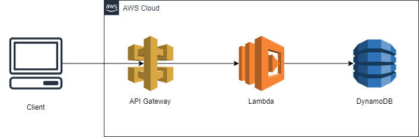

今回は Lambda を使用するほど複雑な処理がなかったので、コスト削減のために**間に Lambda を挟むことなく API Gateway から直接 DynamoDB に書き込む方法**を調べました。

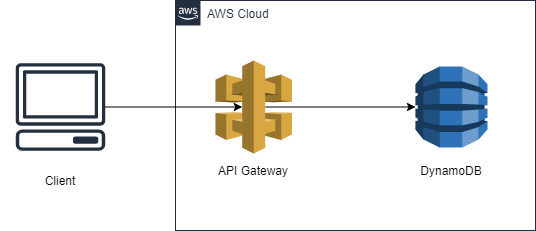

筆者と同じく AWS 初心者でサーバーレスに興味がある方の助けになれば幸いです。長くなってしまったので2部構成になっています。後編はこちら → [[AWS] API Gateway から DynamoDB に直接書き込みを行う方法 【後編: API Gateway の設定】](/method-of-write-directly-to-dynamodb-from-apigateway-part2)

## 概要
対象: AWS 初心者でサーバーレスに興味がある方

今回は「勉強した時間や内容を DynamoDB の Study テーブルに記録する」 API を作成します。

AWS コンソールの画面は 2021/08/27 時点のものです。

## 手順
API Gateway から DynamoDB に直接書き込みを行うための手順は以下のようになります。

【前編】← この記事
1. DynamoDB に Study テーブルを作成する
2. API Gateway から DynamoDB への書き込みを許可する IAM ロールを作成する
3. 作成した IAM ロールにインラインポリシーを追加する

【後編】
4. API Gateway で REST API を作成し、 IAM ロールをアタッチする
5. 統合リクエストを設定する
6. クライアント側から API を実行する

前編では「DynamoDB のテーブル作成」と「API Gateway から DynamoDB の Study テーブルへの書き込みを許可する IAM ロールの作成」を行います。

## DynamoDB に Study テーブルを作成する
まずは勉強時間や内容を記録するための Study テーブルを DynamoDB に作成します。 DynamoDB の画面を開き、「テーブルの作成」を選択します。

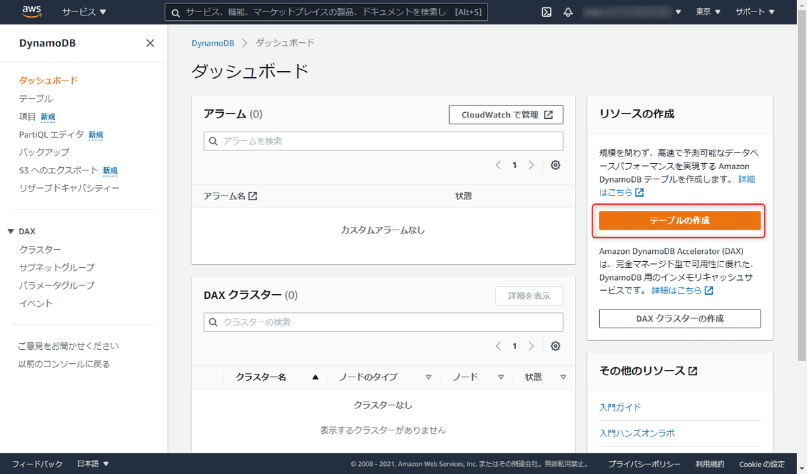

今回はテーブル名を Study 、パーティションキーを study_id とし、デフォルト設定を使用します。入力したら「テーブルの作成」をクリックします。

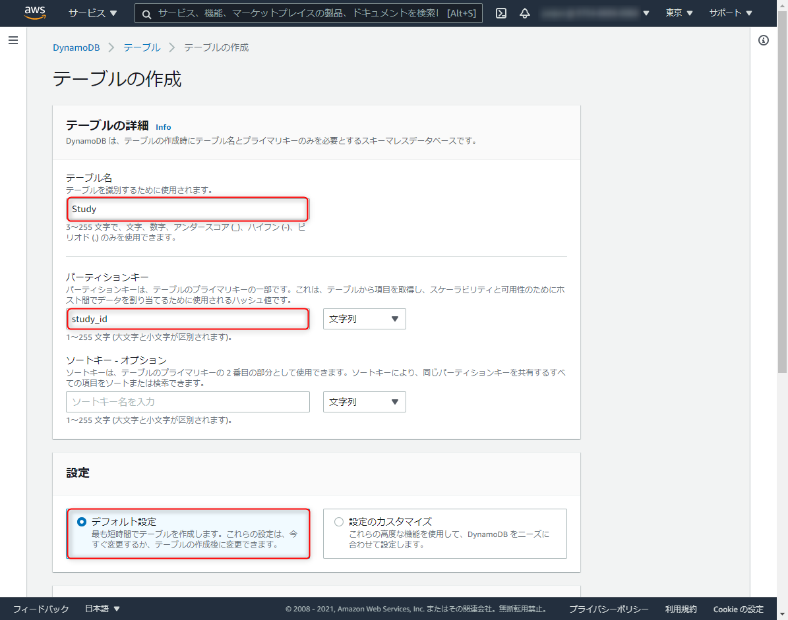

テーブルが作成できたら、例として項目を1つ追加しておきます。「項目」タブから作成された Study テーブルを選択し、「項目の作成」をクリックします。

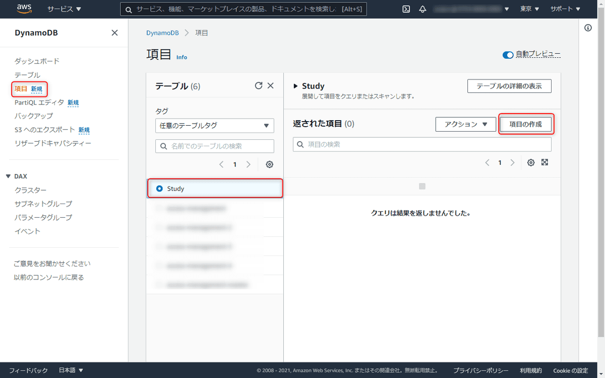

例として英語を45分勉強したという記録を残すため、study_id: 1、 content: 英語、 time: 00:45 を 入力します。入力できたら「項目の作成」をクリックします。

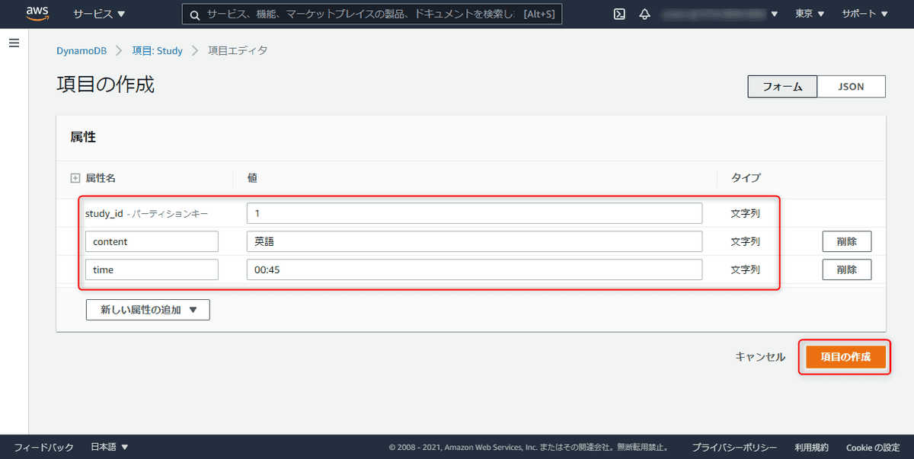

以下のように、テーブルに入力した内容が登録されていることが確認できます。このような内容のデータを書き込むことを目指します。

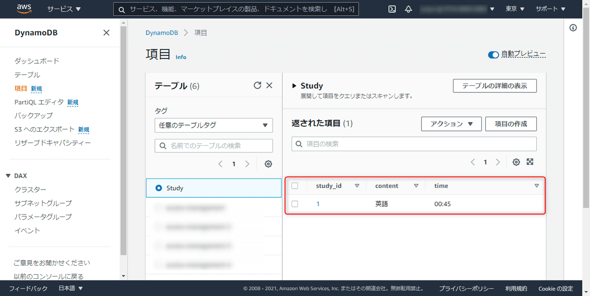

ここで、次の手順の IAM ロール作成時に使用するため、今作成したテーブルの ARN を控えておきます。「テーブル」タブの Study テーブルを選択し、「概要」を開くと**Amazon リソースネーム (ARN)** と記載されたところがあります。この値をコピーします。

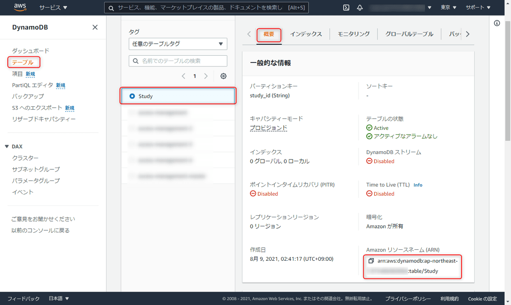

[**ARN（Amazon リソースネーム）**](https://docs.aws.amazon.com/ja_jp/general/latest/gr/aws-arns-and-namespaces.html) とは、**AWS リソースを一意に識別するための名前**のことで、**AWS 全体でリソースを明確に指定する必要がある場合にこの ARN が必要になります**。IAM ロールのインラインポリシーに ARN を指定することで、IAM ロールが処理を行うサービスを指定します。

## API Gateway から DynamoDB への書き込みを許可する IAM ロールを作成する
では次に API Gateway から DynamoDB の Study テーブルへの書き込みを許可する IAM ロールを作成します。[**IAM**](https://aws.amazon.com/jp/iam/) とは「AWS Identity and Access Management」の略で、**AWS リソースへのアクセスを安全に管理するためのサービス**です。IAM ロールは、**AWS リソースに権限を付与する**ことができます。

IAM の画面を開き、ロールを選択したら「ロールを作成」をクリックします。

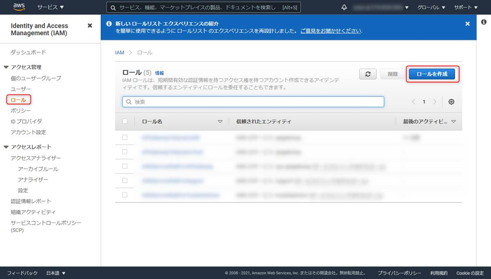

ユースケースの選択で「API Gateway」を選択したら「次のステップ: アクセス権限」をクリックします。

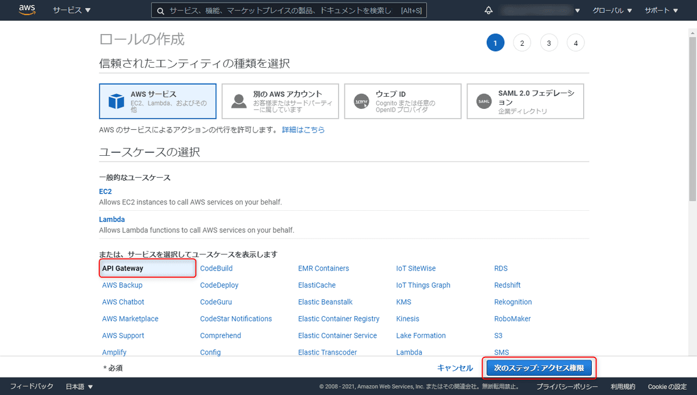

Attached アクセス権限ポリシーのポリシー名に「AmazonAPIGatewayPushToCloudWatchLogs」と表示がされていることを確認します。このポリシーをアタッチすることで、 [CloudWatch](https://aws.amazon.com/jp/cloudwatch/) というモニタリングサービスに対して、この API のログの読み取りと書き込みの権限を付与します。確認できたら「次のステップ: タグ」をクリックします。

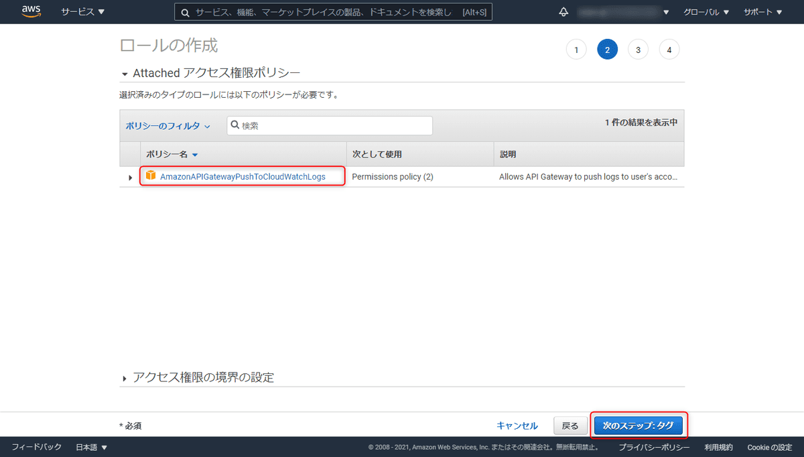

タグとは AWS リソースをわかりやすく管理するために独自のメタデータを割り当てることができるラベルのことです。今回は必要ありませんので、「次のステップ: 確認」をクリックします。

ロール名は適当に「APIGatewayToDynamoTest」とし、「ロールの作成」をクリックします。

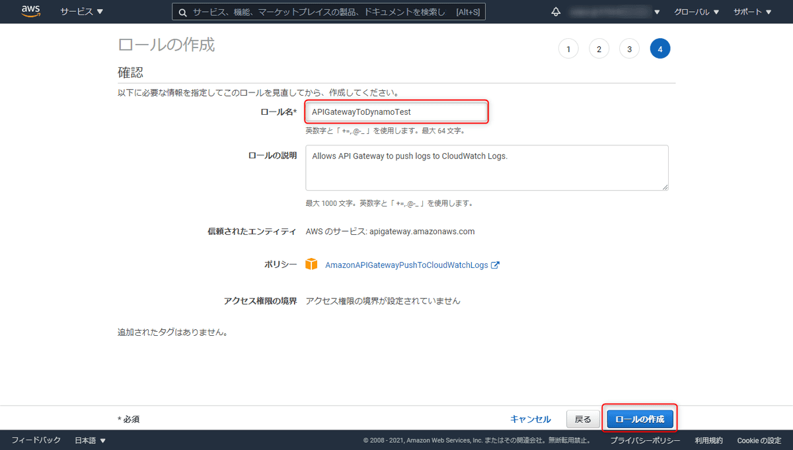

これで IAM ロールが作成されました。次はこのロールに対してインラインポリシーを追加します。

## 作成した IAM ロールにインラインポリシーを追加する

ロールの一覧の中に今作成したロールが追加されているのでロール名を選択し、「インラインポリシーの追加」をクリックします。**インラインポリシー**とは **IAM アイデンティティ（ユーザー、グループ、ロール）に埋め込むことができるポリシーのことで、IAM アイデンティティ独自の権限を付与することができます**。

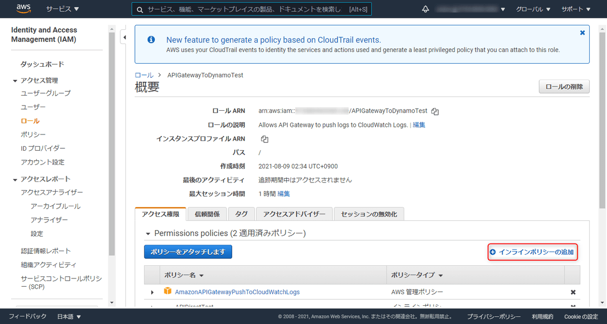

「サービス」には DynamoDB 、「アクション」には書き込み処理の PutItem を入力します。リソースの 「ARN の追加」をクリックします。

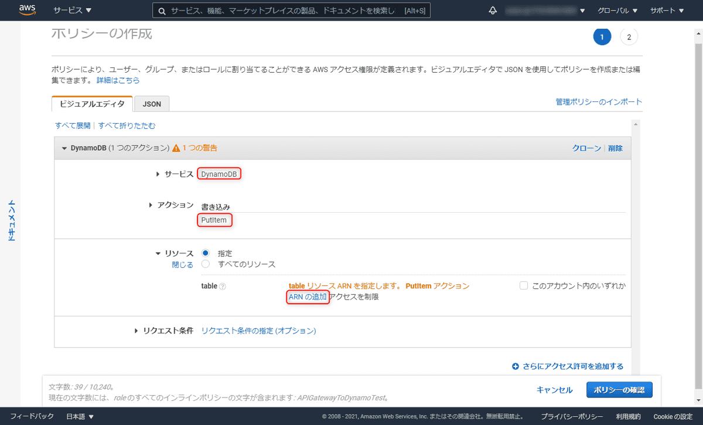

先ほど控えておいた Study テーブルの ARN を入力します。他の項目は自動で入力されるので、「追加」をクリックし、モーダルが閉じたら「ポリシーの確認」をクリックします。

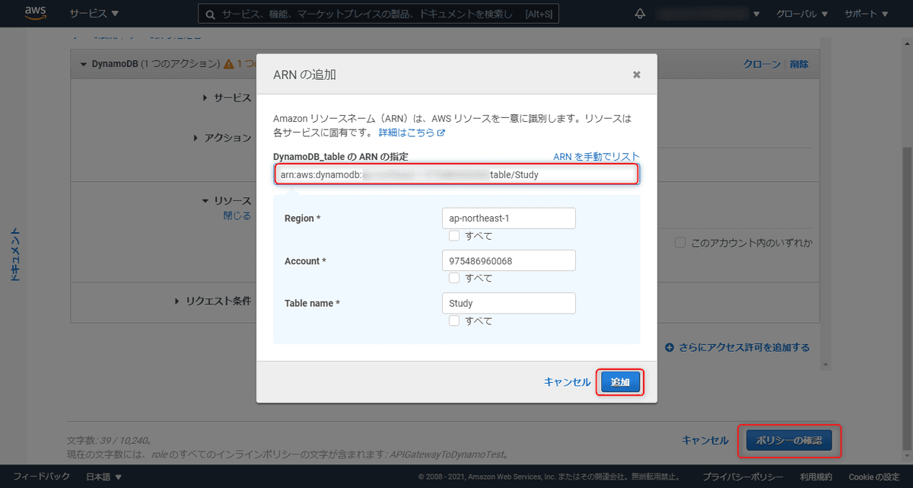

名前は適当に「APIDirectTest」とし、「ポリシーの作成」をクリックします。

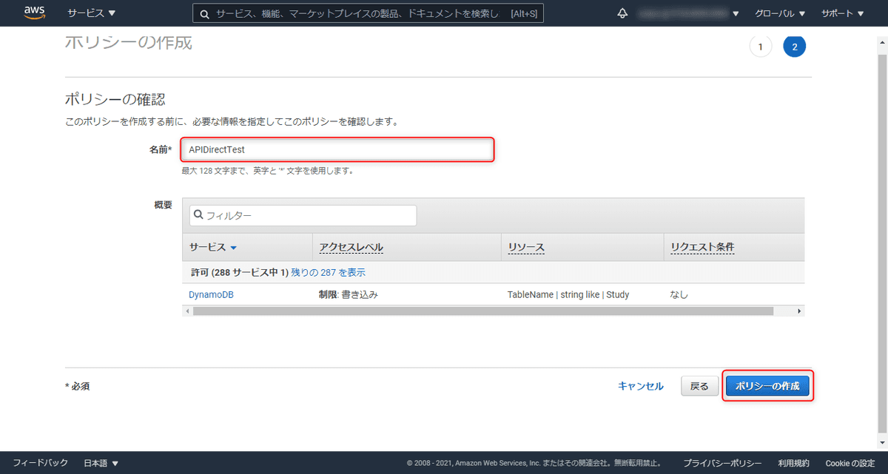

これで **API Gateway から DynamoDB の Study テーブルへの書き込みの権限を持つ** IAM ロールが作成できました。以下のようにインラインポリシーが追加されていたら OK です。後程作成する API Gateway にこの IAM ロールをアタッチするため、ロールの概要上部にある ARN を控えておきます。

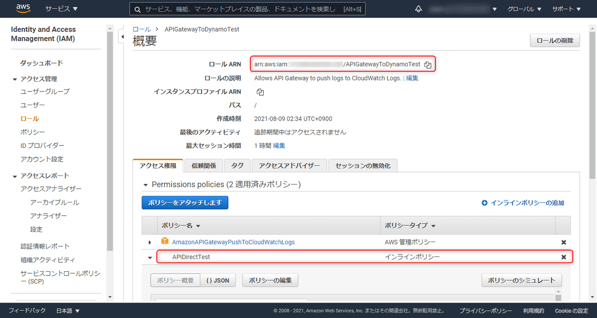

以上で「DynamoDB のテーブル作成」と「API Gateway から DynamoDB の Study テーブルへの書き込みを許可する IAM ロールの作成」ができました。後編では API Gateway を作成し、クライアントから API を叩いて DynamoDB の Study テーブルに書き込まれるようにしていきます。

後編 → [[AWS] API Gateway から DynamoDB に直接書き込みを行う方法 【後編: API Gateway の設定】](/method-of-write-directly-to-dynamodb-from-apigateway-part2)