こんにちは、じゅんじゅんです。この記事は API Gateway から Lambda を間に挟まずに DynamoDB に直接書き込みを行う方法の後編です。前編はこちら → [[AWS] API Gateway から DynamoDB に直接書き込みを行う方法 【前編: IAM ロールの作成】](/method-of-write-directly-to-dynamodb-from-apigateway-part1)

## 手順
【前編】
1. DynamoDB に Study テーブルを作成する
2. API Gateway から DynamoDB への書き込みを許可する IAM ロールを作成する
3. 作成した IAM ロールにインラインポリシーを追加する

【後編】← この記事
4. API Gateway で REST API を作成し、 IAM ロールをアタッチする
5. 統合リクエストを設定する
6. クライアント側から API を実行する

前編では「DynamoDB のテーブル作成」と「API Gateway から DynamoDB の Study テーブルへの書き込みを許可する IAM ロールの作成」を行いました。後編では API Gateway を作成し、直接書き込むための設定をしていきます。

## API Gateway で REST API を作成し、 IAM ロールをアタッチする
API Gateway の画面を開き、「API を作成」をクリックすると、 API タイプを選択する画面が表示されます。選択できる API タイプは以下の4種です、

- REST API
- REST API プライベート
- HTTP API
- WebSocket API

今回使用するのは「**REST API**」です。バックエンドに Lambda、HTTP URI、その他 AWS サービスなどを設定できる RESTful API が作成できます。

「**REST API プライベート**」は API Gateway の VPC エンドポイントを介してのみアクセスできる REST API です。

「**HTTP API**」は、REST API よりも機能を限定している代わりに、 REST API よりも低レイテンシーかつ低コストの API です。2021年8月現在、 HTTP API が通信できるバックエンドサービスの中に DynamoDB は含まれていませんので、今回は HTTP API は使用できません。詳しい REST API との違いや現在使用できるバックエンドサービスについては以下をご参照ください。

> - [Choosing between HTTP APIs and REST APIs](https://docs.aws.amazon.com/apigateway/latest/developerguide/http-api-vs-rest.html)
> - [[アップデート] API Gateway HTTP API で AWS サービス統合が利用可能になりました](https://dev.classmethod.jp/articles/api-gateway-http-apis-adds-integration-with-five-aws-services/)

「**WebSocket API**」は安全なリアルタイムの通信アプリケーションを構築します。WebSocket API を使うことでクライアントとサーバーの両方がいつでも相互にメッセージを送信できるようになります。

今回は REST API の「構築」をクリックします。

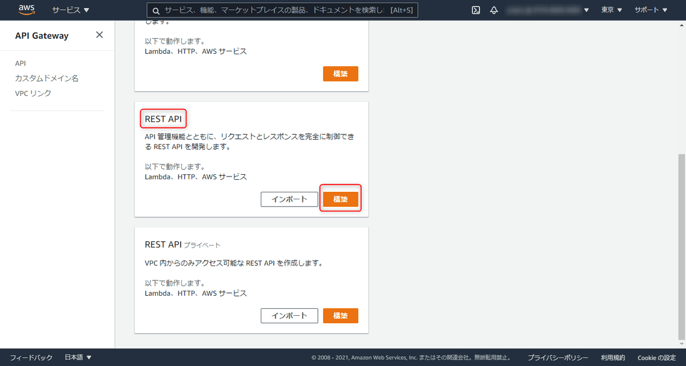

「REST」、「新しい API」を選択し、API 名は「Study API」とします。エンドポイントタイプは「リージョン」を選択します。入力できたら「API の作成」をクリックします。

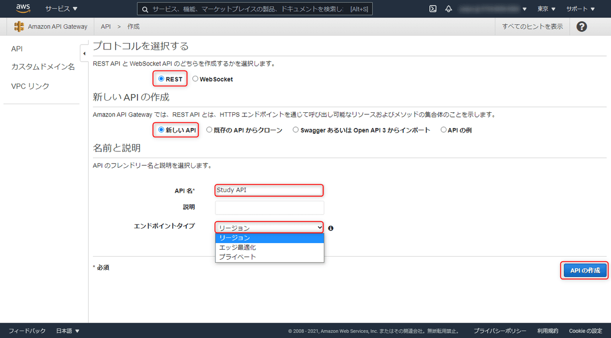

エンドポイントタイプは API トラフィックの大部分の発信元となっている場所に応じて以下の 3 種類から選択できます。

- リージョン
- エッジ最適化
- プライベート

「**リージョン**」は、この API Gateway と同じリージョンのクライアントからのリクエストが多い場合に最適となります。

「**エッジ最適化**」はデフォルトに設定されていて、これを選択するとリクエストが一番近い [CloudFront](https://aws.amazon.com/jp/cloudfront/) にルーティングされます。 CloudFront とはエッジロケーションを使い、最も低いレイテンシーでコンテンツを配信できる CDN サービスです。クライアントから近いエッジロケーションが自動的に使われるので、「リージョン」とは逆でアクセス元が分散されている場合に最適です。

「**プライベート**」を選択すると [Amazon Virtual Private Cloud (VPC)](https://aws.amazon.com/jp/vpc/?vpc-blogs.sort-by=item.additionalFields.createdDate&vpc-blogs.sort-order=desc) からしかアクセスできなくなります。 VPC 内からのみアクセスする場合に使用します。

エンドポイントタイプについての詳細は以下をご覧ください。

> [API Gateway API に対してセットアップするエンドポイントタイプを選択する](https://docs.aws.amazon.com/ja_jp/apigateway/latest/developerguide/api-gateway-api-endpoint-types.html)

リソースの画面になったら「アクション」→「メソッドの作成」を選択し、表示されたドロップダウンの中から「POST」を選択します。すると右にチェックマークが表示されるのでこちらをクリックします。

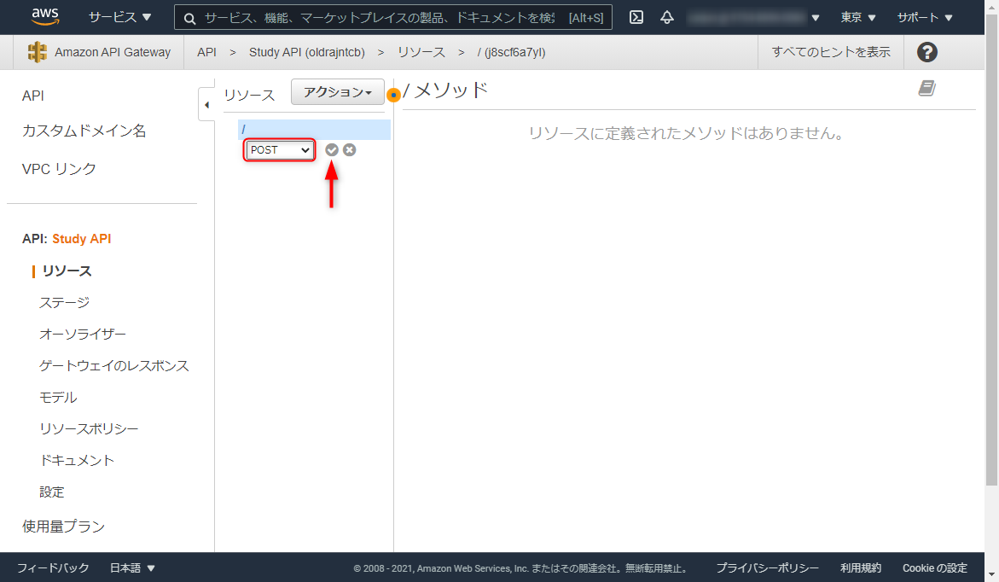

統合タイプを「AWS サービス」、リージョンを DynamoDB があるリージョン、 AWSサービスを「DynamoDB」、メソッドを「POST」、アクションを「PutItem」にし、実行ロールには前編の最後で控えておいた IAM ロールの ARN を入力します。入力できたら「保存」をクリックします。

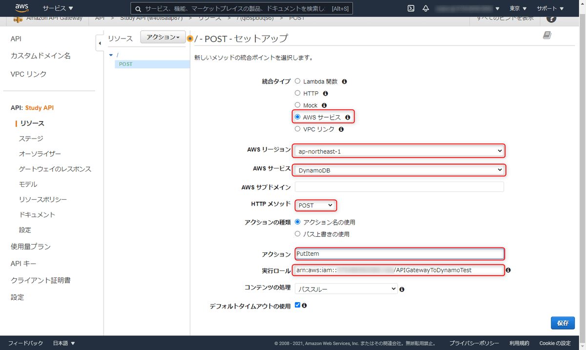

これで API Gateway で REST API を作成し、 IAM ロールをアタッチすることができました。

## 統合リクエストを設定する
最後に統合リクエストの設定を行い、テストを行って Study テーブルに書き込みがされるかを確認しようと思います。

以下の画面が表示されたら、「統合リクエスト」を選択します。**統合リクエストでは AWS サービスなどのバックエンドに対してどのようにデータを渡すかを設定**します。

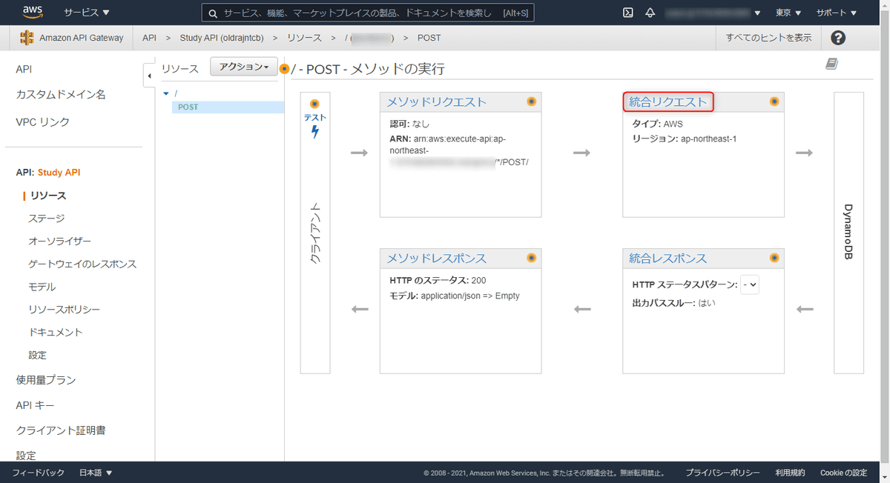

JSON 形式で送られてきたリクエストを DynamoDB の列に対応するように変換するため**マッピングテンプレート**という機能を使います。マッピングテンプレートは VTL というテンプレート言語を使って記述します。詳しくはこちらをご参照ください。

> [Amazon API Gateway モデルとマッピングテンプレートの使用](https://docs.aws.amazon.com/ja_jp/apigateway/latest/developerguide/models-mappings.html)

「マッピングテンプレート」の「リクエスト本文のパススルー」の「テンプレートが定義されていない場合 (推奨) 」を選択したら、「マッピングテンプレートの追加」をクリックします。

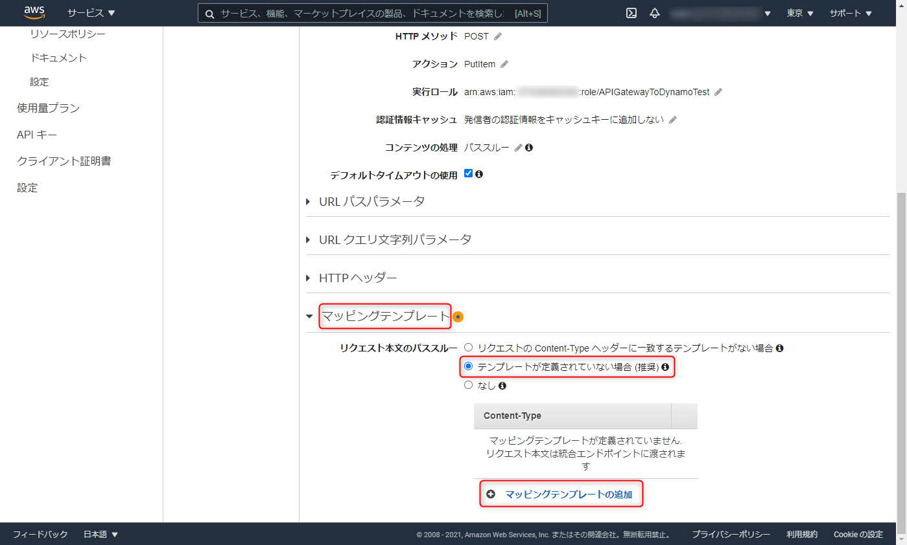

 Content-Type に「application/json」を追加し、以下のように記述します。

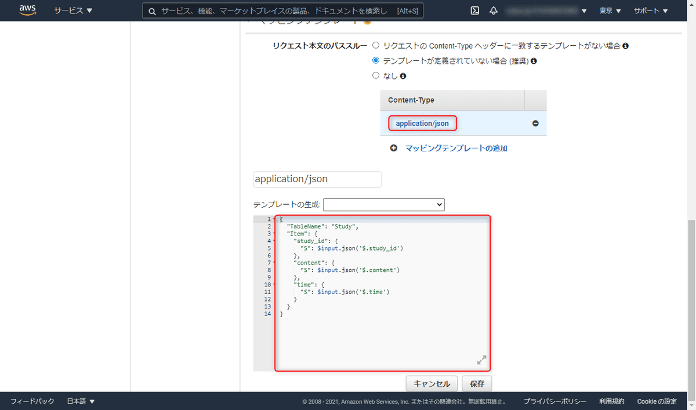
```json
{
  "TableName": "Study",
  "Item": {
    "study_id": {
      "S": $input.json('$.study_id')
    },
    "content": {
      "S": $input.json('$.content')
    },
    "time": {
      "S": $input.json('$.time')
    }
  }
}
```

送られてきた JSON の対応する値を `$input.json()` で Study テーブルの各列に対して設定しています。ちなみに `TableName` と `Item` は省略できません。

この API をテストし、 DynamoDB に書き込みが行われるかを確認します。「テスト」をクリックします。

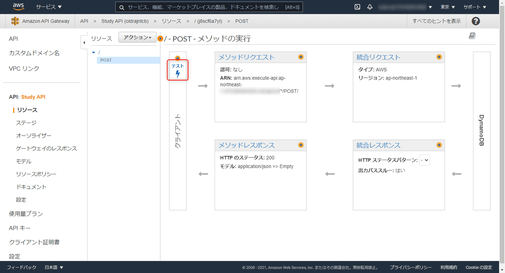

リクエスト本文には登録する値を以下のように JSON で記入します。
```json
{
  "study_id": "2",
  "content": "数学",
  "time": "02:00"
}
```

入力できたら「テスト」を押し、右側のステータスに 200 、ログにマッピングテンプレートの内容が表示されていることを確認したら、 DynamoDB の Study テーブルを確認しに行きます。

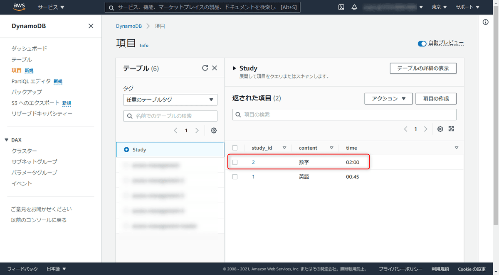

リクエストした内容で無事に登録されていました。

## クライアント側から API を実行する
最後にこの API をクライアント側から実行し、入力内容を登録してみます。まずは API をデプロイします。「リソース」、「アクション」の「API のデプロイ」をクリックします。

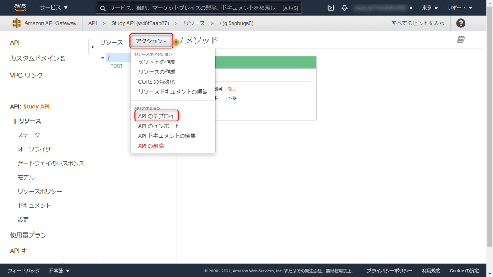

「デプロイされるステージ」は [新しいステージ] を選択し、「ステージ名」はここでは dev としておきます。入力できたら「デプロイ」をクリックします。

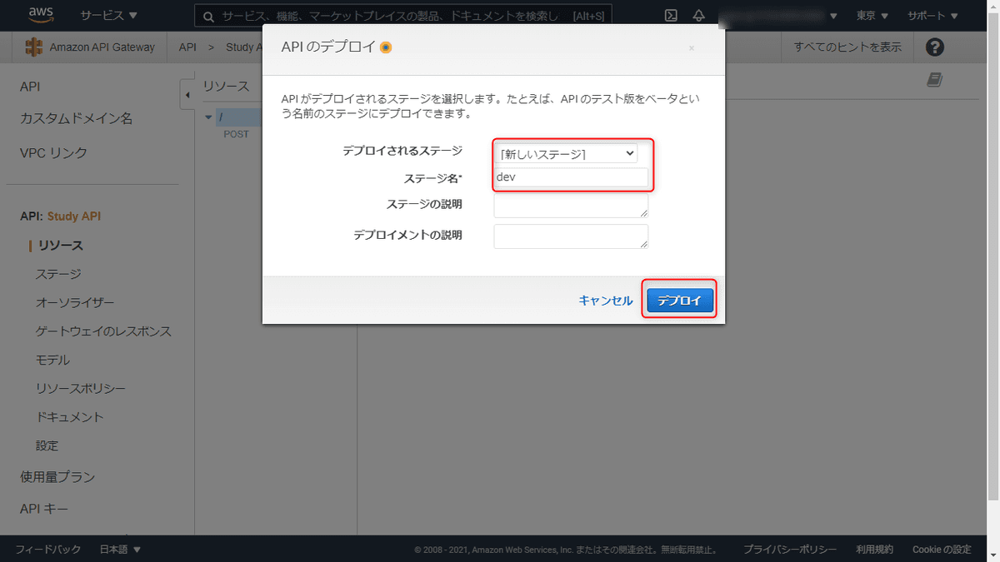

これで API がデプロイされました。「ステージ」から今作成した POST メソッドをクリックすると、この API を呼び出すための URL が記載されています。これをクライアント側から叩きます。

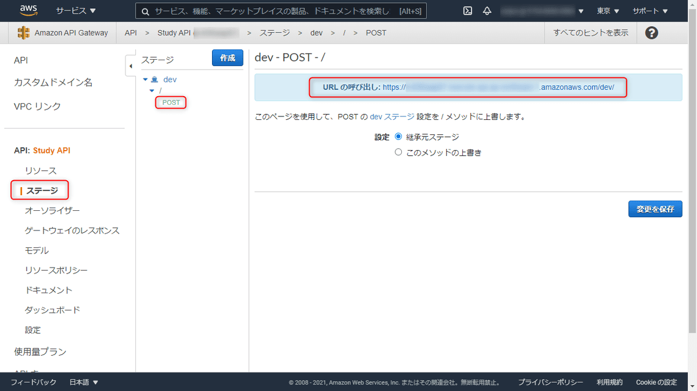

今回は簡単に React と Axios で入力フォームを作成しました。

## 感想
今回はあえて Lambda を使わずに DynamoDB へ書き込みを行いました。データの整形が複雑でなくマッピングテンプレートで十分な場合はコスト削減になりそうです。今後は AWS の勉強も進めていくつもりですので、 AWS についての記事もどんどん書いていきたいと思います。

## 参考
> [API Gateway からDynamoDBを直接操作してみた](https://zenn.dev/amarelo_n24/articles/ab083b0358e902)