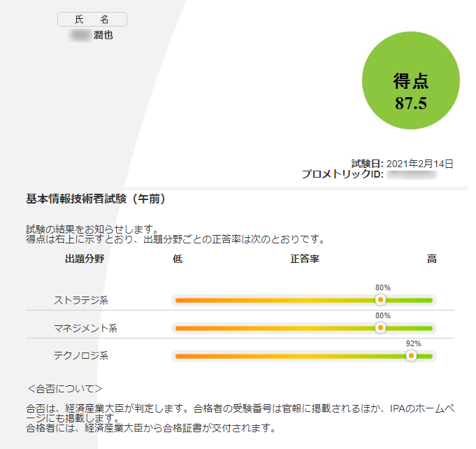
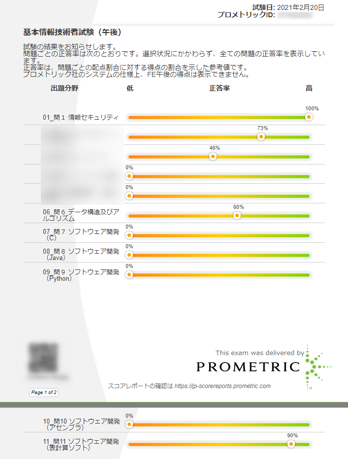
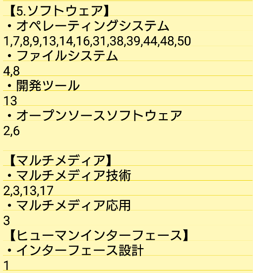
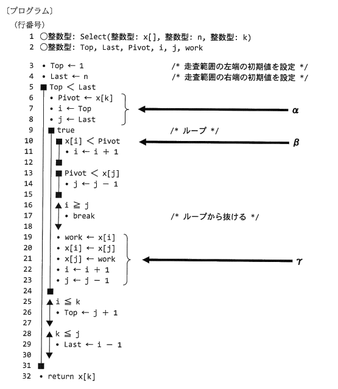

こんにちは、じゅんじゅんです。先日、 CBT 方式で[基本情報技術者試験](https://www.jitec.ipa.go.jp/)を受験してきました。本来は2020年の10月に行われる予定だったもので、コロナの影響で延期となっていましたがようやく受験できました。

今回は、 CBT 方式という普段とは違った形式の試験の感想と、参考になるかはわかりませんが私が行ってきた勉強法についてお話しします。

## 筆者のスペック
私は未経験から MSEN に入社して約半年、システム開発をさせていただいています。基本情報に関しては、プログラミングを勉強し始めたときに[キタミ式の参考書](https://www.amazon.co.jp/dp/B08PPJPZ4V/ref=dp-kindle-redirect?_encoding=UTF8&btkr=1)（今確認したら2019年版でした）を購入し、前職の通勤中などにちょこちょこ読んでいました。

本腰を入れて勉強し始めたのは入社した8月からですが、途中で延期されたこともあり全く触らない期間がありました。勉強を再開したのは12月後半ぐらいからです。

## 結果
まずは結果から。といっても正式な合格発表ではなく、 CBT 方式で受験後に午前は点数、午後は大問ごとの正答率がメールで送られてきます。私はこんな感じでした。

～午前～

～午後～

午後に関しては点数ではないので確定ではないですが、全体の正答率が 73% ぐらいなので大丈夫かなと思ってます。

## CBT 方式の感想
まず大きく違ったところが、**午前と午後の試験を別日に受験できる**というところでした。間を空けておくことでそれぞれの勉強に注力ができるので、普段の試験よりも有利だった気がします。私は午後試験を午前試験の6日後にしてしまったのであまり恩恵は感じられませんでした…。

実際の受験は、隣が板で仕切られた机で、パソコンに表示された問題を見て回答を入力する方式でした。マウスはクリック音もスクロール音もならない物で、ヘッドホンも用意されていたので防音は完璧でした。計算用紙、筆記用具は支給されたものを使用します。

私は過去問で勉強をする際、**問題を PC で見ながら**行っていたのですが、そのおかげで **CBT 方式での回答もそこまで違和感なくできました**。紙で試験勉強を行っていたら、問題に書き込めなかったり、ページ移動をスクロールで行ったりするところが戸惑っただろうなと、特に午後試験のときに思いました。幸いドラッグすることで文章に色付けができるので、**問題文の重要そうなところや自分の選んだ選択肢に色を付けておくことで見直しがスムーズにできました**。

## 私が行った勉強法
ここからは合格するために私が行った勉強法をご紹介します。

### 午前問題
まずは午前について。最初にキタミ式をしっかり1周したあと、2周目を読み終わった分野から順に[基本情報技術者試験ドットコム](https://www.fe-siken.com/)の[分野別過去問題](https://www.fe-siken.com/index_te.html)で過去問を解いていきました。**出題された年度が古い問題は今後は出題されにくいという推測**と、**同じ問題ばかりになる**ことから、例えば「基礎理論」の「離散数学」の場合は現在101問あるので50問だけ解くなど、各項目の新しい問題から半分を解くようにしていました。

これを最終的に全項目を2回やりました。さらに2回やる中で**間違えてしまった問題、苦戦した問題などを全てメモに取り、試験直前はそれらの問題だけを解く**ようにし、できるだけ穴をつくらないようにしました。画像はそのスマホのメモです。

これらのほとんどは電車通勤の間でだけ行い、計算が必要な問題だけ家で手を動かして解きました。**スキマ時間の有効さが身に沁みました**。

### 午後問題
そして午後について。午後の選択問題はデータベース、ソフトウェア、ネットワークに絞って勉強しました（2つを選択しますがどれかが出題されない場合があるため）。プログラミングは表計算を選択しました。

午後は勉強法と言うほどのものはなく、ひたすらに[過去問](https://www.fe-siken.com/index_pm.html)を回していました。直近の問題は出ないと推測し、平成29年の秋から平成26年の春までの問題をやりました。結果、73% 取れたので、過去問だけでも十分ではないかと思います。

情報セキュリティ、ソフトウェアに関しては午前問題でしっかり対策していればそこまで苦戦しないと思います。データベースに関しては最初は苦手でしたが、業務で SQL を使っていたこともあり最終的に1番自身がある分野になりました。**慣れてしまえばかなり点が取りやすい**と思います。

問題は残りの3つ、特にアルゴリズムでした。最初はいくら時間をかけても理解できず、最後まで問題を解ききれないレベルでした。これと表計算についてはもう**何回もやって慣れるしかない**と思います。過去問の問題によってはかかる時間や正答率がバラバラで安定しなかったので最後まで不安でしたが、本番でちゃんと特訓の成果が出せたので良かったです。

例: 平成27年 秋のアルゴリズム問題より抜粋。こんな感じの擬似プログラムが出てきます。慣れたら解けるようになります。

ネットワークも情報セキュリティのように午前問題の拡張版のような感じですが、計算問題がメインであり、計算を行うための知識も必要なので個人的には難しかったです。ただ、計算自体が難しいわけではないので、しっかり対策ができれば安定するのではないかと思ってます（私は間に合いませんでした）。

## 感想
延期が重なったこともあって思いのほか長期戦となりましたが、その甲斐あって一発合格（たぶん）できてよかったです。また2か月後には応用情報技術者試験も控えているので、同じ作戦を取りつつ早めに午後問題の対策を行おうと思います。