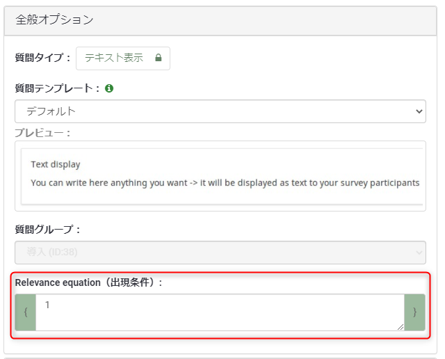
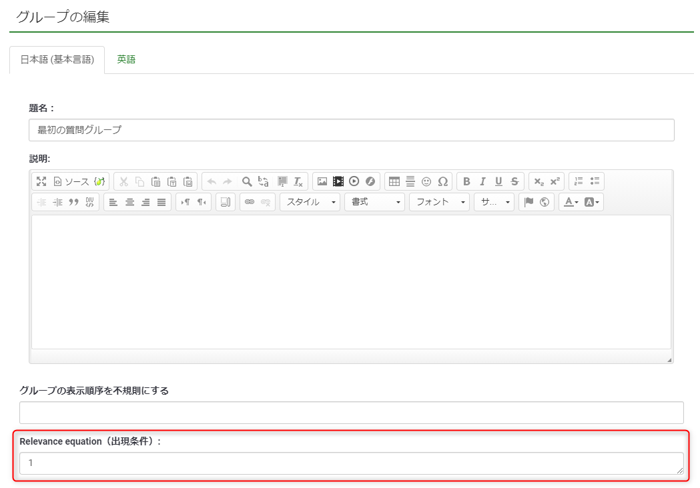

こんにちは、じゅんじゅんです。業務の中で、オープンソースのアンケートシステムである [LimeSurvey](https://www.d-ip.jp/limesurvey/) を使用してアンケートを構築しています。 LimeSurvey は質問文と回答を設定するだけであらゆる形式の質問を作ることができます。

LimeSurvey には、「質問 X の回答が Y だった場合のみ 質問 Z を表示する」といったように**条件を設定することで回答する質問を分岐させる機能**が備わっています。条件が1つの場合は問題ないのですが、例えば「質問 A の回答が B または C 」や「質問 D の回答が E かつ質問 F の回答が G」など、複数の条件を設定する場合、**論理演算子「かつ」「または」は設定のやり方によって自動で決定**されてしまいます。

今回は LimeSurvey で条件を自分で記述してより柔軟に分岐の設定を行う方法をご紹介します。

## 条件を記述できる場所
結論から言うと、質問の編集画面の中に自由に条件を記述できる場所がありました。ずばりココです。

質問編集画面の右側、「全般オプション」タブの一番下の部分です。「出現条件」と書いてあるにも関わらず、なかなか気づけませんでした。一所懸命 [LimeSurvey マニュアル](https://manual.limesurvey.org/LimeSurvey_Manual/ja)を読んでどこで条件を記述できるのか探していました。視野が狭いですね。

ちなみに質問グループにも同様の記述欄があります。

## 条件の書き方
基本的な条件の書き方は以下のようになります。

例1: 「質問コード1 の回答が回答コード1」かつ「質問コード2 の回答が回答コード2」のとき表示
`("質問コード1".NAOK == "回答コード1") && ("質問コード2".NAOK == "回答コード2")`

例2: 「質問コード1 の回答が回答コード1 以外」または「質問コード2 の回答が回答コード2 以外」のとき表示
`("質問コード1".NAOK != "回答コード1") or ("質問コード2".NAOK != "回答コード2")`

例3: 「質問コード1 の回答が回答コード1」 かつ「質問コード2 が未回答ではない」 とき表示
`("質問コード1".NAOK == "回答コード1") && !is_empty("質問コード2".NAOK)`

`&&` に対して `or` だったりしますが、条件式の基本的な書き方なので特にわかりにくい部分はないかと思います。`!is_empty` の部分は `!` を外せば「未回答のとき」となります。また、回答コードが数字のみだと `""` がなくても動きますが、 `A1` など数字以外が含まれていると文字列と判断されるようで、 `""` で囲う必要があります。

ちなみに、マニュアルの[プレゼンテーション - 条件と出現条件式の両方を使えるか？](https://manual.limesurvey.org/ExpressionScript_-_Presentation/ja#.E6.9D.A1.E4.BB.B6.E3.81.A8.E5.87.BA.E7.8F.BE.E6.9D.A1.E4.BB.B6.E5.BC.8F.E3.81.AE.E4.B8.A1.E6.96.B9.E3.82.92.E4.BD.BF.E3.81.88.E3.82.8B.E3.81.8B.EF.BC.9F)にもありますが、条件設定機能で条件を設定している場合、出現条件の欄が編集できないようになっています。手書きをしたい場合は条件設定を削除する必要があります。

元々の条件設定機能でもほとんどの場合は事足りるとは思いますが、複雑な条件を設定したいときなどは手で書いてしまったほうが手っ取り早いかもしれません。
