こんにちは、じゅんじゅんです。

MSEN では年に数回、レクリエーションを開催しています。

先日、「[舞洲 森とリルのBBQフィールド](https://www.lodge-maishima.com/bbq/)」というところで BBQ をしてきましたので、その様子をお届けします。

### バーベキュー場について

今回バーベキュー場として選んだ「舞洲 森とリルのBBQフィールド」ではバーベキューのセットが備え付けられているため、準備するものが食材だけで良いのがお手軽でした。

着火や炭の後処理などもスタッフの方がやってくれるので、バーベキュー初心者でも心配ありません。

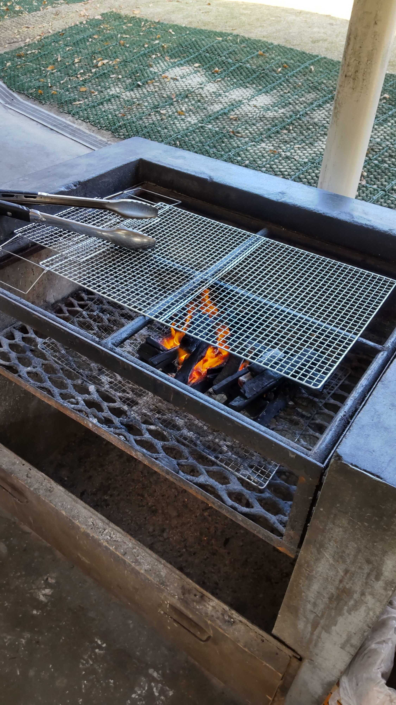

### 到着！

それぞれ食材などの荷物を車に積み、事務所から走ること 30 分ほどで到着！

この日は雲１つない、絶好のバーベキュー日和でした。

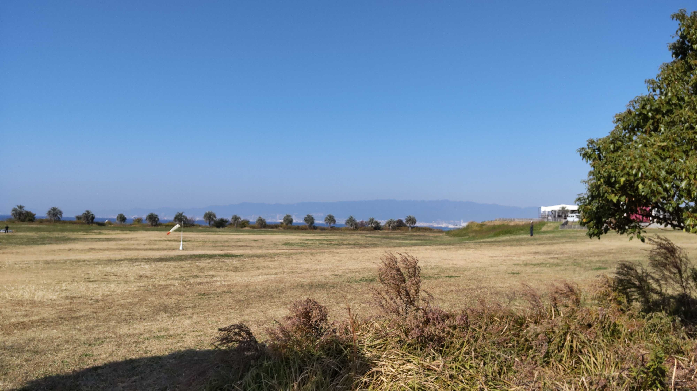

 と ひらたつ (右) さん")

### バーベキュー開始！

受け付けを終え、スタッフの方が着火してくれたところでバーベキュー開始！

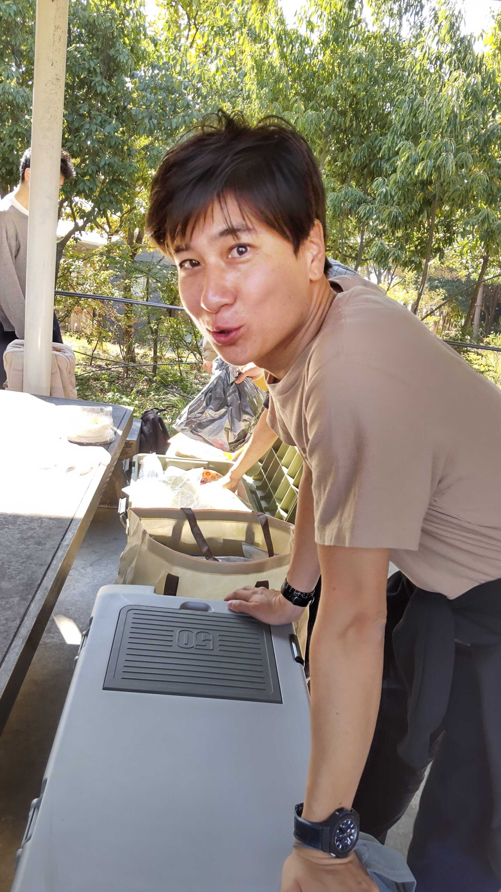

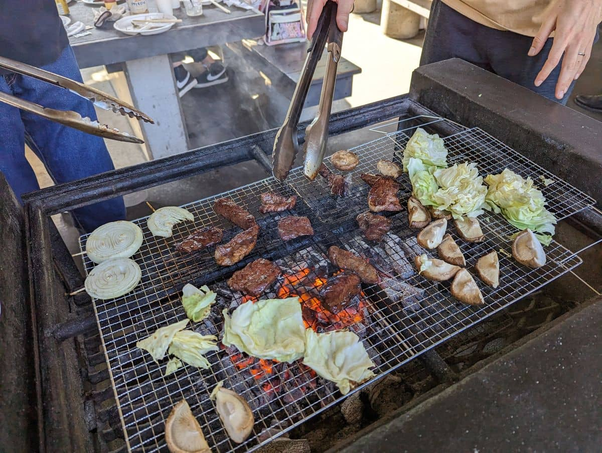

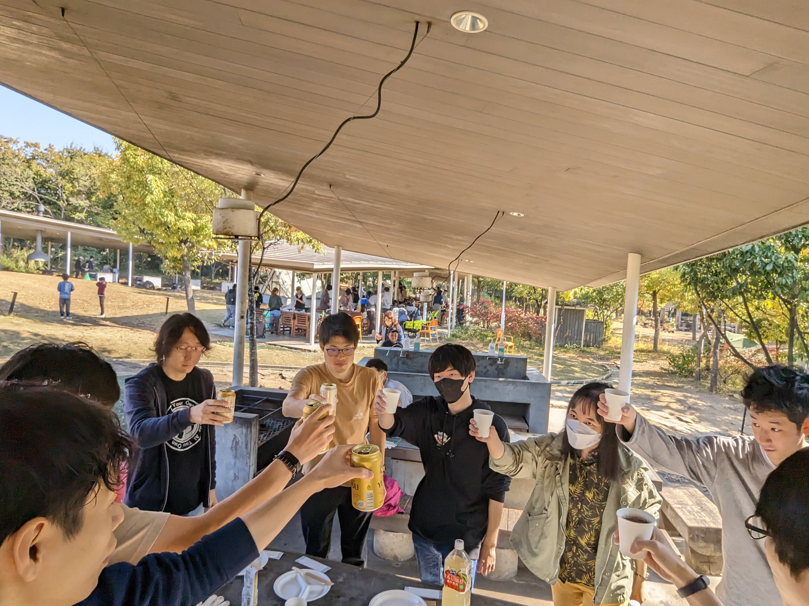

めちゃめちゃおいしくいただきました。

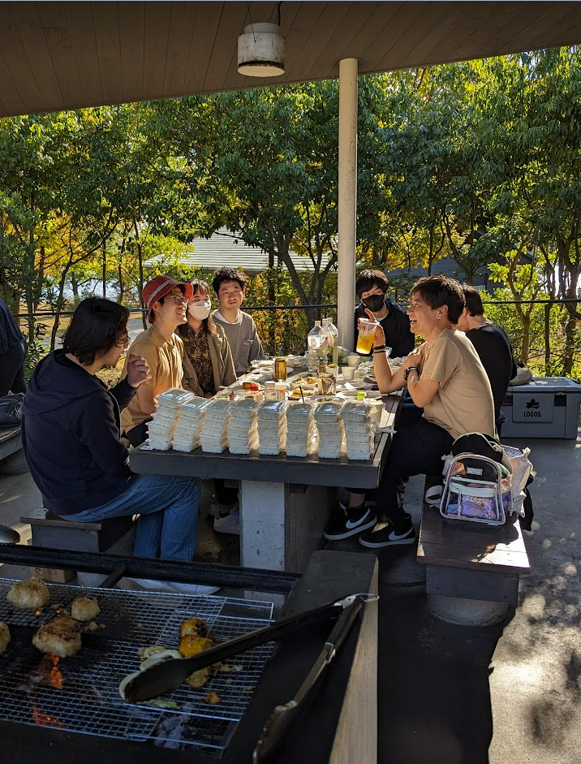

ちなみに燻製セットを持参してチーズとベーコンの燻製もしていました。

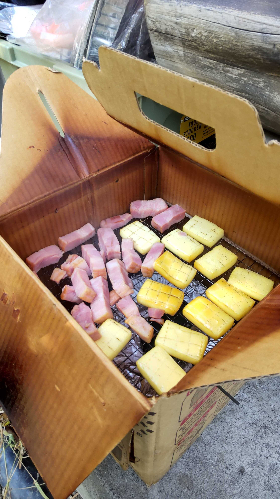

初めて焼きマシュマロを食べました。良い色に焼けています。

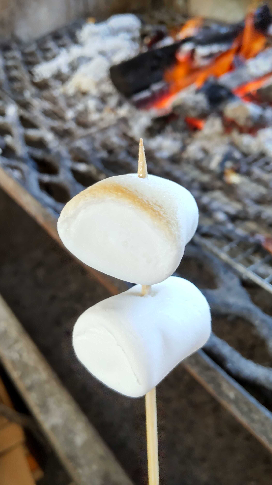

### アルファ米の試食体験

以前、福島区から非常食の棚卸しで、災害訓練用にアルファ米をいただきました。期限が 2023 年 6 月のため、無駄になってしまう前にこのレクで試食体験してみることにしました。

段ボールの中の袋に約 8.5 リットルの水を入れて戻します。1 時間ほどでなんとか食べられるぐらいの柔らかさになりました。ちょっと固くてつぶれがちですが、味は普段食べるお米と同じくらいおいしくいただけます。

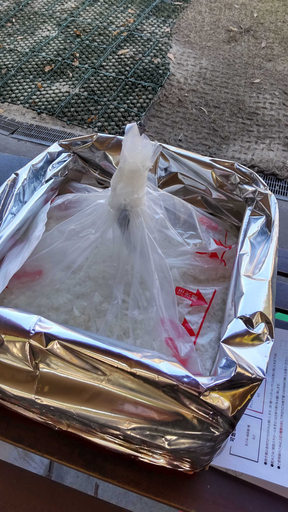

その量、なんと 50 食分です。ある程度食べた残りをみんなで分配して持って帰る予定でしたが、予想以上に多かったです。筆者は 7 パック持って帰りました。チャーハンにします。

")

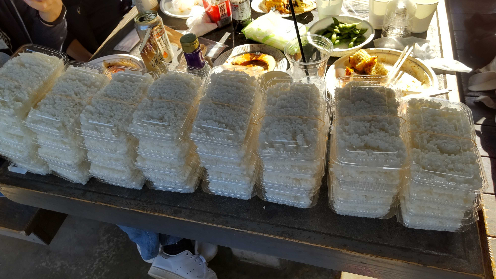

量には圧倒されましたが、これだけあれば非常事態でもしばらくはお米に困ることはなさそうです。

### あとがき

今回は新しいメンバーを含めた初めてのレクでした。よりにぎやかになり、社内が良い雰囲気になっているのを感じます。

今度は旅行できたらいいなぁと思うじゅんじゅんでした。

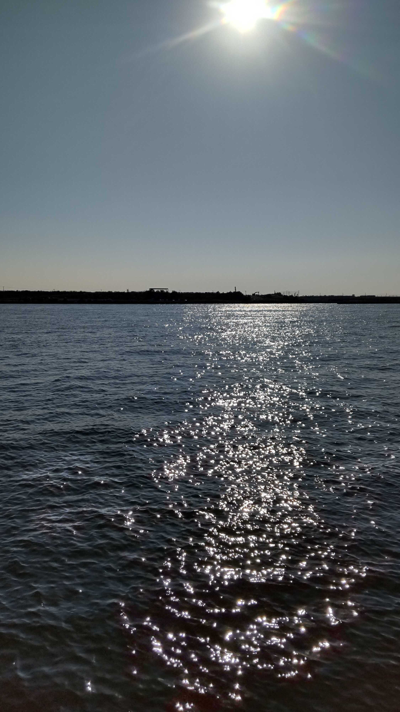

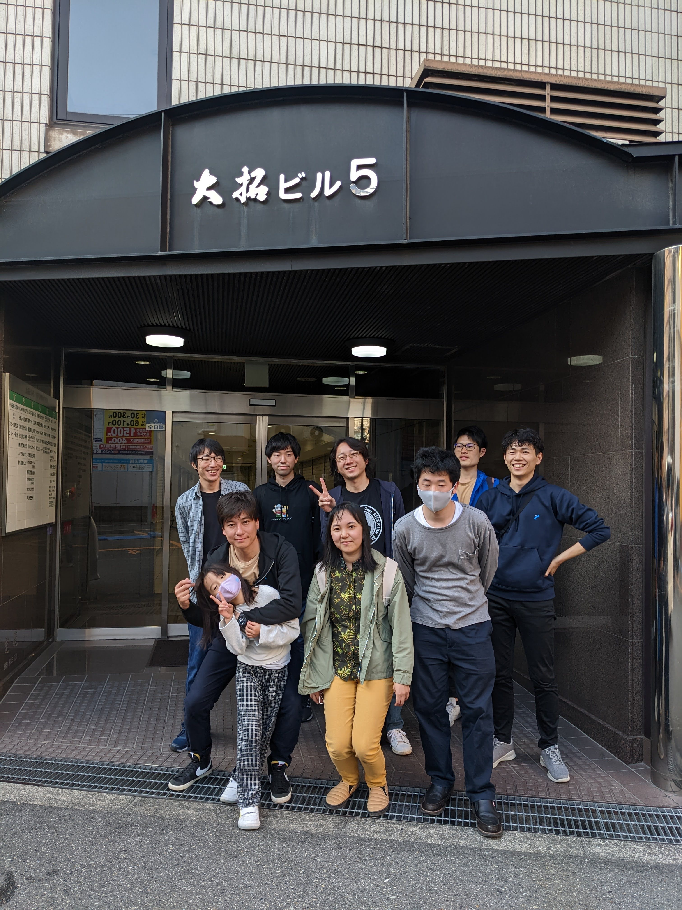
